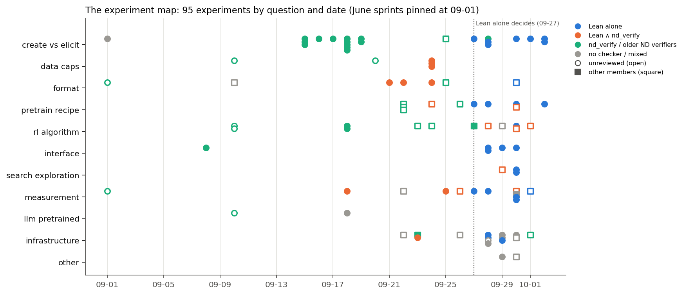
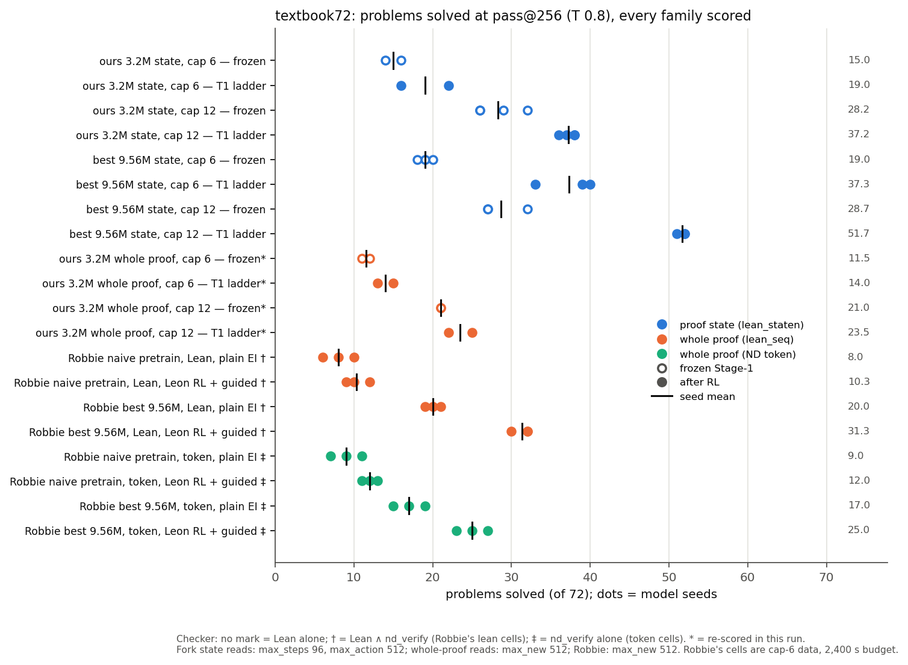
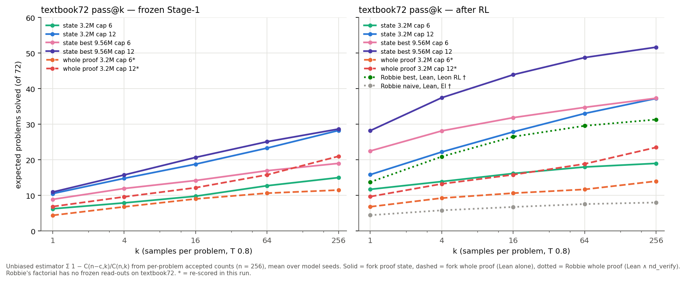
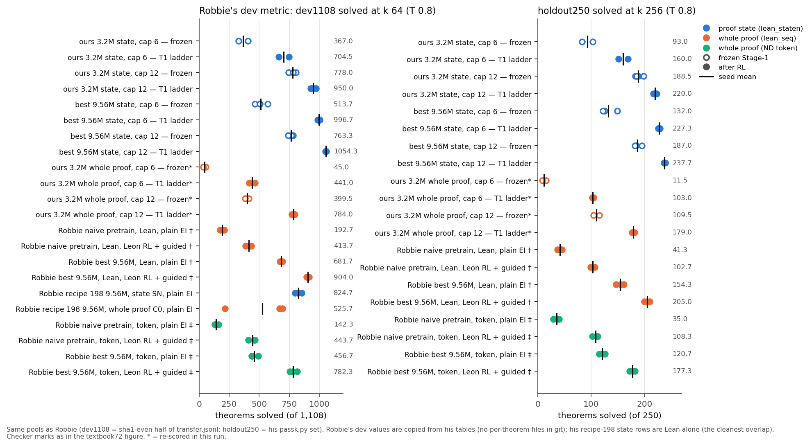
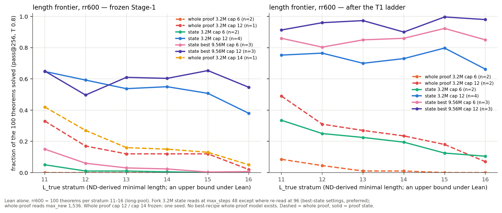

# Evidence atlas: what the project has measured, and what can be compared (2026-10-02)

**Scope.** This atlas covers 95 experiments: 81 by Dan's agents and the earlier Codex sprints (nd-rl `dan` summaries
plus fork run branches) and 14 by other members (Robbie, Leon, Charles, Dmitry, read-only from their nd-rl branches).
It contains:
- one row per experiment ([`MAP.md`](MAP.md), `data/experiment_map.csv`);
- five figures recomputed from per-theorem files where those exist;
- a protocol table;
- a create-vs-elicit evidence table;
- a list of open questions.

Other members' results are described neutrally with sources. This is a map of evidence, not an assessment of anyone.

**How it was built.** Seven read-only extraction agents read the summaries and branches into a fixed schema
(`raw/SCHEMA.md`, `raw/*_notes.md`). The shared-pool numbers were then **recomputed** from per-theorem files:
- 243 fork read-outs from the bucket's `.jsonl`;
- Robbie's factorial `passk.csv`;
- the long-pool per-stratum files.

Every recomputed count matches its summary (0 disagreements; `raw/F_notes.md`, `raw/G_notes.md`). Everything else is
marked `copied` with its source. One gap was filled with a pod: the whole-proof re-score (§5, ≈ $0.5).

**Labels used throughout.**
- **Checker:** "Lean" = Lean alone (from 2026-09-27); † = Lean ∧ `nd_verify`; ‡ = `nd_verify` alone. The fork's
  `nd_verify` still has the forward-box-citation bug (§6).
- **"state"** = proof-state interface `lean_staten`.
- **"whole proof"** = `lean_seq`.
- **"best"** = Robbie's 9.56M recipe ported to the state format (`best-state`).
- **"ours"** = the 3.2M 4 × 256 recipe.

All models are from scratch. Training sets are the cap-6 control set (depth3 f0 a1, 155k) or K12 (155k) unless stated.
`L_true` labels are ND-derived minimal lengths, which are upper bounds under Lean.

## 1. Headlines

1. **textbook72 is a shared axis across every family.**
   - All textbook72 files across members are byte-identical: Robbie's, Dmitry's, Charles's and the fork's
     `data/eval_only/textbook72` and `data/bs/textbook72.jsonl` (theorem-set md5 `b7397660…`). Robbie's dev1108 and
     holdout250 are also the same sets as the fork's (checked by construction).
   - Every read on these pools is T 0.8, with k 256 for textbook72 and holdout250 and k 64 for dev.
   - What differs is the checker and the interface. Lean vs Lean ∧ `nd_verify` changes counts by ≤ 0.02 % (lean-judge)
     to a few theorems (state-env), so it is a labelled difference, not a blocker.
2. **The best textbook72 number on file is best-9.56M state cap 12 after its T1 ladder: 52 / 51 / 52 of 72.**
   - Robbie's best factorial cell (best recipe, Lean whole proof, Leon RL + guided sampling, cap-6 data, 2,400 s
     budget) solves 32 / 30 / 32 †.
   - The cap-6 state version of the same recipe (best-state, also trained on cap-6 data) solves 39 / 40 / 33.
   - That gap mixes interface and RL algorithm, and the runs are not compute-matched.
3. **Interface is the largest single factor we can now isolate (new in this run).**
   - Same 3.2M recipe, same training sets, same pools: proof state beats whole proof in all 12 cap × stage × pool cells.
   - holdout250: +81 (cap 6, frozen), +57 (cap 6, T1), +79 (cap 12, frozen), +41 (cap 12, T1) theorems.
   - textbook72: +3.5, +5, +7, +14 problems.
   - The cap-6 whole-proof base barely solves dev theorems (7–14 lines) at all: 54 / 36 of 1,108, vs 405 / 329 for state.
4. **Pretraining recipe matters more after RL than before.**
   - Frozen best vs ours on textbook72: +4.0 (cap 6), +0.5 (cap 12), inside the MDD.
   - After the same T1 ladder: +18 and +14.
   - Robbie's factorial finds the same ordering in whole-proof format: pretraining +408 dev, RL +268, format +92.
     These are main effects, unreviewed.
5. **RL's clearest effect is length extension from a reachable base.**
   - On rr600 theorems of 13–16 lines, best-9.56M cap 6 goes from 2 % solved frozen to 87 % after T1 (3 seeds).
   - Ours state cap 6 goes from 0 % to 16 %, and ours whole proof cap 6 from 0 % to 1 %.
   - Cap-12 pretraining alone gives 49 % (state) and 10 % (whole proof).
6. **Create vs elicit.** No line of evidence reaches "strong for creation":
   - The best creation-like result (29 support-expansion survivors) is reachable without RL by a proof-state base
     (28 / 29 per seed).
   - The token-era "RL composes depth-3 from zero" was partly a surface barrier: the `lean_seq` base already writes
     depth 3 for 13–28 % of targets.
   - The weight of evidence is elicitation or amplification of behaviour the base reaches rarely (§4).
7. **Most create-vs-elicit rows predate Lean.** 14 of 23 were judged by `nd_verify` alone, and none of those 14 has been
   scanned for the forward-citation bug that Leon fixed (§6).

## 2. The map by question

| question | n | checker mix | review | what the rows say (details in `MAP.md`) |
|---|---|---|---|---|
| create vs elicit | 23 | 14 ‡, 7 Lean, 2 other | 22 reviewed (9 with findings) | pattern ignition gated by base rate; support expansion; trajectory; rl-from-ckpt (§4) |
| data and caps | 5 | 3 †, 2 old | 3 | cap raises written length, not harder targets (cap-horizon); composition effects inside the floor |
| format | 7 | mixed | 3 | Lean not worse than tokens; depth 3 was a surface barrier; Robbie: format pays only with good pretraining |
| pretraining recipe | 10 | 4 ‡, 4 Lean, 2 † | 4 | Robbie's autoresearch (dev 56 → 687), bigger model bimodal; best-state recipe wins after RL |
| RL algorithm | 12 | mixed | 4 | GRPO > EI on depth 3 (token); Leon's recipe + guided sampling (+268 dev); TTRL ≈ targets-only EI |
| interface | 5 | 4 Lean | 5 | state lifts reach below the wall; env naming vs state separated (state-readouts) |
| search and exploration | 3 | Lean, † | 2 | best-first ties sampling at ¼ spend; test-time resampling and SMC (Robbie) |
| measurement | 12 | mixed | 7 | noise floor (MDDs); lean-judge; ndbench; trajectory metrics |
| pretrained LLMs | 2 | old | 1 | OLMo-32B pilot, scale novelty |
| infrastructure | 14 | — | — | sampler 2×, fast Stage-1 6×, podjob, registry |
| other | 2 | — | — | literature reviews |

*Figure 1. Every experiment by question and date. Colour = checker; open = unreviewed; square = other members. The
dotted line is the 2026-09-27 switch to Lean alone.*

## 3. Shared pools: textbook72, dev1108, holdout250

*Figure 2. textbook72 solved at pass@256, one dot per model seed (`data/headline_table.csv`).*

*Figure 3. textbook72 pass@k curves (unbiased estimator from per-problem counts, seed means). Robbie's factorial has no
frozen reads in git.*

*Figure 4. Robbie's dev metric (dev1108, k 64) and holdout250 (k 256). Robbie's dev values are copied from his tables;
holdout250 is recomputed from his `passk.csv`.*

| family | checker | textbook72 /72 | dev1108 /1108 | holdout250 /250 |
|---|---|---|---|---|
| ours 3.2M state cap 6, frozen | Lean | 16 / 14 → 15.0 | 405 / 329 → 367 | 103 / 83 → 93 |
| ours 3.2M state cap 6, T1 | Lean | 22 / 16 → 19.0 | 746 / 663 → 704.5 | 169 / 151 → 160 |
| ours 3.2M state cap 12, frozen | Lean | 26 / 29 / 32 / 26 → 28.2 | 745 / 782 / 804 / 781 → 778 | 183 / 188 / 198 / 185 → 188.5 |
| ours 3.2M state cap 12, T1 | Lean | 37 / 38 / 36 / 38 → 37.2 | 927 / 972 / 961 / 940 → 950 | 217 / 221 / 223 / 219 → 220 |
| best 9.56M state cap 6, frozen | Lean | 19 / 18 / 20 → 19.0 | 569 / 466 / 506 → 513.7 | 149 / 125 / 122 → 132 |
| best 9.56M state cap 6, T1 | Lean | 39 / 40 / 33 → 37.3 | 1002 / 986 / 1002 → 996.7 | 226 / 229 / 227 → 227.3 |
| best 9.56M state cap 12, frozen | Lean | 32 / 27 / 27 → 28.7 | 782 / 767 / 741 → 763.3 | 184 / 195 / 182 → 187 |
| best 9.56M state cap 12, T1 | Lean | 52 / 51 / 52 → 51.7 | 1058 / 1050 / 1055 → 1054.3 | 239 / 237 / 237 → 237.7 |
| ours 3.2M whole proof cap 6, frozen (this run) | Lean | 12 / 11 → 11.5 | 54 / 36 → 45 | 15 / 8 → 11.5 |
| ours 3.2M whole proof cap 6, T1 (this run) | Lean | 15 / 13 → 14.0 | 417 / 465 → 441 | 104 / 102 → 103 |
| ours 3.2M whole proof cap 12, frozen (this run) | Lean | 21 / 21 → 21.0 | 415 / 384 → 399.5 | 115 / 104 → 109.5 |
| ours 3.2M whole proof cap 12, T1 (this run) | Lean | 25 / 22 → 23.5 | 797 / 771 → 784 | 181 / 177 → 179 |
| Robbie naive pretrain, Lean, plain EI | † | 8 / 6 / 10 → 8.0 | 209 / 195 / 174 → 192.7 | 45 / 42 / 37 → 41.3 |
| Robbie naive pretrain, Lean, Leon RL + guided | † | 12 / 10 / 9 → 10.3 | 434 / 420 / 387 → 413.7 | 107 / 102 / 99 → 102.7 |
| Robbie best 9.56M, Lean, plain EI | † | 19 / 21 / 20 → 20.0 | 694 / 677 / 674 → 681.7 | 155 / 161 / 147 → 154.3 |
| Robbie best 9.56M, Lean, Leon RL + guided | † | 32 / 30 / 32 → 31.3 | 916 / 895 / 901 → 904 | 210 / 200 / 205 → 205 |
| Robbie recipe 198, state SN, plain EI | Lean | — | 852 / 824 / 798 → 824.7 | — |
| Robbie recipe 198, whole proof C0, plain EI | Lean | — | 669 / 692 / 216 → 525.7 | — |
| Robbie naive / best, token, EI / Leon (4 cells) | ‡ | 9.0 / 12.0 / 17.0 / 25.0 | 142 / 444 / 457 / 782 | 35 / 108 / 121 / 177 |

**Reading the table.**
- Fork rows within one pool are apples to apples (Lean, T 0.8, same k) except for the decode cap:
  - state reads use `max_steps` 96 and `max_action` 512;
  - whole-proof reads use `max_new` 512.
- Re-reading one checkpoint at another batch flips 6–11 of 70 textbook72 problems (sampling re-draw). The
  best-state MDDs for textbook72 are 9.3 (cap 6) and 6.5 (cap 12) at these seed counts, so differences under ≈ 7
  problems are inside the floor.
- Against Robbie's lean cells, the checker differs († vs Lean; near-equivalent) and so does training: his pipelines run
  for 2,400 s, ours for the T1 ladder.
- The cleanest fork ↔ Robbie overlap is dev1108 for recipe 198 state SN vs best-cap6 state: same checker and interface.
  Even there, the RL differs (plain EI in his harness vs our T1 ladder).

## 4. Create vs elicit

Strength rubric:
- **strong** = beyond the MDD on ≥ 3 seeds, base reach measured to ≥ 10⁴ attempts, pre-registered, reviewed, Lean;
- **moderate** = one or two of these missing;
- **weak** = post hoc, n = 1, or inside the floor.

Full rows: `data/create_vs_elicit.csv`.

| line of evidence | direction | strength | key caveat |
|---|---|---|---|
| pattern ignition, token era (novelty, round 2–3) | elicitation; creation-like only with rewarded neighbours (r3-run4b) | moderate | ‡ only; "zero-rate" draws emit the pattern at 6–7 lines |
| depth 3 as a surface barrier (lean-format, run4-grpo-review) | elicitation in `lean_seq` | moderate | GRPO-from-zero checkpoints lost; ≈ 70 % vacuous box nesting |
| support expansion, whole proof (support-curves, -followups) | creation relative to that base: 29 theorems at 0 / 4×10⁵, seed 1 replicates | moderate | the 25M control is a weaker prover; 2 seeds |
| same survivors under the state interface (support-state, state-readouts) | elicitation via interface (28 / 29); weak creation one level up | moderate / weak | n = 1 for S1/S2; seeds differ 20× in p |
| length frontier (ladder-A … best-state) | extension of reachable families; pretraining cap dominates | moderate | `L_true` upper bounds; base reach only at k 256 |
| textbook72 RL gain (+9 paired, SN-cap12) | amplification; direction undetermined | moderate / none | frozen read only at k 256; pass@4,096 proposed, not run |
| trajectory groups (cap 12, cap 6) | amplification of rare-but-present proofs | weak–moderate | selection biases Δ_RL up; n = 3 |
| rl-from-ckpt | elicitation | weak | decisive test post hoc; replay ≈ 476M tokens confounds |
| base dependence (best-state, compute-match, ds-generator) | unclear | weak | Stage-1 compute not matched |
| expert quality (search-expert, frontier-supply, TTRL) | unclear | weak | inside the MDD; matched on budget, not spend |

## 5. The whole-proof re-score (this run)

**Why.** No fork whole-proof model had been scored on textbook72, dev1108 or holdout250. That left every fork ↔ Robbie
row unmatched on format, and the interface effect unmeasured on these pools.

**What.** Eight existing checkpoints (3.2M, `lean_seq`, from scratch, Lean alone):
- C0 cap 6: frozen `lean-format/ckpts/lf/stage1_a1_seq_s{0,1}` and T1 `ds-generator/.../la_T1_c0_s{0,1}_r8`;
- K12 cap 12: frozen `cap-horizon/ckpts/kh/stage1_k12_s{0,1}` and T1 `state-cap12/.../la_T1_K12_s{0,1}_r8`.

Each was read with the unchanged `eval_set.py` (T 0.8, sample seed 0, batch 2,048, `max_new` 512; peak 8.4 GB). The
pod was an RTX 3090, two jobs per card. Pre-registered in addendum 1 (commit b4f08b79) before the first pod.

**Expected vs outcome.**
- (i) Whole proof below state in ≥ 3 / 4 cells on textbook72 and holdout250: **held, 4 / 4 on both.**
- (ii) C0 T1 above Robbie's `lean-naive-ei`: **held.** textbook72 14 vs 8, holdout250 103 vs 41. Not compute-matched:
  his pipeline is 2,400 s; ours is a full T1 ladder.
- Range predictions:
  - textbook72: 7 of 8 seeds in range (K12 T1 s1, 22, fell below 25–38);
  - holdout250: C0 frozen (15 / 8 vs 30–90) and K12 frozen (115 / 104 vs 120–190) fell below; the T1 rows were in range;
  - dev1108: C0 frozen (54 / 36 vs 100–400) and K12 frozen (415 / 384 vs 450–750) fell below; the T1 rows were in range.

  The frozen whole-proof bases are weaker than predicted on long theorems.
- (iii) Under 0.1 % of samples hit `max_new`: **missed.** 0.12–0.26 % on 11 of 24 reads, mostly frozen bases.
  All 11 were re-read at `max_new` 1,024 (same batch and seed). Every one gave the **identical solved set**
  (`data/truncation_check.csv`). Truncation stays at 0.01–0.23 %: these are non-terminating samples, not long proofs.
  So the 512 cap biases none of the counts.
- **Cost.** 1.08 pod-hours, $0.54. That includes the two failed first attempts (Lean missing, then out of memory). Per
  arm: 491–574 GPU-seconds for the reads at 512, plus 0.1–0.6 k for the truncation check, all on an RTX 3090
  (`data/compute_rescore.csv`).

**First attempt.** It ran at batch 4,096 and ran out of memory with two jobs per 24 GB card. Its 11 reads that
completed are kept as re-draws in `artifacts/atlas/b4096_partial/`. Against the batch-2,048 read of the same checkpoint, the differences are −5 to +7 on dev1108,
−2 to +3 on holdout250 and −4 to 0 on textbook72 (11 pairs), which is sampling noise at this scale.

## 6. Protocol differences: what is apples to apples

`data/protocol_differences.csv` lists ten protocol eras. The comparisons people make most often:

| comparison | apples to apples? | why |
|---|---|---|
| fork families on textbook72 / dev / holdout250 (Figures 2–4) | **yes**, with a decode-cap note | Lean, T 0.8, same k and pool; state `max_steps` 96 vs whole-proof `max_new` 512 |
| fork state vs Robbie factorial lean cells | **partly** | same pools, k, T; † vs Lean; interface, RL and compute differ |
| fork whole proof (this run) vs Robbie naive lean cells | **mostly** | same format, size class, pools, k, T; † vs Lean; T1 ladder vs 2,400 s EI |
| Robbie autoresearch dev scores across eras | **no** | token-era ‡ vs Lean-era †; ±10 seed noise at the start (000 vs 001) |
| Leon textbook dev58 / Charles textbook72 vs fork textbook72 | **no** | k 32–4,096; T 1.0 (Charles); `strict_verify` / nd_v2; 3.2M token models |
| any number before vs after 2026-09-27 | **yes, if labelled** | measured Lean-only excess 0.021 %; C0 counts +2 / +1 (T1), +7 / +2 (frozen) |
| `nd_verify`-only counts (token era) vs Lean | **not checked** | the fork's `nd_verify` accepts forward box citations (Leon's fix); never scanned outside run4-grpo-review (13,317 / 13,317 Lean-confirmed) |
| L\* on transfer2285 vs rr600 / long2 | **no** | transfer2285 is censored at 14; rr600 + ge17 censors cap-12 state at ≥ 17 |
| long-pool reads at `max_steps` 48 vs 96 | **counts yes, lengths no** | rr600 totals move −10 to +5; the longest proof is capped near 48 lines |
| same checkpoint, batch 2,048 vs 4,096 | **re-draw** | 6–11 of 70 textbook72 problems flip; quote `NOISE_FLOOR.md` |

*Figure 5. Length frontier on rr600 (100 theorems per `L_true` stratum, pass@256, Lean alone).*

The `L*` statistic is censored for every cap-12 state model and every best model, so per-stratum rates are the usable
axis. No best-recipe whole-proof model exists, and the cap-12 / cap-14 whole-proof frozen bases have one seed each.

## 7. Open questions the map makes visible

1. **Is best-cap6's L13–16 jump (2 % → 87 %) creation or amplification?**
   - Frozen reach was read only at k 256.
   - A support test (k ≥ 10⁴ on the 13–16 strata, as support-curves did) would place the largest RL effect in the
     atlas on the create/elicit axis.
2. **How much of Robbie's best-cell vs best-cap6-state gap (31 vs 37 textbook72, 904 vs 997 dev) is interface, and how
   much is RL?**
   - A best-recipe whole-proof model under our T1 ladder (or our state model under Leon's RL) would separate them.
3. **Do any `nd_verify`-only accepts use forward box citations?**
   - That covers the token-era create-vs-elicit rows and Robbie's token cells.
   - It is a CPU scan of stored accepted proofs, or a Lean re-judge like run4-grpo-review's.
4. **No frozen read anywhere exceeds k 256 on textbook72**, so "RL solved X" never comes with base reachability on
   that pool. The pass@4,096 frozen read proposed in `textbook72` would answer it.
5. **There is no noise floor for T1 ladders, state models, long pools or the support counts.** Most ladder-level
   differences cannot yet be called.
6. **The interface effect is largest on frozen bases at long lengths** (whole-proof cap-6 dev 45 vs state 367).
   - How much is environment-assigned naming? state-readouts suggests the state, not the naming.
   - How much is the action granularity?
7. **Compute matching across members.** Robbie's pipelines are budgeted in wall-clock (2,400 s); ours in attempts. No
   cross-member comparison is compute-matched.
8. **Seeds.** Most fork families have 2–4 seeds and Robbie's 3. The newest whole-proof rows have 2. Best-state's MDDs
   say textbook72 differences under ≈ 7 are inside the floor.

## Files

- `data/experiment_map.csv`, generated by `scripts/build_map.py` from `raw/*_map.csv`; it also writes `MAP.md`.
- `data/textbook72_harmonized.csv` and `data/dev_holdout_harmonized.csv`, from `scripts/f_recompute.py`.
- `data/length_frontier.csv`, from `scripts/g_recompute.py`.
- `data/rescore_wholeproof.csv`, from `scripts/rescore_rows.py`.
- `data/headline_table.csv`, from `scripts/headline_table.py`.
- `data/create_vs_elicit.csv` and `data/protocol_differences.csv`, hand-written from `raw/*_notes.md`.
- Figures, from `scripts/make_figures.py`.
- Re-score raw files: `artifacts/atlas/` (and the bucket `evidence-atlas/artifacts/atlas/`).
