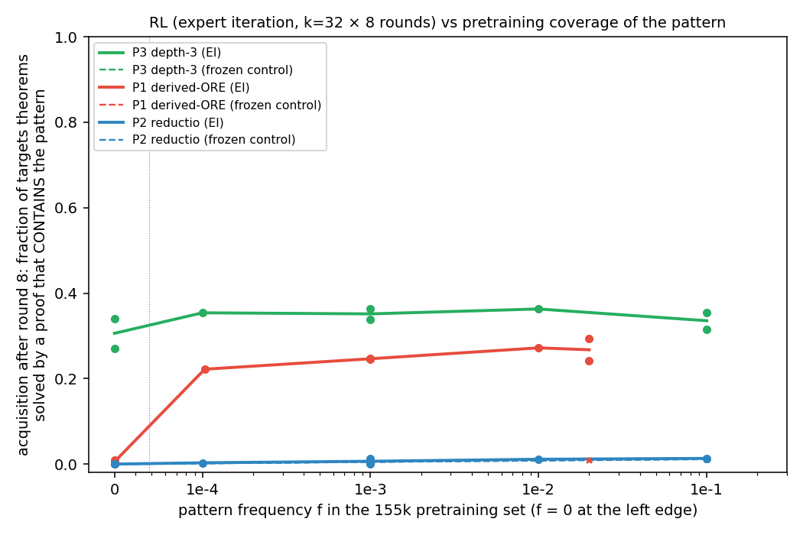
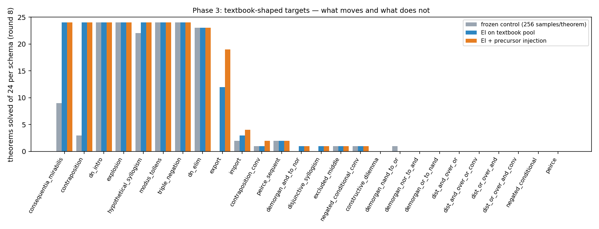

# Does RL create capabilities, or elicit rare ones? — campaign answer

**Both, and the measurements say which is which.** Expert iteration amplifies behaviour the pretrained model already assigns non-negligible
probability to, *and* it composes one kind of pattern pretraining never contained — a deeper nesting of a move it
already makes — but it does not invent unseen rule sequences, and it ignores patterns the reward never requires.

- **Phase 1.** Three quarters of the take-home's RL gain is elicitation: the frozen model solves 57% of the
  transfer set at the same 512-sample budget and 66% at 10⁴. The remaining quarter (348 of 1,411 RL-solved
  theorems) is unreachable by sampling at 10⁴; every 9-line RL proof has base probability below 10⁻³⁰. The
  log-probability estimate is calibrated against 10⁴ real samples. The novelty sits in one line: a third nested box.
- **Phase 2.** With **zero** depth-3 proofs in pretraining, RL solves 27–34% of depth-3 targets *with* depth-3 proofs,
  the same as at 10⁻³ or 10⁻¹ coverage; the frozen control and the base model (3·10⁶ samples) produce none, and every found
  proof is below 10⁻⁵ under the base. That is composition. Derived-ORE is pure amplification: ~0 at f = 0, 22%
  at f = 10⁻⁴, flat after. Reductio never moves because the targets do not need it.
- **Phase 3.** Textbook targets lift only schemata with a foothold; validation-36 `> 6` goes 0 → 1/24, or 2/24 with
  precursor injection, which buys the one theorem (export, p ≈ 10⁻⁸) that sampling cannot reach. De Morgan and
  distribution stay at 0.

**Rule of thumb:** RL crosses zero coverage when the missing pattern is a structural repetition of a learned move,
not when it is a new rule sequence or a shape with no short instances.

