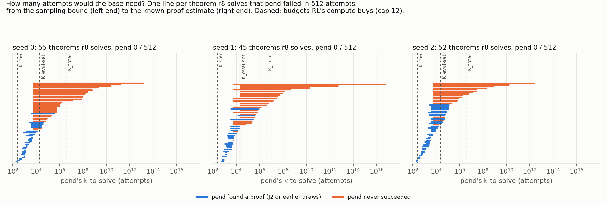
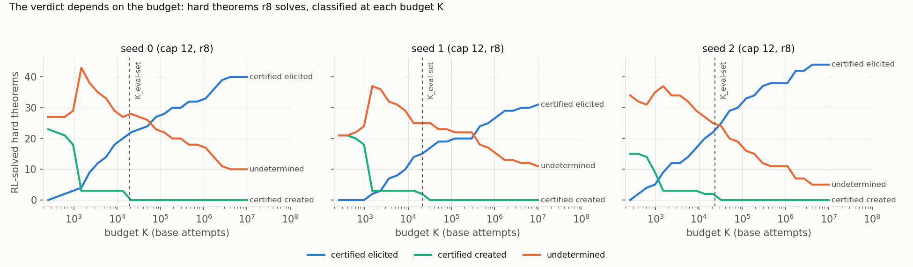
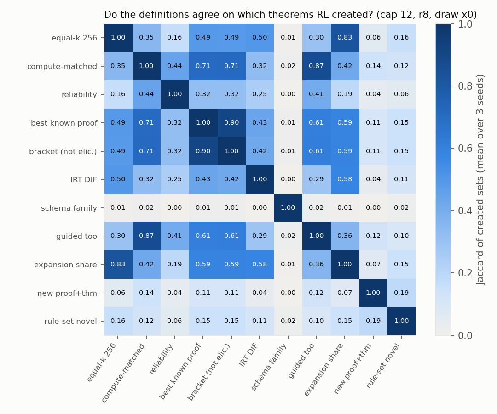
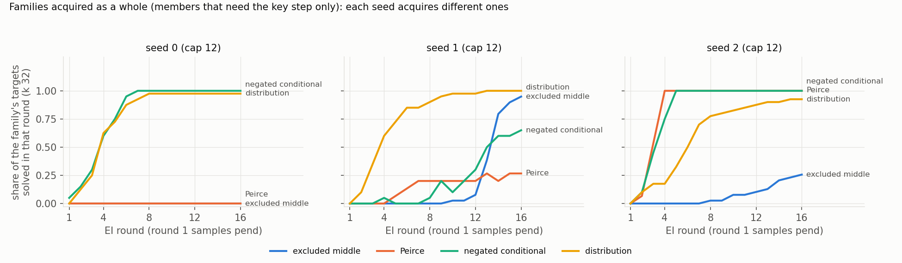

# What should "capability" mean for this project, and how do we measure it?

Run `capability-defs` (proposal 26), 2026-10-05, executor agent:claude. Pre-registration
`preregistration/capability-defs.md` (3e6f9865), plus a `log.md` entry before every pod job. Lean alone decides.

**Models.** Every number is on **best-cap12** unless labelled: `best_model.ALiBiGPT`, 6 × 384, 9,560,832 parameters,
`lean_staten`, from scratch on K12 (`data/kh/train_k12.jsonl`, 155,000 proofs; Stage 1 1,200 s on an A40). **pend** =
end of pretraining (`trajectory`); **r8 / r16** = after 8 / 16 rounds of expert iteration (EI; `trajectory`,
`rl-continue`); seeds s0–s2. **Cap 6** = the same recipe on the cap-6 set. **Theorems:** textbook72 (scoring only) +
holdout250 = 322, never trained on. **Reads:** plain sampling, T 0.8, 96 steps, 512 tokens per action, k 256 per draw
(x0, x1); guided reads are labelled.

## 1. The plain answer

**A capability is what a model can do at a stated cost.** For a theorem t, let p be the chance that one sampled
attempt ends in a Lean-accepted proof; 1 / p, the *k-to-solve*, is the expected number of attempts. Random weights have
p > 0 but need e^290 to e^3,200 attempts here, so every claim needs a budget K. We recommend **K_eval-set**: RL's GPU
time spent instead on base attempts over the evaluation theorems (≈ 2 × 10⁴ each). RL **created** t if RL solves t,
the base cannot within K, and training without RL proofs cannot either. Of the 51–60 theorems per seed that RL
"creates" at equal k, 14–22 survive the budget, 8–20 the replay-only control, 5–6 every seed's base; ⟨J9 short⟩.
Excluded middle, acquired by one seed's RL, is taught by 16 demonstrations even to a base pretrained without its key
step.

## 2. The catalogue

Twenty definitions, one card each in `capability_defs/cards/` (notation: `cards/_FRAME.md`): formal quantity,
decision rule (created / elicited / neither / undetermined), null, cost here, sensitivities, failure modes, relations,
literature anchors (`lit/REVIEW.md`: 185 papers screened, 57 read in depth) and **a critic's verdict**: one subagent per
card argued that the definition fails; its strongest argument and my answer are on the card. **Every critic landed a
failure I accepted** (pre-registered: at least a third). Six definitions are dropped as decision rules, two kept only
as descriptions, one folded into another; the rest were revised.

Status: **standard** = recommended (§4); **kept** = valid as revised; **descriptive** = a number, not a verdict;
**dropped** = fails as a decision rule. Families: S sampling, L likelihood, E elicitation, T transfer, R reliability,
P psychometric, C compute, D distribution, N null, M mechanistic, X intervention. Last column: created-set size at r8
(draw x0), s0 / s1 / s2 (§3.2).

| # | card | fam. | "RL created a capability on t" (after the critic) | status | r8 set |
|---|---|---|---|---|---|
| 1 | `passk-budget` (Dan's b) | S | RL solves t at k 256; the base is not within reach at K_eval-set (p̂ < 1 / K over ≥ K attempts); net of RL-free training | **standard** | 22 / 21 / 14 (net 20 / 14 / 8) |
| 2 | `marginal-bracket` | S L | the base's k-to-solve interval [1 / UB, 1 / estimate] lies above the budget (not certified elicited) | **standard**; the interval is the primary per-theorem output | 29 / 26 / 25 |
| 3 | `capability-vs-propensity` | E | no per-theorem method (more samples, guided redraws, renamings) reaches t within the budget | **standard** (reporting format) | 19 / 17 / 13 |
| 4 | `schema-acquisition` | T | a key-step family goes from base ≤ 0.05 to RL ≥ 0.5 on held-out members | **standard** | 0 / 2 / 0 members (r16: 0 / 11 / 0) |
| 5 | `elicit-finetune` | E | demonstrations teach the base no faster than a never-had-it knockout → *teachable*, not latent | kept (teachability test) | §3.6 |
| 6 | `tf-proof-prob` (Dan's a) | L | the base's *best known* proof has π < 1 / K and the base fails at k_eval | kept (RL's own proof only a "new route" tag) | 29 / 27 / 24 |
| 7 | `reliability` | R | p̂_R ≥ ½ and the base not within reach at K | kept (RL side of 1) | 12 / 9 / 5 |
| 8 | `irt-ability` | P | RL's DIF+ items exceed those of an ability-matched RL-free placebo | kept: **finds no RL excess** | 26 / 26 / 30 (unmatched) |
| 9 | `compute-equivalent` | C | RL solves t; a pretraining continuation with RL's GPU time does not (J7) | kept | 18 / 17 / 14 |
| 10 | `new-proof-new-theorem` | L S | 1, and every RL proof of t uses a rule set no base-accepted proof of any theorem uses | kept | 5 / 4 / 0 |
| 11 | `transfer-invariance` | T | the gain holds on held-out members and renamings | folded into 4 | — |
| 12 | `sharpen-expand` | D | RL's success mass sits on proofs the base would not reach (ρ ≥ ½), beyond the replay placebo | descriptive | 48 / 42 / 46 |
| 13 | `passk-equal-k` | S | base 0 / 256, RL ≥ 1 / 256 | descriptive ("group B") | 54 / 51 / 60 |
| 14 | `causal-ablation` | X | RL from a base pretrained without a *composition* acquires the family | redesigned, not run (≈ $26) | — |
| 15 | `chain-reachability` | S | t solved only after the ladder solved easier theorems | dropped; mechanism column | 14 / 14 / 10 |
| 16 | `out-of-data-novelty` | D | RL's proofs use a rule combination absent from pretraining | dropped; descriptive | 14 / 20 / 20 |
| 17 | `composition` | S | a step outside the base's support ("new move") vs new placement | dropped; bottleneck column | — |
| 18 | `kl-update-size` | D | RL's update is large or RL-specific | dropped (RL update ≈ replay update) | — |
| 19 | `bits-over-null` | N | RL's share of the bits over random init | dropped (≤ 5 % by construction) | — |
| 20 | `latent-probe-steer` | M | probes, steering, model diffing | dropped; not computed | — |

What the critics established:
- **"Created at k" is a fact about n.** 0 / 512 base attempts put k-to-solve above ≈ 170, while RL's budgets are
  10³–10⁶. Equal-k stays only as the descriptive "group B".
- **RL's own proof is the wrong object for likelihood**: it is often the base's proof plus a vacuous detour (35 of 120
  cases; §3.3, example 2). Decide on the base's *best known* proof and the sum over known proofs.
- **"Tied to RL's compute" is a menu of budgets** spanning 10⁴; the headline must be one set-level, compute-matched
  comparison.
- **Placebos must be matched** (IRT, §3.7); **templates are not schemata** (keep members that need the key step);
  **elicitation methods must be per theorem** (a fine-tune on other theorems' verdicts is RL by another name); **novelty
  tests cannot decide creation** (every rule RL uses occurs in ≥ 4 % of pretraining proofs).

## 3. Quantification on our models

### 3.0 Set-up

- **Existing artefacts:** plain reads of 22 checkpoints × 3 seeds × 2 draws at both caps; teacher-forced scores of
  references and RL's proofs; ladder logs; `rl-from-ckpt`'s ladders and replay-only controls.
- **Ten pod jobs** (NVIDIA A40, $0.49 / h), each pre-registered in `log.md` before launch:

  | job | what it did |
  |---|---|
  | J1 | teacher-forced scores under init / pend / r8 / r16 of every known accepted proof of the 322 theorems: 1.2–1.4 × 10⁵ proofs per seed at one name base, the top ≈ 4,500 per seed at all 33 |
  | J2 | 16,384 more pend attempts on every hard theorem; 65,536 where 16,384 found nothing; doubled-cap truncation check |
  | J3 | guided reads (step-checked redraws) of pend / r8 / r16, both caps |
  | J4, J6, J6b | excluded-middle demonstration fine-tunes of pend and of a knockout pretrained without double negation (DN) |
  | J5 | the missing plain draws (cap-12 r16 x0, cap-6 r16 holdout250) |
  | J7 | a pretraining continuation of pend matched to the r8 ladder's GPU time |
  | J8 | J1 scores under four earlier pretraining checkpoints (start dependence) |
  | J9 | certification sampling: ≈ 1.2–1.4 M more pend attempts on 3 theorems per seed |
  | J10 | 16,384 more pend attempts on the long-pool theorems RL solves and pend fails at 256 |

- **Budgets** (`cards/_FRAME.md`; base attempts cost 3.6 ms on an A40):
  - k_eval = 256;
  - **K_eval-set** = ladder GPU-seconds / (322 × 3.6 ms) = 19,281 / 21,107 / 23,310 at r8 (s0 / s1 / s2) and
    ≈ 4.8–5.0 × 10⁴ at r16: RL's compute spent instead on base attempts over the evaluation set;
  - K_per = 777 / 731 / 954 per training target and K_total = 3.3–4.3 × 10⁶ (both pre-registered with the ladder's own
    read cost, 6.3–7.5 ms per attempt; at 3.6 ms they would be 1.8–2.1× larger).
- **RL-free controls:** the **replay-only** ladder (`rl-from-ckpt`'s c⟨s⟩_pend_r8: the same 8 fine-tune rounds on
  pretraining replay, no RL proofs) and the **compute-matched continuation** (J7).
- **Hard theorems:** pend 0 / 512 on draws x0 + x1: 86 / 77 / 77 of the 322.

### 3.1 How far is the base from each theorem?

For every hard theorem RL solves, pend's k-to-solve gets an interval (F1; `cd_bracket.py`): from the **sampling bound**
(Clopper–Pearson over ≥ 16,896 base attempts, ≥ 66,048 where the first 16,384 found nothing) to the **known-proof
estimate** (pend's teacher-forced probability, T 0.8, summed over every accepted proof of t any model found).

**The known-proof estimate is accurate.** On 30 calibration theorems per seed (p measured from ≈ 4,900 attempts) it
recovers a median **0.98 / 0.94 / 0.93** of p (IQR within 0.85–1.02); over all 59–71 measured theorems per seed the
10th–90th percentiles are 0.16–1.34. It is not a strict lower bound (the scorer conditions on canonical names, the
sampler on its own, and the environment renames ≈ 14 % of them), so certificates take a factor-2 margin. One proof
carries a median 50–62 % of the sum, so Dan's "probability of a specific proof" is nearly the whole answer *if* it is
the base's best known proof. It costs one forward pass per proof instead of 1 / p samples, and reaches e^−39.

**Where the base sits.** For the 55 / 45 / 52 hard theorems r8 solves, the median estimated k-to-solve is 10^4.6 /
10^5.3 / 10^4.5 attempts (range 10^2.3–10^16.8): right at K_eval-set ≈ 10^4.3, so verdicts depend on the budget (F2).





| r8-solved hard theorems, verdict at K_eval-set | s0 | s1 | s2 |
|---|---|---|---|
| RL-solved hard theorems | 55 | 45 | 52 |
| elicited: sampling lower bound ≥ 1 / K | 17 | 17 | 21 |
| elicited: known-proof estimate ≥ 2 / K | 5 | 1 | 3 |
| base found it, but not certifiably within reach | 12 | 8 | 17 |
| not reached: 0 base successes in ≥ K attempts | 21 | 19 | 11 |
| undetermined (0 successes, fewer than K attempts) | 0 | 0 | 0 |
| certified created (UB95 < 0.05 / K) | 0 | 0 | 0 |

- At k 256 all 152 look "created". At K_eval-set, 64 are elicited and 51 **not reached** (0 base successes in
  ≥ 65,536 attempts); the base found the other 37 one to seven times, without a certificate either way.
- Certifying creation takes ≈ 60 K zero-success attempts: stage B's 66,000 certify only K ≤ 1,100; J9 paid for
  K_eval-set on nine theorems (§3.8).

### 3.2 What each definition calls "created", and how noisy that is

Cap 12, per seed (`cd_part3.py`, rendered by `cd_report_tables.py`). "Net" removes theorems the replay-only control
solves on the same draw. Redraw floor: Jaccard between the sets defined on the two sample draws. Seed floor: Jaccard
between seeds (s0–s1, s0–s2, s1–s2).

| definition (card) | r8, x0: s0 / s1 / s2 | net of replay-only | r16, x1 | redraw Jaccard (r8) | seed Jaccard (r8, pairs) |
|---|---|---|---|---|---|
| equal-k (`passk-equal-k`) | 54 / 51 / 60 | 37 / 27 / 33 | 61 / 65 / 61 | 0.78 / 0.70 / 0.68 | 0.35 / 0.39 / 0.34 |
| compute-matched (`passk-budget`) | 22 / 21 / 14 | 20 / 14 / 8 | 25 / 34 / 17 | 0.84 / 0.86 / 0.87 | 0.19 / 0.16 / 0.25 |
| … of which 0 base successes | 18 / 18 / 9 | 17 / 12 / 6 | 22 / 31 / 12 | 0.85 / 0.84 / 0.80 | 0.24 / 0.17 / 0.23 |
| cm, no seed's base ever solves t | 5 / 6 / 6 | 5 / 4 / 5 | 7 / 16 / 9 | 0.83 / 0.83 / 0.71 | 0.38 / 0.38 / 0.50 |
| cm, J7 continuation fails t (draw x0) | 0 / 0 / 0 | 0 / 0 / 0 | 0 / 0 / 0 | – / – / – | – / – / – |
| reliable (`reliability`) | 12 / 9 / 5 | 10 / 6 / 3 | 12 / 14 / 8 | 1.00 / 1.00 / 0.83 | 0.11 / 0.06 / 0.27 |
| best known proof < 1 / K (`tf-proof-prob`) | 29 / 27 / 24 | 23 / 16 / 17 | 31 / 39 / 26 | 0.88 / 0.89 / 0.84 | 0.22 / 0.20 / 0.31 |
| not certified elicited (`marginal-bracket`) | 29 / 26 / 25 | 24 / 17 / 17 | 32 / 38 / 23 | 0.88 / 0.89 / 0.85 | 0.28 / 0.26 / 0.31 |
| guided read fails too (`capability-vs-propensity`) | 19 / 17 / 13 | 17 / 12 / 8 | 23 / 30 / 16 | 0.82 / 0.83 / 0.86 | 0.12 / 0.14 / 0.20 |
| family members (`schema-acquisition`) | 12 / 6 / 11 | 12 / 6 / 5 | 20 / 9 / 12 | 0.60 / 0.50 / 0.82 | 0.20 / 0.10 / 0.00 |
| IRT DIF+ (`irt-ability`, unmatched) | 26 / 26 / 30 | 18 / 19 / 23 | 32 / 36 / 35 | 1.00 / 1.00 / 1.00 | 0.41 / 0.37 / 0.44 |
| expansion share ρ ≥ ½ (`sharpen-expand`) | 48 / 42 / 46 | 36 / 24 / 27 | 55 / 59 / 50 | 0.92 / 0.93 / 0.91 | 0.34 / 0.32 / 0.38 |
| new rule set + cm (`new-proof-new-theorem`) | 5 / 4 / 0 | 5 / 3 / 0 | 4 / 11 / 2 | 1.00 / 1.00 / 0.00 | 0.29 / 0.00 / 0.00 |
| chain depth ≥ 2 + cm (`chain-reachability`) | 14 / 14 / 10 | 12 / 8 / 5 | 14 / 23 / 12 | 0.88 / 0.93 / 1.00 | 0.17 / 0.14 / 0.26 |
| rule set not in K12 (`out-of-data-novelty`) | 14 / 20 / 20 | 8 / 9 / 11 | 14 / 29 / 23 | 0.81 / 0.85 / 0.82 | 0.62 / 0.55 / 0.60 |

Set level, `passk-budget`'s headline (coverage of the 322 at each model's budget):

| seed | base within reach at K_eval-set (r8 / r16 budget) | replay-only r8, k 256 | J7 continuation, k 256 | r8, k 256 | r16, k 256 | Δ_cov r8 / r16 |
|---|---|---|---|---|---|---|
| s0 | 265 / 267 | 239 | – | 286 | 291 | +21 / +24 |
| s1 | 270 / 271 | 244 | – | 286 | 303 | +16 / +32 |
| s2 | 281 / 281 | 249 | – | 293 | 295 | +12 / +14 |

- **Asking more of the base shrinks the sets.** Equal-k "creates" 54 / 51 / 60 at r8. With RL's GPU time spent on
  base attempts instead, 22 / 21 / 14 stay out of reach (18 / 18 / 9 with not one base success), 20 / 14 / 8 net of
  replay, and **5 / 6 / 6 were never solved by any seed's base**.
- **Set level, RL is ahead at matched compute on every seed:** r8 at 256 attempts solves 12–21 more of the 322 than
  the base reaches at K_eval-set (r16: 14–32). Neither RL-free control closes the gap (replay-only 239 / 244 / 249;
  compute-matched continuation 220 / 215 / 219).
- **Redraw floors are high** (0.80–1.00 budgeted; equal-k 0.68–0.78); **seed floors are low** (0.06–0.39): each seed's
  RL "creates" different theorems. The exceptions compare with something shared: rule-set novelty (0.55–0.62) and
  "no seed's base" (0.38–0.50). `la_transfer_2060` is in all three seeds' strictest sets, `la_transfer_1077` and
  `la_transfer_1648` in two.
- **Long pool** (`transfer_long2`, 21 theorems with long proofs; equal-k only): RL "creates" 13 / 15 / 16 at r8, but
  given 16,384 more attempts the base finds 29 of these 45 (64 %; J10), as often as on the main sets.
- **Cap 6** (weaker bases, no large-k base reads, so only unbudgeted definitions): equal-k 101 / 132 / 122 at r8;
  pend's guided read solves 38–44 % of them.

### 3.3 Do the definitions agree?



- Mean off-diagonal Jaccard 0.31 at r8 and 0.36 at r16 (pre-registered Q14: ≤ 0.4).
- Two clusters.
  - *Is the base out of reach?* compute-matched, bracket, best known proof, guided-too and chain depth agree at
    0.6–0.9. Guided-too is a subset of compute-matched: pend's guided read rescues only 3 / 4 / 1 of the 22 / 21 / 14
    theorems that sampling at K_eval-set cannot reach.
  - *Did RL's behaviour change?* equal-k, expansion share and IRT DIF agree at 0.5–0.8 with each other and at
    0.3–0.6 with the first cluster.
- Family-level and novelty definitions agree with nothing (≤ 0.2): they answer different questions.

**Where they disagree, in Lean** (`cd_examples.py`, `out/examples.md`).

1. **Equal-k says created; every budgeted definition says elicited.** `textbook_245a0349…` (s0),
   ⊢ ((P ∧ Q) → R) → (Q → (P → R)). pend 0 / 768 in the reads, r8 733 / 768. But pend finds it 10 times in 16,384
   more attempts; its known-proof estimate, e^−6.9 ≈ 1 / 1,000, is carried by r8's own shortest proof; the replay-only
   control solves it 78 / 512 and s2's pend 505 / 768. RL made a 1-in-1,000 proof reliable.

```lean
theorem t (P Q R S : Prop)  : (((P ∧ Q) → R) → (Q → (P → R))) := by
  have n8 : (((P ∧ Q) → R) → (Q → (P → R))) := (fun (n1 : ((P ∧ Q) → R)) => by
    have n7 : (Q → (P → R)) := (fun (n2 : Q) => by
      have n6 : (P → R) := (fun (n3 : P) => by
        have n4 : (P ∧ Q) := ⟨n3, n2⟩
        have n5 : R := n1 n4
        exact n5)
      exact n6)
    exact n7)
  exact n8

```

2. **RL's own proof says new; the base's best proof says old (padding).** `la_transfer_629` (s0). RL's eventual proof
   has log π_pend = −15.6, so "the base would never write RL's proof" fires. pend solves the theorem 545 / 768 with
   the 4-step proof; RL's proof is that proof wrapped in a vacuous `Or.elim` detour (term size 8 vs 4):

```lean
theorem t (P Q R S : Prop) (h1 : ((S → Q) → (P ∨ S))) : ((¬(P ∨ S)) → (¬(S → Q))) := by
  have n1 : ((S → Q) → (P ∨ S)) := h1
  have n11 : ((¬(P ∨ S)) → (¬(S → Q))) := (fun (n2 : (¬(P ∨ S))) => by
    have n3 : ((¬(S → Q)) ∨ (¬(P ∨ S))) := Or.inr n2
    have n10 : (¬(S → Q)) := Or.elim n3 (fun (n4 : (¬(S → Q))) => by
      exact n4) (fun (n5 : (¬(P ∨ S))) => by
      have n9 : (¬(S → Q)) := (fun (n6 : (S → Q)) => by
        have n7 : (P ∨ S) := n1 n6
        have n8 : False := n2 n7
        exact (n8 : False))
      exact n9)
    exact n10)
  exact n11

```

3. **Every budgeted definition and the family definition agree: created, on one seed.** `la_transfer_1453` (s1),
   ⊢ ((P ∧ R) ∧ (R ∧ S)) ∨ ¬((P ∧ R) ∧ (R ∧ S)). pend 0 / 66,560 (UB95 4.5 × 10⁻⁵), known-proof estimate e^−32.4
   (k-to-solve ≈ 10¹⁴); replay-only 0 / 512; s0 and s2's pend 0 / 768 each; r8 0 / 768, r16 435 / 512. It is an
   excluded-middle instance, so four demonstrations would teach it (§3.6):

```lean
theorem t (P Q R S : Prop)  : (((P ∧ R) ∧ (R ∧ S)) ∨ (¬((P ∧ R) ∧ (R ∧ S)))) := by
  have n8 : (¬(¬(((P ∧ R) ∧ (R ∧ S)) ∨ (¬((P ∧ R) ∧ (R ∧ S)))))) := (fun (n1 : (¬(((P ∧ R) ∧ (R ∧ S)) ∨ (¬((P ∧ R) ∧ (R ∧ S)))))) => by
    have n5 : (¬((P ∧ R) ∧ (R ∧ S))) := (fun (n2 : ((P ∧ R) ∧ (R ∧ S))) => by
      have n3 : (((P ∧ R) ∧ (R ∧ S)) ∨ (¬((P ∧ R) ∧ (R ∧ S)))) := Or.inl n2
      have n4 : False := n1 n3
      exact (n4 : False))
    have n6 : (((P ∧ R) ∧ (R ∧ S)) ∨ (¬((P ∧ R) ∧ (R ∧ S)))) := Or.inr n5
    have n7 : False := n1 n6
    exact (n7 : False))
  have n9 : (((P ∧ R) ∧ (R ∧ S)) ∨ (¬((P ∧ R) ∧ (R ∧ S)))) := Classical.byContradiction (fun hh => n8 hh)
  exact n9

```

4. **Created relative to the base, not relative to more pretraining.** `la_transfer_2060` (s0, and in the strictest
   set of all three seeds): ¬((S ∨ P) ∧ (R ∧ P)) ∧ ¬¬(Q → S) ⊢ ¬(((S ∨ P) ∧ (R ∧ P)) ∨ ¬(Q → S)). pend 0 / 66,304
   (known-proof estimate e^−18.2 over 1,803 known proofs), replay-only 0 / 512, r8 734 / 768, yet the compute-matched
   continuation J7 solves it 7 / 512. RL's proof (pend's most probable known proof is a longer detour, term size 13):

```lean
theorem t (P Q R S : Prop) (h1 : ((¬((S ∨ P) ∧ (R ∧ P))) ∧ (¬(¬(Q → S))))) : (¬(((S ∨ P) ∧ (R ∧ P)) ∨ (¬(Q → S)))) := by
  have n1 : ((¬((S ∨ P) ∧ (R ∧ P))) ∧ (¬(¬(Q → S)))) := h1
  have n2 : (¬((S ∨ P) ∧ (R ∧ P))) := n1.1
  have n10 : (¬(((S ∨ P) ∧ (R ∧ P)) ∨ (¬(Q → S)))) := (fun (n3 : (((S ∨ P) ∧ (R ∧ P)) ∨ (¬(Q → S)))) => by
    have n4 : (¬(¬(Q → S))) := n1.2
    have n9 : False := Or.elim n3 (fun (n5 : ((S ∨ P) ∧ (R ∧ P))) => by
      have n6 : False := n2 n5
      exact n6) (fun (n7 : (¬(Q → S))) => by
      have n8 : False := n4 n7
      exact n8)
    exact (n9 : False))
  exact n10

```

### 3.4 Threshold sensitivity

Created-set sizes (cap 12, r8, draw x0; s0 / s1 / s2) as each definition's threshold moves (`out/part3.txt`):

| definition | threshold | sizes |
|---|---|---|
| compute-matched | K = 0.1 / 0.3 / 1 / 3 × K_eval-set | 38 / 36 / 36 → 33 / 28 / 28 → **22 / 21 / 14** → 21 / 20 / – (s2: n < 3 K) |
| best known proof < 1 / K | same | 42 / 41 / 42 → 34 / 34 / 32 → **29 / 27 / 24** → 26 / 24 / 21 |
| bracket: not certified elicited | same | 43 / 40 / 37 → 36 / 34 / 32 → **29 / 26 / 25** → 25 / 23 / 19 |
| equal-k | base sample 256 / 512 / all reads (≥ 768) | **54 / 51 / 60** → 50 / 42 / 49 → 47 / 40 / 43 |
| reliable (within compute-matched) | p̂_R ≥ 0.1 / 0.25 / 0.5 / 0.75 | 13 / 14 / 11 → 12 / 11 / 8 → **12 / 9 / 5** → 9 / 6 / 5 |
| expansion share | ρ ≥ 0.25 / 0.5 / 0.75 / 0.9 | 50 / 42 / 48 → **48 / 42 / 46** → 44 / 39 / 40 → 37 / 38 / 36 |
| schema family | RL ≥ 0.3 / 0.5 / 0.7 (pend ≤ 0 / 0.05 / 0.1 changes nothing) | 12 / 6 / 11 → **12 / 6 / 11** → 10 / 3 / 9 |

- **The budget is the dominant free parameter.** A tenfold smaller budget makes the compute-matched set 1.7–2.6×
  larger. Above K_eval-set it hardly shrinks: what remains is far out of reach (known-proof estimates 10^−4.6 to
  10^−16.8, median ≈ 10^−6.3).
- **"Created at k" is a fact about n.** Giving the base 512 or ≥ 768 attempts instead of 256 removes 7–17 theorems
  from the equal-k set.
- Reliability and family thresholds matter less than the budget; expansion share barely moves.

### 3.5 Plain vs guided

Every proof-state model is read both ways (AGENT_POLICY): **plain** (a rejected action ends the attempt) and
**guided** (`--arm logical`: a step the logical checker rejects is redrawn, ≤ 10 times per attempt). Both at k 256,
T 0.8; solved counts per set, plain / guided (`cd_j3.py`, `out/j3.txt`). A guided attempt costs ≈ 1.8× the tokens
and 2.2× the GPU time of a plain one (`guided-tts`, same r8 checkpoints), so this is not compute-matched.

| model | textbook72 dev58: plain / guided | train14 | holdout250 | guided tokens per attempt |
|---|---|---|---|---|
| cap 12 s0 pend | 28 / 36 | 6 / 6 | 196 / 218 | 307 |
| cap 12 s0 r8 | 40 / 43 | 8 / 11 | 240 / 239 | 322 |
| cap 12 s0 r16 | 42 / 45 | 9 / 10 | 240 / 240 | 354 |
| cap 12 s1 pend | 27 / 33 | 6 / 10 | 205 / 223 | 343 |
| cap 12 s1 r8 | 38 / 41 | 10 / 11 | 236 / 237 | 324 |
| cap 12 s1 r16 | 45 / 45 | 12 / 11 | 246 / 247 | 354 |
| cap 12 s2 pend | 30 / 38 | 6 / 10 | 200 / 222 | 315 |
| cap 12 s2 r8 | 42 / 45 | 11 / 11 | 237 / 241 | 308 |
| cap 12 s2 r16 | 44 / 50 | 12 / 12 | 239 / 241 | 331 |
| cap 6 s0 pend | 14 / 24 | 4 / 5 | 153 / 183 | 249 |
| cap 6 s0 r8 | 35 / 38 | 8 / 10 | 225 / 226 | 353 |
| cap 6 s0 r16 | 37 / 40 | 8 / 11 | 232 / 233 | 415 |
| cap 6 s1 pend | 15 / 19 | 3 / 4 | 126 / 165 | 334 |
| cap 6 s1 r8 | 38 / 39 | 5 / 8 | 226 / 230 | 335 |
| cap 6 s1 r16 | 36 / 38 | 5 / 8 | 233 / 235 | 327 |
| cap 6 s2 pend | 11 / 21 | 4 / 6 | 128 / 175 | 276 |
| cap 6 s2 r8 | 32 / 37 | 7 / 8 | 221 / 229 | 408 |
| cap 6 s2 r16 | 34 / 38 | 6 / 10 | 232 / 236 | 367 |

- **Guided reading helps the base far more than RL**: +18 to +22 holdout250 theorems for cap-12 pend, −1 to +4 for r8 /
  r16 (cap 6: +30 / +39 / +47 for pend). The holdout250 gap between r8 and pend shrinks from 44 / 31 / 37 (plain) to
  21 / 14 / 19 (guided).
- **Q13:** pend's guided read solves 50 / 55 / 60 % of the equal-k set (cap 6: 40 / 38 / 44 %). Much of RL's plain gain
  is propensity: the base can already reach those theorems when its wrong steps are caught.
- **But not where it matters for creation:** within the compute-matched set the guided read rescues only 3 / 4 / 1
  theorems (§3.3). Theorems that 2 × 10⁴ plain attempts cannot reach are not reached by step checking either.

### 3.6 Families: excluded middle and the classical schemata

Families are the generator schemata of `rl_targets` and transfer; classical families keep only members that need
the classical step (not G4ip-provable). Two reads (`cd_schema.py --keystep`, `cd_part3.py`; F4): *training shares*
(per EI round, the share of the 40 trained-on members solved in 32 attempts; round 1 samples pend) and *the card's
rule at the budget* (holdout250 key-step members, 2–6 per family; the base reaches a member if p̂ ≥ 1 / K_eval-set).

| family (key-step members) | pend round 1 (s0 / s1 / s2) | r16 training share | held-out at budget: base reaches / r16 solves | verdict at budget |
|---|---|---|---|---|
| excluded middle A ∨ ¬A | 0.00 / 0.00 / 0.00 | 0.00 / **0.95** / 0.26 | 0 / 0, **0 / 6**, 0 / 1 of 6 | created on s1 only |
| Peirce ((A → B) → A) → A | 0.00 / 0.00 / 0.00 | 0.00 / 0.27 / **1.00** | 0 / 0, 0 / 1, 1 / 2 of 2 | s1 borderline; **s2 elicited** |
| Peirce, sequent form | 0.00 / 0.00 / 0.05 | 0.30 / 0.05 / **1.00** | 1 / 2, 0 / 2, **3 / 3** of 3 | s1 created; s0, s2 elicited |
| negated conditional, classical members | 0.05 / 0.00 / 0.00 | 1.00 / 0.65 / 1.00 | 5 / 5, 3 / 5, 5 / 5 of 5 | **elicited** on 3 / 3 |
| distribution ∧ over ∨ (intuitionistic) | 0.00 / 0.00 / 0.00 | 0.97 / 1.00 / 0.93 | 2 / 3, 2 / 3, 2 / 2 of 3 | **elicited** on 3 / 3 |
| De Morgan ¬(A ∧ B) ⊢ ¬A ∨ ¬B, classical members | 0.00 / 0.00 / 0.00 | 0.00 / 0.00 / 0.00 | 0 / 0 of 1 | never acquired |

Cap-6 r16 training shares: excluded middle and Peirce 0.00 on every seed; negated conditional 0.10 / 0.10 / 0.05;
distribution 0.93 / 0.50 / 0.97.



- **Read at 32 attempts, each seed acquires different families** (excluded middle on s1, bursting at rounds 13–14;
  both Peirce families on s2). **Read at the budget, most of this is elicitation**: the base reaches the held-out
  members of the negated-conditional and distribution families, and of s2's Peirce families, within K_eval-set.
- **What survives is s1's classical step**: excluded middle (base 0 of 6 held-out members in 66,560 attempts each; r16
  6 of 6, and 36 of the 39 classical-only transfer instances) and, on two or three members each, the Peirce families.
  The strongest evidence here that RL *can* produce a family-level capability its base lacks, on one seed in three.

**Latent or teachable?** (J4, J6, J6b; 39 classical-only held-out A ∨ ¬A instances, k 256, plain reads.)

| model (cap 12) | s0 | s1 | s2 |
|---|---|---|---|
| pend | 0 | 0 | 0 |
| pend + replay-only fine-tune (A0) | 0 | 0 | 0 |
| pend + 16 non-LEM proofs (C16) | 0 | 0 | 0 |
| **pend + 4 LEM proofs (A4)** | **36** (0.66) | **33** (0.35) | **36** (0.64) |
| **pend + 16 LEM proofs (A16)** | **37** (0.79) | **34** (0.68) | **37** (0.83) |
| RL r16 | 0 | 36 (0.70) | 13 (0.13) |
| no-DN knockout (pretrained without any DN step) | 0 | 0 | 0 |
| knockout + 16 LEM proofs, K12 replay (J6) | 35 (0.71) | 37 (0.72) | 37 (0.70) |
| pend + 16 LEM proofs, DN-free replay (J6b, 2 fine-tune seeds) | 36, 36 | 36, 35 | 35, 36 |
| knockout + 16 LEM proofs, DN-free replay (J6b) | 34, 34 | 36, 36 | 36, 36 |
| either model + 16 matched non-LEM proofs, DN-free replay (J6b) | 0 | 0 | 0 |

Cells: solved of 39 (mean pass@1). LEM = law of excluded middle; the demonstrations are s1's RL proofs of *other*
instances. Fine-tunes are one ladder-style round (600 steps, 128 proofs per step).

- Four demonstrations install the schema in every seed's base, including s0, whose own RL never found it.
- A model pretrained without a single DN step learns it as fast: the pre-registered J6b test (gain over matched
  controls, pend vs knockout; latent if ≥ 0.3 apart on ≥ 2 / 3 seeds) gives +0.05 / −0.01 / −0.01: **teachable, not
  latent**.

**What RL "created" is the discovery of an instance, not a hard-to-learn ability.** Once one proof exists, the pattern
is cheap to teach.

### 3.7 Is RL "more of the same"?

Four set-level tests of whether RL is "more training of the same kind".

**IRT at matched ability** (`cd_irt_matched.py`, `out/irt_matched.txt`). A 2PL model calibrated on the pretraining
checkpoints puts every model on one ability scale θ. An item is "created" if the model solves it far above what its θ
predicts (DIF+, log-odds residual > ln 10) while the start checkpoint failed it in 512 attempts. Rate = created per
start-failed item the model solves.

| calibrated through p5000 (s0 / s1 / s2) | Δθ | created | rate |
|---|---|---|---|
| pretraining continuation to pend (no RL) | +0.65 / +0.41 / +1.14 | 47 / 60 / 54 | 1.31 / 1.22 / 0.86 |
| replay-only ladder r8 (no RL) | +2.12 / +2.09 / +2.14 | 50 / 49 / 54 | 1.04 / 0.80 / 0.73 |
| EI r2 | +2.33 / +2.05 / +2.69 | 48 / 41 / 48 | 0.86 / 0.72 / 0.62 |
| EI r8 | +4.37 / +4.53 / +5.14 | 60 / 54 / 51 | 0.65 / 0.55 / 0.40 |

At matched Δθ, EI "creates" no more than RL-free training (calibrated through p12000 the same holds: EI r2 37 / 46 /
46 vs replay 33 / 47 / 48). The original contrast, 26–30 for r8 against 4–7 for the replay-only placebo, compared
Δθ ≈ 2.1 with Δθ ≈ 0.6.

**Update size** (`cd_update.py`, s0; relative Frobenius norm of the weight change, summed over 26 matrices). RL r8
0.28; replay-only r8 0.30; late pretraining (step 20,000 → pend) 0.81; the gap between two seeds' bases 1.43. The RL
and replay-only updates have cosine 0.45; the RL-specific part (r8 minus replay-only) has norm 0.30. RL moves the
weights less than the last stretch of pretraining did.

**A compute-matched pretraining continuation (J7).** pend trained further on K12 (same recipe, learning rate re-warmed
to 3 × 10⁻⁴ and decayed) for 28,054 / 31,462 / 33,535 steps. A probe sized this to the r8 ladder's GPU time; the run
was faster than the probe, so it used 60,863 of the ladders' 73,838 A40-seconds (82 %). Read like RL (k 256, x0):

| seed | pend | J7 continuation | r8 | J7 solves of B (equal-k) | of the compute-matched set | θ (pend ≈ 0) |
|---|---|---|---|---|---|---|
| s0 | 232 | 220 | 286 | 19 / 54 | 4 / 22 | +0.51 (r8 +2.10) |
| s1 | 236 | 215 | 286 | 18 / 51 | 4 / 21 | +0.58 (r8 +1.91) |
| s2 | 234 | 219 | 293 | 16 / 60 | 0 / 14 | +0.58 (r8 +2.18) |

- **More pretraining on the same data is a lateral move**: it gains 12–19 theorems pend misses and loses 30–42. Its
  ability gain matches the replay-only control's (θ +0.55 / +0.70 / +0.64), a quarter of RL's.
- pend had already seen each K12 proof ≈ 20 times. In this regime compute without new data buys little; RL's gain
  comes from new data, its own verified proofs.

**Start dependence (J8).** `rl-from-ckpt`'s ladders started from earlier pretraining checkpoints. For each start, the
theorems its r8 solves that the start failed in 512 attempts, scored by the start's own known-proof estimate
(`cd_j8.py`, `out/j8.txt`; s0 / s1 / s2):

| start | new solves | elicited at K_total | replay-only from the same start also solves | net of it |
|---|---|---|---|---|
| step 1,600 | 182 / 157 / 167 | 21 / 33 / 25 % | 83 / 84 / 83 % | 31 / 25 / 29 |
| step 5,000 | 117 / 123 / 149 | 29 / 24 / 22 % | 63 / 62 / 69 % | 43 / 47 / 46 |
| step 12,000 | 86 / 109 / 106 | 41 / 34 / 34 % | 66 / 72 / 73 % | 29 / 30 / 29 |
| step 16,000 | 76 / 48 / 90 | 32 / 42 / 34 % | 53 / 56 / 61 % | 36 / 21 / 35 |
| pend (§3.1) | 55 / 45 / 52 | 76 / 71 / 85 % | 29 / 40 / 46 % | 39 / 27 / 28 |

From an earlier start, RL's new solves sit further outside the start's reach, but most of them are what any further
training on pretraining data brings. What remains net of replay is 21–47 theorems at every start, and it is mostly
*not* certified elicited even at K_total (0–24 %).

### 3.8 Certifying a few theorems (J9)

The cheap label "not reached" (0 base successes in ≥ K attempts) is not a certificate: certifying that the base's
chance of solving t within K attempts is below 5 % (one-sided 95 %) takes ≈ 60 K zero-success attempts. J9 paid for
it on the theorems a creation headline would rest on: per seed, the three most reliable r8 solves (pass@1) among the
strictest set (compute-matched, no seed's base ever solved it, replay-only control fails it). Each got 1.2–1.4 M more
pend attempts (9 / 10 / 11 chunks of 131,072 for s0 / s1 / s2), on top of the 66,000 it already had.

⟨S38 TABLE⟩

⟨S38 TEXT⟩

### 3.9 Pre-registered expectations vs outcomes

Scored against `preregistration/capability-defs.md` (L1–L3, Q1–Q16) and the per-job entries in `log.md`. "Hit" means
inside the pre-registered range on every seed unless counted.

| item | pre-registered | outcome | |
|---|---|---|---|
| L1 | ≥ 60 new papers screened, ≥ 20 in depth; ≥ 90 % of cited claims verified; ≤ 2 errors in ≥ 30 re-checked | 185 screened, 57 in depth; 32 / 32 re-checked claims correct | hit |
| L2 | no surveyed definition separates creation from elicitation without a budget or a reference model | none found (`lit/REVIEW.md`) | hit |
| L3 | critics break ≥ 1 / 3 of the cards | 20 / 20 | hit |
| Q1 | equal-k set 45–70 (r8), 55–85 (r16); redraw Jaccard 0.45–0.80 | 54 / 51 / 60; 61 / 65 / 61; 0.68–0.78 | hit |
| Q2 | 60–95 % of J2 theorems get ≥ 1 base success in 16,384 | 47 % / 37 % / 62 % | 1 / 3 |
| Q3 | known-proof estimate certifies 40–85 % of B elicited at K_total; 0 certifiable created there | 76 % / 71 % / 85 %; 0 | hit |
| Q4 | ≤ 25 % of B certified elicited at K_per by the estimate alone | 4 % / 0 % / 8 % | hit |
| Q5 | median log Σ_F π − max log π ≥ 1 nat | 0.33 / 0.45 / 0.44 | miss |
| Q6 | "new proof, old theorem" ≥ 20 % of B | 41 % / 29 % / 37 % | hit |
| Q7 | RL's share of the bits over the null < 2 % for ≥ 95 % of B | median 1.4 / 1.2 / 1.0 %; 81–88 % of B below 2 % | miss |
| Q8 | IRT: pretraining model ranks r8's successes at Spearman ≥ 0.7; r8 above every pretraining checkpoint; ≥ 3 of 6 LEM items in s1 r16's top residual decile | 0.57 / 0.59 / 0.56; yes on 3 / 3; 5 of 6 | a miss; b, c hit |
| Q9 | "p_pend < 0.05, p_r8 ≥ 0.5" is 1.2–2.5× the equal-k set | 1.31 / 1.22 / 1.00× | 2 / 3 |
| Q10 | excluded middle: s1 r16 ≥ 0.5; s0 ≤ 0.1; pend ≤ 0.05 | 36 / 39 solved (0.70); 0; 0 | hit |
| Q11 | 16 LEM demonstrations: held-out pass@256 ≥ 0.5 on ≥ 1 seed; control ≤ 0.1 | 37 / 34 / 37 of 39; control 0 | hit (3 / 3) |
| Q12 | pretraining-length equivalent of r8's ability 3–30× | 6.2 / 4.7 / 7.1× | hit (descriptive only) |
| Q13 | guided pend reads solve ≥ 10 % of B (cap 12; J3c6: also cap 6) | 50 / 55 / 60 %; cap 6 40 / 38 / 44 % | hit |
| Q14 | mean pairwise Jaccard ≤ 0.4; least-agreeing pair includes the K_total bracket | 0.31 (r8), 0.36 (r16); least-agreeing pairs involve the tiny new-rule-set set (K_total bracket dropped as a creation budget) | first hit; second miss |
| Q15 | known-proof estimate / p̂ median 0.3–1.0 on calibration theorems | 0.98 / 0.94 / 0.93 | hit |
| Q16 | beta-binomial from 256 attempts predicts solves at 10⁴ within ±25 %; zero-inflated at least as well | BB −0 % / +13 % / −7 %; ZIBB −32 % / −23 % / −33 % | BB hit; ZIBB miss |
| J1 stage 2 | replay failures < 1 %; Q15; Q5 expected to miss | 0 failures; Q15 hit; Q5 miss | hit |
| J2 A′ | ≤ 20 % of the hard theorems no RL model solves get a base success | 0 / 29, 1 / 18, 0 / 22 | hit |
| J2 B | ≥ 50 % of stage-A zeros stay at 0 / 65,536 | 23 / 30, 31 / 37, 14 / 21 (77 / 84 / 67 %) | hit |
| J2 truncation | ≤ 1 doubled-cap re-read gets a success | 1 of 6 (`textbook_6997656e…`, 2 / 16,384; 0 at standard caps) | hit |
| J4 | A0 ≤ 0.1; A16's holdout250 solved@64 within ±3 % of A0's | A0 0; +12 / +15 / +5 theorems | A0 hit; ±3 % miss on 2 / 3 |
| J5 | r16 redraw Jaccard 0.6–0.8; cap-6 r16 ≥ r8 on holdout250 | 0.78 / 0.78 / 0.68; 232 vs 225, 233 vs 226, 232 vs 221 | hit |
| J6 | (i) knockout greedy 0.05–0.15 below pend; (ii) knockout 0 / 40 LEM; (iii) holdout250 0.85–0.97× pend; (iv) pend+A16 vs knockout+A16 within 0.2 | (i) 0.06 / 0.09 / 0.10; (ii) 1 / 0 / 1 of 40, the one being the intuitionistic member (0 / 39 classical-only); (iii) 0.88 / 0.80 / 0.85×; (iv) 0.05 / 0.08 / 0.00 | (i) hit; (ii) miss on 2 / 3 (technical); (iii) 2 / 3; (iv) hit, but its replay re-taught DN (→ J6b) |
| J6b | pend's gain − knockout's gain within 0.2 (teachable) | +0.05 / −0.01 / −0.01 | hit |
| J7 | (i) θ between pend + 0.5 and r8; (ii) solves 30–70 % of B; (iii) solves fewer of the 322 than r8 | (i) +0.53 / +0.65 / +0.49 over pend; (ii) 35 / 35 / 27 %; (iii) 220 / 215 / 219 vs 286 / 286 / 293 | (i) 2 / 3; (ii) 2 / 3; (iii) hit |
| J8 | elicited share at K_total falls monotonically from pend to p1600; ≥ 50 % for pend, ≤ 25 % for p1600 | pend 76 / 71 / 85 %; p1600 21 / 33 / 25.1 %; not monotone on any seed | monotone miss; pend hit; p1600 1 / 3 |
| J9 | ≥ 6 of 9 theorems stay at 0 successes | ⟨⟩ | ⟨⟩ |
| J10 | ≤ 40 % of the 45 long-pool pairs get a base success in 16,384 | 29 / 45 (64 %) | miss |

### 3.10 Compute

⟨S310⟩

## 4. Recommendation

Three definitions as the project standard, used together, plus one diagnostic. All use Lean as the only judge and
three training seeds, and report per-seed sets with the redraw and seed floors beside them.

**A. Compute-matched reach, with each theorem's k-to-solve interval** (`passk-budget` + `marginal-bracket`: Dan's (b)
made strict, with his (a) as the estimator).
- *Protocol:*
  1. RL model: plain reads (T 0.8, 96 steps, 512 tokens per action), k 256 on two sample seeds. "Solves" = ≥ 1
     Lean-accepted proof on the defining draw; the other draw gives the redraw floor.
  2. Base: the same protocol, 512 attempts per evaluation theorem. On every theorem RL solves and the base fails, add
     attempts until n ≥ K_eval-set = (ladder GPU-seconds) / (N_eval × measured seconds per base attempt). Here: 16,384,
     then 49,152 more where the first 16,384 found nothing.
  3. Known-proof estimate: teacher-force the base (T 0.8) on every accepted proof of t that any model found, including
     the base's own large-k proofs; 33 name bases for each checkpoint's top 20 proofs per theorem, the one-base bound
     (−ln 33) for the rest.
  4. Per theorem, print the **k-to-solve interval** [1 / UB95, 1 / estimate]. Verdict at K: **elicited** if p̂ ≥ 1 / K or
     the estimate is ≥ 2 / K; **not reached** if 0 successes in ≥ K attempts; **created (certified)** only if
     UB95 < 0.05 / K (≈ 60 K zero-success attempts, bought for headline theorems only); otherwise undetermined.
  5. Set level (the headline): Δ_cov = #{RL solves at 256} − #{base within reach at K_eval-set}, and the candidate
     created set **net of both RL-free controls** (the replay-only ladder; a pretraining continuation matched to the
     ladder's GPU time) and of other seeds' bases.
- *What counts as created:* a non-empty net set on ≥ 2 / 3 seeds, larger than the redraw floor, with its theorems
  certified if a headline rests on them.
- *Cost here:* ≈ 4.3 A40-hours per seed (J1 0.7, J2 3.6), ≈ 60 % of the r8 ladder's GPU time; most of it is the
  49,152 extra attempts on stage-A zeros, which only matter for theorems near the budget.
- *What existing results show:* RL is ahead at matched compute on every seed. r8 at 256 attempts solves 12–21 more of
  the 322 theorems than the base reaches with K_eval-set attempts each (r16: 14–32), and neither RL-free control
  closes the gap. Per theorem, the 51–60 equal-k "creations" per seed shrink to 14–22 outside the base's reach, 8–20
  net of replay, and 5–6 that no seed's base ever solved; ⟨J9 found⟩. The creation sets of different seeds overlap
  little (Jaccard 0.16–0.25), but `la_transfer_2060` is in all three.

**B. Capability vs propensity** (`capability-vs-propensity`: the reporting format for every evaluation).
- *Protocol:* per model and theorem set, two numbers:
  - **propensity** = plain pass@1 (mean over theorems, k 256 reads);
  - **capability** = solved within the budget by the best *per-theorem* method: plain sampling up to K_eval-set, and
    guided reads (`guided_eval.py --arm logical`, k 256, T 0.8, max_rej 10).
  Nothing trained on verifier verdicts for other theorems counts as a per-theorem method.
- *What counts as created:* RL raises capability, not just propensity. Where it raises only propensity, it "converted
  capability into propensity" (elicited).
- *What existing results show:* much of RL's plain gain is propensity. pend's guided read solves half of the equal-k
  set (50 / 55 / 60 %) and halves the holdout250 gap to r8 (44 / 31 / 37 → 21 / 14 / 19). But it rescues only 1–4 of
  the theorems that compute-matched sampling cannot reach.

**C. Key-step family acquisition, with a teachability test** (`schema-acquisition` + `elicit-finetune`).
- *Protocol:*
  - A family is a generator schema restricted to members that need its key step (classical families: members not
    provable by the G4ip decision procedure, `intuit.py`). Rates on held-out members: base within the budget, RL at
    k 256.
  - **Created at family level:** base ≤ 0.05 and RL ≥ 0.5 on held-out key-step members, on the seed in question; a
    recipe-level claim needs ≥ 2 / 3 seeds.
  - **Teachability:** fine-tune the base and a knockout pretrained without the key step on 16 demonstrations (control:
    16 length-matched non-family proofs; replay drawn from the knockout's corpus; two fine-tune seeds). **Latent** if
    the base's gain exceeds the knockout's by ≥ 0.3 (held-out pass@256) on ≥ 2 / 3 seeds; **teachable** if within 0.2.
- *What existing results show:* excluded middle (s1 only) and Peirce (s2 only) are created at family level on single
  seeds; the classical members of the negated-conditional family and the intuitionistic distribution family on all
  three. Excluded middle is **teachable, not latent**: 16 demonstrations lift held-out pass@256 by 0.87–0.92 in the
  base and in a knockout pretrained without double negation alike (differences +0.05 / −0.01 / −0.01), and 4
  demonstrations already give 33–36 of 39.

**D. Diagnostic: IRT ability with an ability-matched placebo** (`irt-ability`, with `compute-equivalent`).
- *Protocol:* fit a 2PL item-response model on the pretraining checkpoints (calibration through a fixed checkpoint),
  place RL and RL-free models on the same θ scale, and count items with DIF+ (success far above what θ predicts). RL is
  "off the pretraining axis" only if its DIF+ rate exceeds that of RL-free models at the same Δθ.
- *What existing results show:* RL moves the model much further along the pretraining ability axis than RL-free
  training of the same compute (Δθ ≈ 2.1 for r8 against 0.55–0.70 for replay-only and 0.51–0.58 for the
  continuation), but at matched Δθ its item-level gains are no larger than theirs (from p5000: EI r2 48 / 41 / 48
  DIF+ items at Δθ 2.0–2.7, replay-only 50 / 49 / 54 at Δθ ≈ 2.1). RL is "more of the same", obtained far more
  efficiently.

**Dan's two notions, as we recommend using them.**
- **(a) Teacher-forced probability.** Use it as an *estimator* of the base's p, summed over every known accepted proof,
  never on RL's own proof alone (padding). It recovers 0.93–0.98 of the measured p (median), so it extends sampling
  to probabilities far below 1 / n cheaply: one forward pass per proof instead of 1 / p samples.
- **(b) pass@k at large k.** Replace "large k" by K_eval-set and report k-to-solve intervals. Extrapolate only at the set
  level: a beta-binomial fitted to ≈ 768 attempts per theorem predicted the number of hard theorems the base solves in
  16,384 attempts within 0–13 % on every seed (§3.9, Q16); per theorem, no unbiased estimate exists beyond the n
  sampled.

## 5. Glossary

- **Attempt.** One sampled proof, run to the end in the proof-state environment (T 0.8, the read caps). Lean decides.
- **Solve probability p.** The chance that one attempt proves t. Every other number here is a view of it.
- **pass@k.** The chance of at least one proof in k attempts: 1 − (1 − p)^k.
- **k-to-solve.** 1 / p, the expected attempts to the first proof.
- **Budget K.** Attempts allowed before saying "cannot". **K_eval-set** (the headline): RL's GPU time spent instead on
  base attempts over the 322 evaluation theorems, ≈ 2 × 10⁴ each at r8. K_per: per training target (≈ 10³). K_total:
  all RL compute on one theorem (3–4 × 10⁶).
- **Within reach at K.** p ≥ 1 / K: at least a 63 % chance of a proof in K attempts.
- **pend; r8 / r16.** The model at the end of pretraining; after 8 / 16 rounds of expert iteration (sample, keep what
  Lean accepts, fine-tune).
- **Hard theorem.** One the base failed in 512 attempts.
- **Replay-only control.** RL's 8 fine-tune rounds on pretraining data only: no RL proofs, no verifier.
- **Compute-matched continuation (J7).** The base pretrained further for about as long as the r8 ladder ran.
- **Created (at K).** RL solves t; the base is not within reach at K; RL-free training does not solve t. *Not reached:*
  0 base successes in ≥ K attempts. *Certified:* 0 in ≈ 60 K attempts (base's chance within K below 5 %, 95 %
  confidence).
- **Elicited.** RL solves t and the base is within reach. RL made a reachable thing reliable.
- **Propensity vs capability.** What the model does by default (plain pass@1) vs what it can do with the best
  per-theorem method within a budget (more samples, step-checked redraws, renamings).
- **Known-proof estimate.** The base's teacher-forced probability, summed over every accepted proof of t that any model
  found. It recovers 0.93–0.98 of the measured p, so it estimates p; certificates use a factor-2 margin.
- **Key-step family.** Theorems sharing a proof pattern (e.g. all A ∨ ¬A), keeping only members that need the
  pattern's key step.
- **Teachable vs latent.** *Teachable*: a few demonstrations install the skill, even in a model pretrained without its
  key step. *Latent*: the base learns it markedly faster than that knockout.
- **IRT ability θ.** One score per model, fitted jointly with a difficulty per theorem.
- **Noise floors.** *Redraw:* the same model sampled again. *Seed:* another training run of the recipe.
- **Null.** Random initialisation: e^290 to e^3,200 attempts per proof here.

## 6. Open questions for Dan (each with my recommendation)

1. **Which budget defines "the base cannot"?** Options: k_eval (256, the field's equal-k test); 1 % of pretraining
   compute per theorem (the safety-evaluation convention, ≈ 3 × 10³ attempts here); **K_eval-set** (≈ 2 × 10⁴ at r8,
   5 × 10⁴ at r16); K_total (≈ 4 × 10⁶). *Recommendation:* K_eval-set for verdicts, with every theorem's k-to-solve
   interval printed so a reader can apply another budget; never k_eval.
2. **Is the replay pretraining inside our RL part of "RL"?** Each EI round also trains on 20,000 pretraining records
   (≈ 476 M tokens over 8 rounds); the replay-only control solves a third to a half of what equal-k calls created.
   *Recommendation:* report RL net of the replay-only control and of a compute-matched continuation, so that "RL" means
   what the verifier signal added.
3. **Created relative to this seed's base, or to the recipe?** The bases differ: `textbook_245a0349` is 0 / 768 for
   s0's pend and 505 / 768 for s2's. *Recommendation:* per-seed verdicts for mechanisms; a headline "RL creates X"
   requires that no seed's base reaches X within the budget.
4. **A theorem or a family?** *Recommendation:* key-step families for creation headlines. Theorem-level sets agree
   across seeds only at Jaccard 0.16–0.39.
5. **What counts as an elicitation method?** *Recommendation:* per-theorem methods only (more samples, any temperature,
   guided redraws, prior-only search, renamings). Learning from verifier verdicts on *other* theorems is RL's own
   mechanism: study it as teachability, not as the base's capability.
6. **If four demonstrations install a schema, was it latent?** *Recommendation:* call it **teachable**, and reserve
   **latent** for a base that learns markedly faster than a model pretrained without the key step (here it does not:
   +0.05 / −0.01 / −0.01).
7. **How much certification to pay for?** ≈ 60 K zero-success attempts per theorem: ⟨J9 cost per theorem⟩ at
   K_eval-set. *Recommendation:* label the cheap verdict "not reached within budget" and certify only the theorems a
   headline rests on (J9: 9 theorems for ⟨J9 cost⟩).
8. **The next experiment for "can RL create?"** *Recommendation:* ablate a *composition* (DN applied to a
   negation-introduction line, 16,703 records), not a primitive; pretrain three seeds without it, run 16 EI rounds, and
   read the key-step excluded-middle family on held-out members (≈ $26), before moving to a richer domain.
9. **Reporting standard.** *Recommendation:* every RL result reports propensity (plain pass@1), capability within the
   budget (best per-theorem method), and the compute-matched reach table net of RL-free controls; equal-k stays a
   descriptive label.
