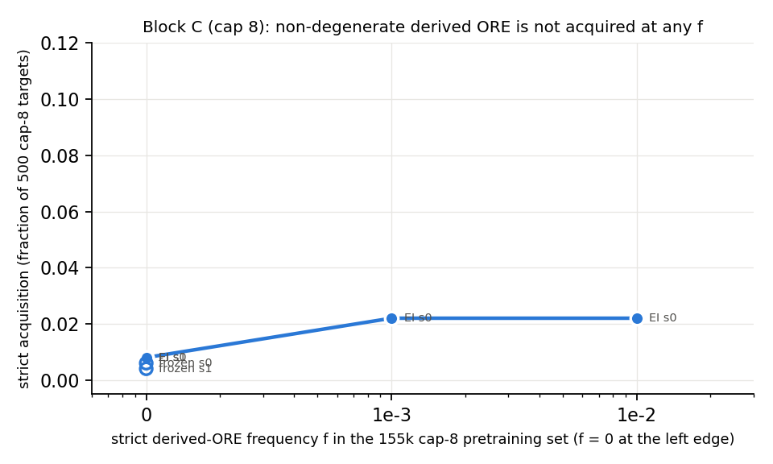

# Follow-up: did depth-3 replicate, what reductio showed, what cap-8 showed

Run 2026-09-16; details in `phase2.md` §Follow-up, `numbers.md`, `log.md`.

**Depth-3 at f = 0 replicates.** Three new f = 0 sets (zero depth-3 proofs in written form) and two new f = 0.1 sets, two training seeds each, identical Stage-1 and expert iteration. All eight f = 0 arms acquire depth-3: 0.271–0.364, mean 0.339 ± 0.029. The six f = 0.1 arms give 0.122–0.355 (mean 0.307 ± 0.092; the low arm ignited only at round 7). The distributions overlap; between-set SD is 0.012 against 0.027 between training seeds, so the pretraining draw does not matter. Two corrections to campaign 1: "the base model produces none" is draw-dependent — four of six new f = 0 models put a third `IMPI` box at p ≈ 10⁻²–10⁻³ on a handful of `A > (B > (C > D))` targets (frozen controls find 0–10 such theorems; ≥ 94% of every arm's depth-3 proofs stay below 10⁻⁵); and the first depth-3 proofs came at rounds 2 / 4, not 3 / 5 (a bookkeeping bug, fixed).

**Reductio, tested properly, is elicitation.** On 606 targets whose double negation must be derived (21 classical-only schemata without `~~` plus 6 generator-native theorems), f = 0 seeds 1 and 2 solve **0 / 606**; f = 0 seed 0 solves 58, all with the strict `NEGI(~G)…DN` shape, confined to the two 7-line schemata — and its base model already produces that shape at 2·10⁻⁴–4·10⁻³ on 5 of 300 targets (pass@10⁴). RL amplified a rare generalisation; it did not invent the sequence. f = 0.1 arms reach 10–16% on the same short schemata; Peirce, excluded middle, De Morgan and converse contraposition stay at 0 in every arm.

**Cap-8 strict derived-ORE is not acquired.** On 500 targets with no ≤ 8-line proof, strict acquisition is 0.008 / 0.008 (f = 0), 0.022 (10⁻³), 0.022 (10⁻²): flat, even at the natural cap-8 rate. Frozen controls: 3 / 2 strict; base pass@10⁴ (f = 0): 118 of 300 solved, strict proofs on 7. The arms solve 40% of the targets by other routes: the pattern is reachable, just never selected.

**One line.** RL crosses zero pretraining coverage only for the structural pattern (a deeper box), in 8 of 8 arms; for rule-sequence patterns it amplifies what the base model already generalised to at ~10⁻³, or nothing.

