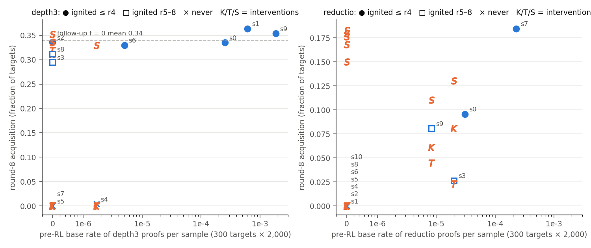
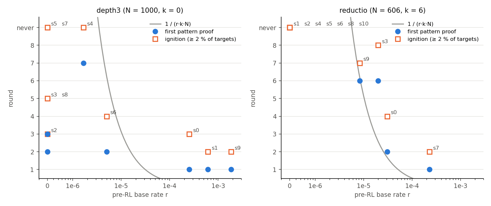
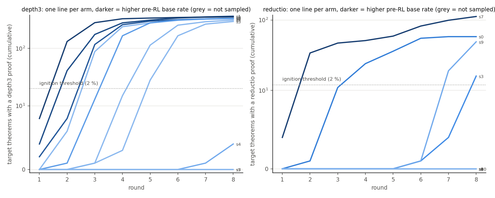
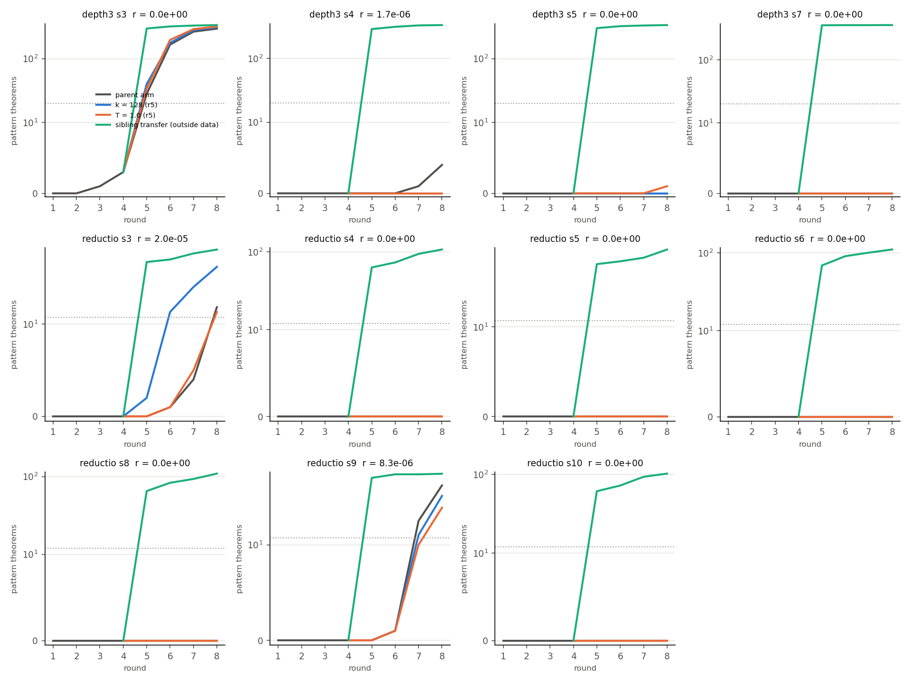

# Ignition study: what decides whether and when an expert-iteration arm ignites

Run 2026-09-16. Eight new Stage-1 seeds on the depth-3 f = 0 set `a1` and eight on the reductio f = 0 set, plus the existing draws; per draw a pre-RL sample of the 300 shortest targets at pass@2,000, then identical expert iteration (k = 32, 8 rounds). *Ignition* = first round with ≥ 2 % of targets solved by a pattern proof (numbers: `numbers.md` §Ignition).

**Reductio (a rule sequence): ignition is the base rate.** 4 of 11 draws emit the strict `NEGI(~G)…DN` shape before any RL (8·10⁻⁶–2.3·10⁻⁴ per sample, all on `nand_neg` targets); exactly those 4 ignite, in order of rate (s7 round 2, s0 4, s3 8, s9 7); the other 7 stay at 0/606 through 155k attempts without ever training. First proofs arrive about when 1/(r·k·N) says (observed rounds 1 / 2 / 6 / 6 vs predicted 0.2 / 1.7 / 2.6 / 6.2); round-8 acquisition follows the ignition round (0.185, 0.096, 0.081, 0.026).

**Depth-3 (a structural pattern): the base rate predicts early ignition, and nothing else.** Rates span 0 to 1.9·10⁻³ across ten draws of one set. Every draw with r ≥ 2.5·10⁻⁴ ignited by round 3; of five draws with no depth-3 sample in 600k, three ignited (rounds 3, 5, 5), two never. Whether a zero-rate arm ignites is decided during training on depth ≤ 2 proofs, not by sampling luck. Round-8 acquisition depends only on ignition: 0.30–0.36 if ignited by round 5, ≤ 0.004 otherwise; the frozen control (pre-RL sample at 256 attempts) gives 0–16 pattern theorems on the 300 targets against 238–263 after RL.

**Interventions from the round-4 state** (4 depth-3, 7 reductio non-igniters): one training step on a sibling's found proofs (outside data) ignited 11 of 11 in the next round and reached the plateau (depth-3 0.33–0.35; reductio 0.11–0.18, above every self-ignited reductio arm). One round at k = 128 (+96 attempts per target) or at T = 1.0 ignited only the two reductio arms that later ignited on their own (s3, s9), none of the nine zero-rate arms.

**Base generalisation:** 10 of 16 depth-3 f = 0 draws (95 % CI 0.35–0.85) and 4 of 11 reductio draws (0.11–0.69) emit the pattern at all in 600k samples.

**Expectations (log.md 18:37):** E2, E5 held; E1 wrong (2 of 8 new depth-3 seeds ignited by round 2, three never); E3 half right; E4 under-predicted k = 128. **Caveat:** the 300-target sample holds 20 of 30 `nand_neg` targets and can miss a draw's reachable ones (s3/s9's first hits were targets 516/534).

