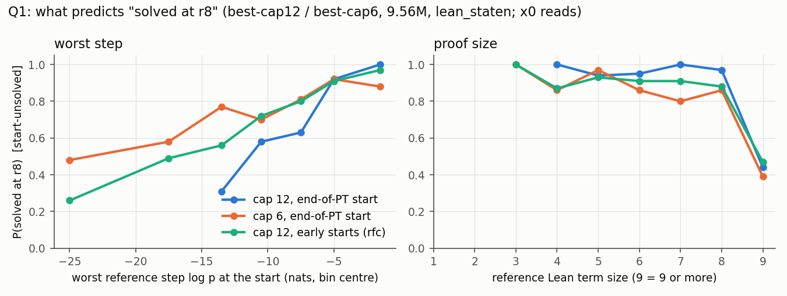
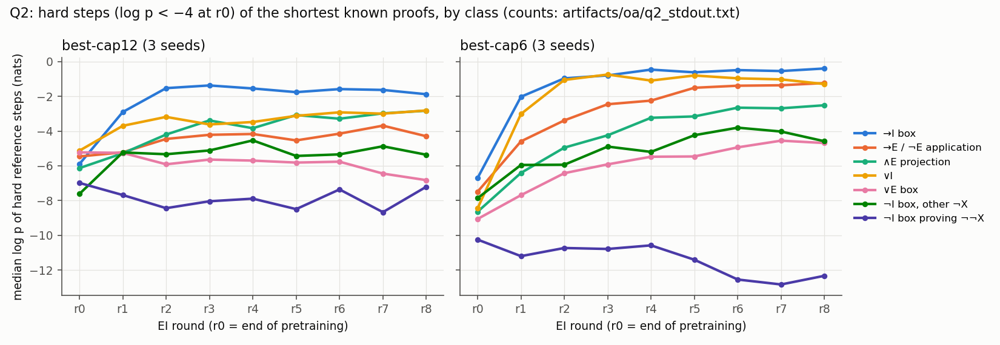
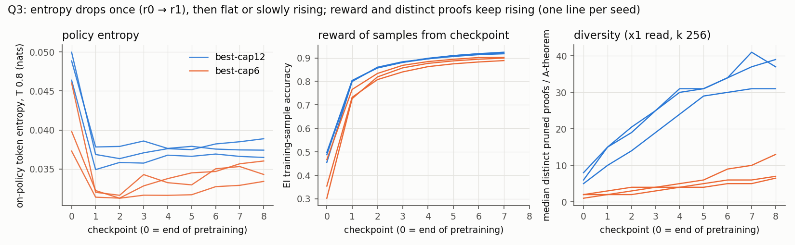

# organism-analysis: what predicts RL success, and what RL learns (from data already on disk)

Run `organism-analysis` (executor, 2026-10-02). Pre-registration `preregistration/organism-analysis.md` (3ac05e64,
committed before the first pod). **No training.** The only GPU use is forward passes on stored checkpoints (two A40
pods). **Lean alone:** every solved/unsolved label comes from inherited Lean-judged reads (`lean_judge`), and
`nd_verify` judges nothing. Scripts are in `oa/`, outputs in `artifacts/oa/`, and figures in `organism/figures/`.
The gallery is in `organism/gallery.md`. `grpo-best` was not DONE when the analysis started, so it is **not included**.

**Models (every number below names one of these).** All are `best_model.ALiBiGPT` 6 × 384, **9,560,832 params**,
`lean_staten`, trained from scratch (Stage-1 1,200 s on an A40), followed by T1 expert-iteration ladders (8 rounds × k 32,
T 0.8):

- **c12** = best-cap12 seeds 0–2 (K12 set, cap 12; `trajectory`).
- **c6** = best-cap6 seeds 0–2 (cap-6 set; `trajectory-cap6`).
- **rfc** = c12's seeds, with ladders started at pretraining steps 1,600 / 5,000 / 12,000 / 16,000 (`rl-from-ckpt`).

r0 is the start of RL: the end of pretraining for c12 and c6, and the start checkpoint for rfc.

**Theorems:** textbook72 + holdout250 (evaluation only; RL never trains on them). Of their reference proofs (a
shortest-known ND proof from `minlen`; ND-derived line labels are upper bounds under Lean), 307 replay in the
environment.

**Per-step log p:** inherited from `tj_score`. These are nats at T 1.0, teacher-forced in the proof-state environment
and marginalised over name bases.

## Q1. What predicts "solved at r8"?

**Setup.**

- **Unit:** (theorem, seed, start), restricted to units that are unsolved at the start (x0 read, k 256).
- **Target:** the x0 read at r8 solves the theorem.
- **Features:** taken from the reference proof under the start checkpoint (`artifacts/oa/q1_stdout_x0.txt`).
- **CV:** the held-out seed × held-out theorem fold. No seed and no theorem appears in both train and test.
- **Model labels:** "w1" = logistic regression on the worst step alone, which is the same as a single threshold;
  "logit" = logistic regression on all features; "GBM" = gradient boosting, depth 3.

| population (n, solved share) | w1 AUC | logit AUC | GBM AUC | logit − w1 (95 % CI) | w1 at P = 0.5 |
|---|---|---|---|---|---|
| c12 pend (223, 0.73) | 0.765 [0.68, 0.84] | 0.774 [0.69, 0.85] | 0.872 [0.81, 0.92] | [−0.07, 0.09] | −10.5 nats |
| c6 pend (477, 0.74) | 0.634 [0.56, 0.70] | 0.754 [0.69, 0.82] | 0.805 [0.73, 0.86] | [0.04, 0.20] | −21.6 |
| rfc, all four starts (1,865, 0.78) | 0.697 [0.64, 0.76] | 0.831 [0.78, 0.88] | 0.864 [0.82, 0.90] | [0.08, 0.19] | −15.0 |

Per-seed AUCs are in the stdout file. Robustness with the x1 draw (`q1_stdout_x1.txt`) gives the same picture with one
exception: the c12 GBM falls to 0.747, so its lead in that row is not robust.

**MDD.** The minimum detectable difference comes from the per-seed spread of the paired difference against w1
(2.8 · SD / √3):

| | c12 | c6 | rfc |
|---|---|---|---|
| logit − w1: MDD | 0.09 | 0.15 | 0.08 |
| logit − w1: observed (x0) | −0.00 | +0.10 | +0.13 |
| GBM − w1: MDD | 0.15 | 0.10 | 0.04 |
| GBM − w1: observed (x0) | +0.10 | +0.16 | +0.16 |

- **Resolved:** GBM beats the worst step in c6 and rfc, and the logistic model beats it in rfc.
- **Not resolved:** nothing in c12, where the worst step alone is as good as anything.

**Findings.**

1. **One worst-step threshold suffices only at cap 12, from the end of pretraining** (by the pre-registered rule).
   For c6 and for the early starts, the multi-feature models add 0.10–0.16 AUC.
2. **The top feature is proof size, not the worst step.** Lean term size of the reference ranks first or second in
   every population, by both standardised coefficient and GBM permutation importance. The only feature that competes
   with it is "the worst step is a ¬I box", which ranks first in c6 (coefficient) and rfc (both measures).
   - P(solved at r8) is 0.80–1.0 for term size ≤ 8 and 0.39–0.47 for term size ≥ 9, in all three populations
     (`q1_predictors.png`, right).
   - *Post hoc:* the jump is carried by references that need a `Classical.byContradiction` box. With reductio and
     term size ≥ 9, P = 0.31 (c12) / 0.22 (c6) / 0.26 (rfc); for large proofs without reductio, P = 0.68 / 0.63 / 0.74
     (`q1_extra_stdout.txt`).
   - That ¬I-box feature lowers the odds of a solve; its permutation importance is 0.04–0.07.
3. **The worst-step scale is not portable across caps.** Ranking transfers, calibration does not.
   - c12 → c6: logistic AUC 0.766, GBM 0.791, close to c6's own within-run CV. But the 50 % point moves from −10.5 to
     −21.6 nats: cap-6 RL solves theorems whose start worst step is far lower (`q1_predictors.png`, left).
   - c12 pend → rfc starts: logistic 0.78–0.80 at every start, including p1600.

## Q2. What RL learns, step by step

**Hard step:** a reference step with log p < −4 at r0. There are 629 (c12), 1,282 (c6) and 4,585 (rfc).

- Most are ∧E projections (21–25 %), applications (15–22 %) and ¬I boxes (13–20 %).
- Box openers plus projections make up 65 % / 60 % / 59 % (`q2_stdout.txt`).

Per class and round, medians over 3 seeds (`q2_class_rounds.png`):

- **→I boxes, ∨I, applications, projections** gain fast, mostly in r1–r2:
  - c6: →I −6.7 → −0.4, ∨I −8.4 → −1.3, application −7.5 → −1.2, ∧E −8.6 → −2.5.
  - c12: smaller gains (→I −5.9 → −1.9).
- **∨E boxes** gain at cap 6 (−9.1 → −4.7) but *fall* at cap 12 (−5.2 → −6.8). The policy's own proofs route around
  them; see gallery example 1, where the r8 proof avoids the reference's `Or.elim`.
- **¬I boxes do not move** (c12 −7.2 → −6.4; c6 −9.3 → −8.8). *Post hoc*, the stuck part is the boxes that prove a
  **double negation ¬¬X**:
  - c6: median gain −1.5 nats, negative in 3 / 3 seeds (−0.7 / −2.1 / −0.8).
  - c12: +0.9, with per-seed values −3.0 / +1.4 / +1.6.
  - Other ¬I boxes gain +4.3 (c6) and +2.4 (c12).
  - This is not for lack of practice. ¬¬X boxes are 37–48 % of the negation boxes in RL's own training proofs
    (0.6–0.8 % of all RL training steps; `q2_exposure.json`).

**Transfer to theorems RL never solved.** "Never solved" means no read at r1–r8 solves the theorem: 9–14 per seed at
c12 and 32–34 at c6. RL never trains on any evaluation theorem.

- **Their hard steps still gain.** Per-theorem median gain r0 → r8:
  - c12: +0.5 / +2.8 / +3.4 nats per seed, against +3.5 / +2.6 / +2.2 for RL-solved theorems.
  - c6: +4.5 / +2.9 / +3.0, against +6.4 / +5.8 / +5.5.
- **Class predicts the gain.** In gain ~ r0 log p + seed + class, class has partial R² 0.12 (c12) / 0.18 (c6) over all
  hard steps, and 0.37 / 0.35 among never-solved theorems.
- **The same classes gain in solved and never-solved theorems.** Across classes, Spearman ρ = 0.80 (c12, 4 classes) and
  0.39 (c6, 7 classes).
- **Against matched controls.** The control is never-solved hard steps of other classes in the same seed and the same
  1-nat r0 bin.
  - Classes that gain more than their control: applications (+7.2 c12, +3.2 c6), →I (+6.5, +3.4), ∨I (+1.9, +6.5)
    and ∧I (c6 +3.4).
  - ¬I gains less: −6.8 / −7.6 nats, CIs excluding 0.
- **Read:** RL moves *step types*, and that reaches theorems it never solved. The step type it does not move, ¬¬
  introduction, is the one common to the theorems that stay unsolved.
- **Exposure does not explain which classes gain.** The correlation between a class's share of RL training steps and
  its gain is weak: ρ = 0.29 (c12) and 0.09 (c6).

**Gallery** (`gallery.md`, 15 examples, chosen by the pre-registered median-gain rule): reference proofs in Lean, one
line per action, with per-step log p at r0 and r8, plus r8's eventual proof for group-B theorems.

## Q3. Entropy and diversity

**What was measured.**

- **On-policy entropy:** fresh rollouts at T 0.8 (the ladders' sampling temperature) on 4 × 1,024 fixed RL targets for
  each of the 111 stored checkpoints, then teacher-forced to get the entropy of the T 0.8 policy over every generated
  token. Peak memory was 12–23 GB at batch 2,048, and action truncation was ≤ 0.67 %. This is a measurement, not a count.
- **Diversity:** distinct Lean-accepted proofs per theorem in the stored k 256 reads. The "pruned" count first drops
  unused lines (`oa_common.nd_pruned_canon`), so padding does not count as diversity.

Sources: `q3_entropy_stdout.txt`, `q3_div_stdout.txt`, `q3_entropy_diversity.png`.

**Findings.**

1. **Entropy falls once, then flattens or rises.** On-policy token entropy drops from r0 to r1 by:
   - c12: 25 / 26 / 23 %;
   - c6: 16 / 30 / 19 %.

   From r1 to r8 it is flat at c12 (0.035–0.039 nats) and *rises* at c6 (0.031–0.032 → 0.033–0.036). Hard reference
   steps lose two thirds of their entropy (teacher-forced, T 1.0: 0.095 → 0.032 at c12, 0.087 → 0.029 at c6), almost all
   of it at r1. The early-start ladders (rfc) show the same single drop from a higher level (p1600: 0.090 / 0.076 →
   0.038).
2. **The Cui fit R = −a·e^H + b is carried by that one jump.**
   - Over r0–r8 against EI training-sample accuracy, R² is 0.82 / 0.86 / 0.93 (c12) and 0.18 / 0.74 / 0.85 (c6).
   - The predicted ceiling b − a is 1.8–2.7, an impossible accuracy, because entropy barely varies.
   - Restricted to r1–r8, the fitted *a* turns negative in 5 / 6 ladders: reward rises while entropy rises.
   - In these EI ladders, performance is not a function of entropy after round 1.
3. **Diversity does not collapse.** Distinct accepted proofs per theorem rise in every round, in every ladder and every
   group (median per A-theorem, x1):
   - c12: 7–11 → 67–72 raw and 5–8 → 31–39 pruned;
   - c6: 1.5–2 → 13–21 raw and 1–2 → 6.5–13 pruned.

   Accepted proofs also get longer, by about 2.5 pruned lines from r0 to r8 (c12 s0: 10.8 → 13.5). EI keeps up to 4
   distinct proofs per target per round, which rewards variety.
4. **Diversity does not collapse before group C stalls, because there is no collapse.** Group C's cumulative solved
   count (x0 ∪ x1) stops growing at round 5 / 7 / 8 (c12) and 5 / 8 / 6 (c6). C theorems that are ever solved get a mean of
   1–5 distinct proofs per solved read (one c12 seed reaches 7.8 at r6), so the stall is about reach, not about diversity running out.

## Expected vs outcome (pre-registered)

Seeds per arm: 3. MDDs are stated in Q1. Per-seed values are in `artifacts/oa/*.json`.

**Hits**

- w1-only AUC 0.75–0.88 at c12 (0.765).
- The w1 50 % point lies in −16…−9 at c12 (−10.5) and for the early starts (−15.0).
- c12 → c6: logistic AUC drops ≤ 0.05 (0.774 → 0.766) and the 50 % point shifts ≥ 1.5 nats (by 11).
- c12 → rfc logistic AUC ≥ 0.70 at p5000–p16000.
- Box openers + projections ≥ 60 % of hard steps (65 / 60 %).
- Class partial R² ≥ 0.05.
- Cross-class ρ > 0.4 at c12 (0.80).
- Hard-step entropy falls more than easy-step entropy (absolute; relative only at c12).

**Misses**

- w1-only AUC at c6 (0.634).
- "Full model adds ≤ 0.04": c6 +0.12, rfc +0.13.
- "GBM within ±0.03 of logistic": c12 +0.10 (not on x1), c6 +0.05.
- "w1 is the top feature": it is term size.
- "Worst-step kind adds < 0.02".
- c6 50 % point (−21.6).
- "Lower AUC at p1600": 0.80, no lower.
- "Every class gains > +2 / +4 nats in solved theorems": ¬I and c12 ∨E do not.
- "Never-solved hard steps gain < +1.5 (c12)": they gain +2.4.
- c6 cross-class ρ (0.39).
- **Entropy:** "falls monotonically by ≥ 30 %" (r0 → r8: −21 to −24 % at c12, −3.5 to −25 % at c6; not monotone).
- **Cui:** "R² ≥ 0.8 in ≥ 4 / 6" (3 / 6) and "b − a within 0.1 of r8" (0 / 6).
- **Diversity:** "distinct proofs peak at r1–r2 and fall ≥ 30 %" (they rise every round); "collapse before stall in
  ≥ 4 / 6" (no collapse in any ladder).

**Mixed**

- "Same class beats its matched control by ≥ 0.5 in ≥ half the classes": 4 / 5 (c12) and 4 / 7 (c6) on point
  estimates. Several intervals span 0.

**Answer to "one threshold?"** Yes for c12 from the end of pretraining. No for c6 or the early starts.

## Limitations

- **n = 3 seeds per arm.** All are inherited; no new seeds were possible without training. c12's never-solved set is
  only 9–14 theorems per seed.
- **Q1 features come from one fixed reference proof.**
  - The policy may succeed by another route: the ∨E fall at c12 and gallery example 1 show it doing so.
  - Group labels come from single k-256 reads: B / C flip 5–10 % on a re-draw (`trajectory-cap6`).
- **The post-hoc splits (reductio, ¬¬) were found after looking.** They are hypotheses for a pre-registered test.
- **On-policy entropy uses 4,096 rollouts per checkpoint on RL targets** (not the evaluation pools). It includes the
  name tokens the environment overwrites.
- **Compute:** 6,991 A40 GPU-seconds (`record.compute`; two jobs shared a card part of the time) and 92.6 M generated
  tokens over 111 checkpoints. Pods oa-p0 1.00 h + oa-p1 0.90 h, $0.93. All 111 checkpoint md5s match the
  inherited ones (`artifacts/oa/compute_stdout.txt`).
- **Theorem pools.** The analysis fits *predictors* on textbook72 / holdout250 outcomes. No policy was trained or tuned
  on them.
