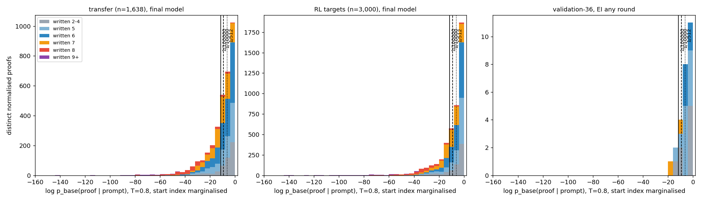
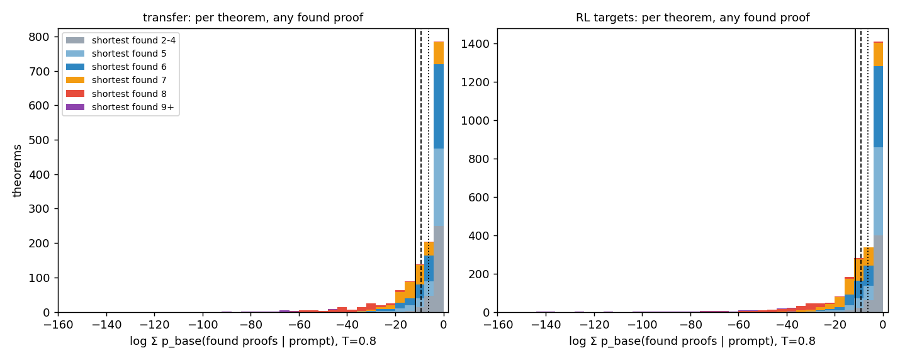
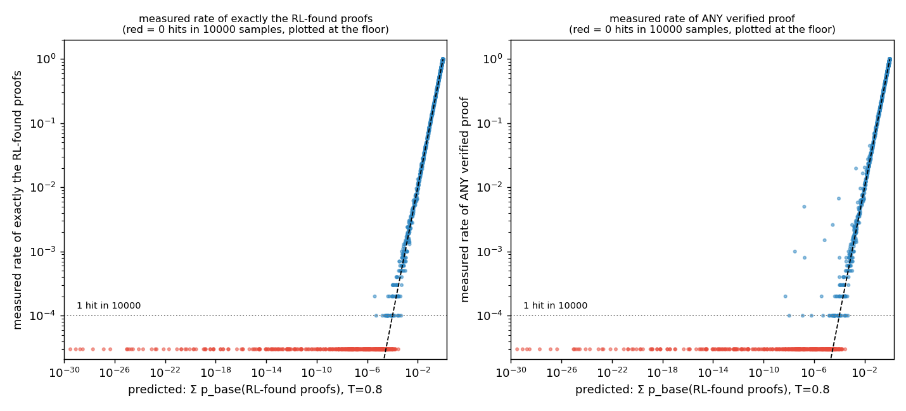

# Phase 1 — Was the take-home's frontier gain elicitation or creation?

All proof counts are start-index normalised (`normalize.norm`), all probabilities are under the Stage-1 base model
`ckpts/stage1_abs.pt` at the sampling temperature T = 0.8 and **marginalised over every start index the tokenizer
allows** (sum of the probabilities of the 60-ish shifted copies of the proof; `novelty.py`). Tables:
`artifacts/phase1_tables.md` (generated by `phase1_analysis.py`); per-proof records `artifacts/novelty_phase1_proofs.jsonl`;
per-theorem records `artifacts/novelty_phase1_theorems.jsonl`; base-model sampling `artifacts/cov_base_transfer_k1e4.s*.jsonl`
(k = 10⁴ per transfer theorem) and `artifacts/cov_base_val36_k1e5.s0.jsonl` (k = 10⁵ per validation theorem).

**Answer in one paragraph.** The frontier gain was *elicitation for the theorems and creation for the proofs*. Per theorem,
the base model resampled at the same budget (512) already solves 57% of the transfer set (934/1,638), and at 10⁴ samples it
solves 66% (1,080/1,638); the final RL model's 512-attempt solve rate (86%, 1,411/1,638) therefore contains a block of
theorems — 348 of the 1,411 RL-solved theorems (25%) — that the base model does not reach in 10⁴ samples, and their found proofs have
predicted base probabilities that put them beyond 10⁵ samples as well (median log p ≈ −25; every 9-line proof is below
10⁻³⁰). So the distinction between "rare but reachable" and "unreachable by sampling" holds at every budget that was
actually used (512) and at the two budgets checked empirically (10⁴, 10⁵), for a quarter of what RL solved and
for essentially all of the ≥ 8-line proofs. The log-probability prediction is trustworthy: on the theorems where it
predicts a measurable rate, the measured frequency of *exactly the RL-found proofs* in 10⁴ base samples agrees with the
prediction to a median of 0.00 nats (100% within a factor of 3). Where the improbability sits is narrow and repeatable:
it is not spread over the proof but concentrated in one or two middle lines (median 66% of the proof's surprisal in one
line), and for the longest proofs that line is the opening of a **third nested box** (`|` is the most surprising token)
followed by an `ANDI`/`ORI`/`NEGE` step inside it that cites a line from an outer context. In other words RL did not
invent rules; it composed the box-opening move one level deeper than the pretraining distribution ever showed, which is
exactly the "compose known rules into an absent pattern" question that Phase 2 tests directly (pattern P3, depth 3).

## 1. Log-probabilities of the RL-found proofs under the base model

Proofs scored: every normalised-distinct proof found by the final model (EI round 16) on the transfer set (3,330 proofs
of 1,411 theorems), on the RL targets (4,506 / 2,570), and on validation-36 (14 / 11 at round 16; 26 / 13 over all
rounds), plus the frozen Stage-1 model's own found proofs as a calibration set (1,724 transfer, 3,149 targets).

**Calibration.** The frozen model's transfer proofs were found with 512 samples each; 1,463 of 1,724 have predicted
p ≥ 1/512 and only 7 are below 10⁻⁵. Under the final model the same RL-found proofs have log p ≈ −0.1 … −8 (they are
what it now writes greedily), so the numbers below are a property of the *base* model, not of the proofs.



*Distribution of log p_base(proof | prompt) for the final model's proofs, stacked by written length. Vertical lines:
1/512, 1/10⁴, 1/10⁵. Right of a line = rare but reachable at that budget; left = unreachable by sampling at that budget.*

Per proof (transfer, final model), counts on each side of the lines:

| written length | n | ≥ 1/512 | 1/512 … 1/10⁴ | 1/10⁴ … 1/10⁵ | < 1/10⁵ | median log p |
|---|---:|---:|---:|---:|---:|---:|
| 2–4 | 483 | 289 | 82 | 31 | 81 | −5.0 |
| 5 | 683 | 339 | 103 | 60 | 181 | −6.4 |
| 6 | 1109 | 556 | 159 | 96 | 298 | −6.2 |
| 7 | 784 | 233 | 117 | 106 | 328 | −10.1 |
| 8 | 242 | 12 | 9 | 9 | 212 | −31.2 |
| 9 | 29 | 0 | 0 | 0 | 29 | −69.9 |
| all | 3330 | 1429 | 470 | 302 | 1129 | |

Per theorem (log of the summed probability of all its found proofs; length = its shortest found proof):

| shortest RL proof | theorems | ≥ 1/512 | 1/512 … 1/10⁴ | 1/10⁴ … 1/10⁵ | < 1/10⁵ |
|---|---:|---:|---:|---:|---:|
| 2–4 | 313 | 280 | 24 | 6 | 3 |
| 5 | 327 | 245 | 29 | 17 | 36 |
| 6 | 410 | 291 | 43 | 19 | 57 |
| 7 | 260 | 86 | 30 | 39 | 105 |
| 8 | 87 | 1 | 2 | 1 | 83 |
| 9 | 14 | 0 | 0 | 0 | 14 |

The RL targets look the same (`artifacts/phase1_tables.md`): 161/173 theorems whose shortest RL proof is 8 lines, 38/38
at 9 and 8/8 at 10 lines are below the 10⁻⁵ line. Validation-36: `contraposition` (7 lines) sits at log p = −8.6
(p = 1.8·10⁻⁴, between the 512 and 10⁴ lines); `export` (7 lines, found once at round 14) at −16.6 (p = 6·10⁻⁸,
≈ 1.6·10⁷ samples); the nine ≤ 6-bin theorems the EI model solves are all at p > 0.1.



## 2. Empirical check: does the base model find these theorems when sampled 10⁴ times?

`coverage.py`: base model, T = 0.8, 10⁴ samples per transfer theorem (1,638 × 10⁴ = 1.6·10⁷ samples), every distinct
normalised sample verified once, only successes and per-theorem counts stored; validation-36 at 10⁵ per theorem.



*Left: predicted probability of exactly the RL-found proofs vs their measured frequency among 10⁴ base samples. Right:
the same x-axis vs the measured rate of ANY verified proof. Red points had 0 hits.*

- **The prediction is calibrated.** For the 941 theorems with predicted rate ≥ 10/k, the median of
  log(measured / predicted) for exactly the RL-found proofs is 0.00 nats and 100% are within a factor of 3.
- **Other proofs exist but rarely rescue a theorem.** Of the 380 theorems whose RL-found proofs have predicted total
  p < 10⁻⁴, the base model solved 40 (11%) in 10⁴ samples with a *different* proof. The found-proof estimate is
  therefore a slightly pessimistic but essentially correct reachability label.
- **Base-model pass@B on the transfer set** (all 1,638 theorems; the take-home's frozen control at 512 attempts gave
  57.3%): 32: 48.1%, 128: 52.4%, 512: 57.0%, 10³: 59.6%, 10⁴: 65.9%. Going from 512 to 10⁴ samples buys 9 pp; the final RL
  model at 512 attempts is at 86.1%.

### Headline table — transfer theorems RL solved that the base did not solve in 10⁴ samples

*(full table: `artifacts/phase1_tables.md`; every row: `artifacts/phase1_unsolved_by_base.jsonl`)*

**348 of the 1,411 RL-solved transfer theorems (25%) are unsolved by the base model in 10⁴ samples.** By the shortest
RL-found written length: 3: 3, 4: 4, 5: 45, 6: 72, 7: 128, 8: 82, 9: 14 (all 14 nine-line-only theorems are in this
set). By the bounded minimal length (`minlen.py`, ≤ 8): 3: 3, 4: 7, 5: 48, 6: 95, 7: 125, 8: 60, none ≤ 8: 10 — i.e.
44% of them *have* a ≤ 6-line proof that the base model does not find either, and 56% need at least 7 lines. The top of the table (lowest base probability first):

| log p_base(any found) | theorem | shortest RL proof | # RL proofs | first round | min_lines_ub |
|---:|---|---:|---:|---:|---:|
| -90.9 | `( ~ ( ( ~ ( ~ S ) ) v Q ) ) \|- ( ( ~ ( ~ ( Q & S ) ) ) > ( ( ~ ( ~ S ) ) > ( ( Q v ( R & S ) ) > (  … )` | 9 | 1 | 8 | 8 |
| -81.1 | `( R > ( S > S ) ) \|- ( ( ( R & S ) > ( R v Q ) ) > ( R > ( ( ~ ( S > S ) ) > ( ( ( R & S ) > ( R v  … )` | 9 | 1 | 10 | None |
| -77.4 | `S , ( ( Q & S ) > ( ~ Q ) ) \|- ( ( ~ ( ~ Q ) ) > ( ( ~ Q ) > ( Q > ( ( ( Q & S ) > ( ~ Q ) ) & S ) ) ) )` | 9 | 1 | 5 | 8 |
| -72.9 | `( ( P & Q ) > ( S & Q ) ) , ( P & Q ) \|- ( ( P & Q ) > ( ( ~ ( ~ Q ) ) > ( ( P & Q ) > ( ( ( P & Q  … )` | 9 | 2 | 8 | None |
| -69.9 | `( R v ( ~ ( Q v Q ) ) ) \|- ( S > ( ( ( Q v S ) & ( R > Q ) ) > ( ( ~ Q ) > ( ( S v ( Q > S ) ) & (  … )` | 9 | 1 | 8 | None |

Every one of the deepest entries is a theorem whose conclusion is three nested implications: the proof must open three
boxes and prove something inside the innermost one from lines of the outer contexts.

### Validation-36 at 10⁵ base samples

| theorem | bin | ref lines | base hits / 10⁵ | first hit | EI solved (any round) | log p_base(EI proofs) |
|---|---|---:|---:|---:|---|---:|
| contraposition | >6 | 7 | 14 | 5,681 | yes (r2 on; greedy at r3, r7, r11, r16) | −8.6 |
| export | >6 | 7 | 0 | – | yes (r14 only) | −16.6 |
| explosion | ≤6 | 5 | 57 | 3,311 | no (never in 32 × 16 samples) | – |
| the other 21 theorems of the >6 bin | >6 | 8–18 | 0 | – | no | – |
| the 11 other ≤6 theorems EI solves | ≤6 | 2–6 | 28k–94k | 1–8 | yes | > −1.3 |

The base model at 10⁵ samples solves 14/36 (1/24 in the >6 bin: `contraposition`, right where the log-prob put it);
`explosion` is "rare but present" (p = 5.7·10⁻⁴) and RL simply never drew it. `export` is the one validation theorem
RL solved that is unreachable by sampling at 10⁵ (predicted ~10⁷).

## 3. Where the novelty sits

For the 1,129 transfer proofs (1,266 target proofs) with p_base < 10⁻⁵, the per-token surprisal under the base model
(T = 1, best start index, start-index token excluded) is summed per line:

| | transfer | targets |
|---|---|---|
| share of the proof's surprisal in its max line (median) | 0.66 (≥ 0.5 in 83%) | 0.67 (83%) |
| lines with > 3 nats: 1 / 2 / 3 / ≥ 4 | 484 / 490 / 140 / 15 | 596 / 459 / 169 / 41 |
| position of the max line: first / middle / last | 0 / 959 / 170 | 0 / 1045 / 221 |
| rule at the max line (top 6) | NEGE 247, R 138, ORI1 137, ANDI 108, DN 102, AS 100 | NEGE 255, DN 144, AS 127, R 123, ANDI 115, ORI1 108 |
| most surprising token (top 4) | `\|` 277, `F` 222, `R` 156, `(` 116 | `\|` 402, `F` 228, `R` 147, `(` 115 |

By length the locus shifts: for 5–7-line proofs it is a `NEGE`/`DN`/`R`/`BOTE` step (deriving `F` from a hypothesis and
an outer negation, or reiterating an outer line into a box); for 8–10-line proofs it is `AS`/`ANDI`/`ORI` at box depth
3 — the third `|` is the token the base model cannot predict, and the step after it (conjoining or disjoining an outer
line with the new hypothesis) carries the rest. Five pretty-printed examples with per-line surprisal are at the end of
`artifacts/phase1_tables.md`; the first two:

```
   0.00  N1 ( ~ P ) : PR
   0.00  N2 | ( ~ ( ~ P ) ) : AS
   0.00  N3 | | ( ~ ( ~ P ) ) : AS
   8.86  N4 | | | P : AS                       <- third box
  26.92  N5 | | | F : NEGE N4 N1               <- cites the premise from depth 3
  14.04  N6 | | | ( ( ~ S ) > S ) : BOTE N5
  17.86  N7 | | ( P > ( ( ~ S ) > S ) ) : IMPI N4 N6
   1.62  N8 | ( ( ~ ( ~ P ) ) > ( P > ( ( ~ S ) > S ) ) ) : IMPI N3 N7
   0.04  N9 ( ( ~ ( ~ P ) ) > ( ( ~ ( ~ P ) ) > ( P > ( ( ~ S ) > S ) ) ) ) : IMPI N2 N8
```
```
   0.00  N1 S : PR
   0.00  N2 ( ( Q & S ) > ( ~ Q ) ) : PR
   0.01  N3 | ( ~ ( ~ Q ) ) : AS
   0.00  N4 | | ( ~ Q ) : AS
  25.83  N5 | | | Q : AS                       <- third box
  15.83  N6 | | | ( ( ( Q & S ) > ( ~ Q ) ) & S ) : ANDI N2 N1
  18.48  N7 | | ( Q > ( ( ( Q & S ) > ( ~ Q ) ) & S ) ) : IMPI N5 N6
   0.02  N8 | ( ( ~ Q ) > ( Q > ( ( ( Q & S ) > ( ~ Q ) ) & S ) ) ) : IMPI N4 N7
   0.11  N9 ( ( ~ ( ~ Q ) ) > ( ( ~ Q ) > ( Q > ( ( ( Q & S ) > ( ~ Q ) ) & S ) ) ) ) : IMPI N3 N8
```

Note that neither proof uses a rule the base model lacks; both are "open one more box, then do the obvious thing".
The take-home's generator does produce depth-3 proofs (3.7% of the cap-6 pool) but almost never with an intro rule
applied at depth 3 to outer lines; Phase 2 measures what happens when that pattern's pretraining frequency is dialled
from exactly 0 upwards.

## 4. Bounded minimal proof lengths (`minlen.py`)

Goal-directed search over the 14 rules with the verifier's box semantics, formulas restricted to the subformula closure
of the theorem plus their negations and double negations, explicit lemma sharing, iterative deepening on the total
line count ≤ 8, every found proof re-checked with `nd_verify`. On validation-36 it labels 20/36 theorems and agrees
with the reference `min_lines_ub` on all 20 (the 16 with reference bounds 10–18 stay unlabelled). On the take-home pools:

| pool | n | labelled (≤ 8) | has a ≤ 6-line proof | 7 | 8 |
|---|---:|---:|---:|---:|---:|
| transfer | 1,638 | 1,573 | 1,149 (70%) | 297 | 127 |
| RL targets | 3,000 | 2,860 | 2,071 (69%) | 552 | 237 |

So 70% of the "7–16-line" theorems have a ≤ 6-line proof: the take-home's length labels were upper bounds, as stated
there, and loose ones. This does not change the Phase-1 conclusion (the reachability analysis is on the proofs the
models actually wrote), but it is why the Phase-2 target pools are filtered to theorems for which this search finds
no ≤ 6-line proof.

## 5. Budget note

`novelty.py` scores 756k shifted sequences in ~2 min on one A40; the empirical check is the expensive part
(1.6·10⁷ samples ≈ 3.5 GPU-hours with the fixed sampler, 12–14 s per theorem per shard with two shards sharing a GPU).
