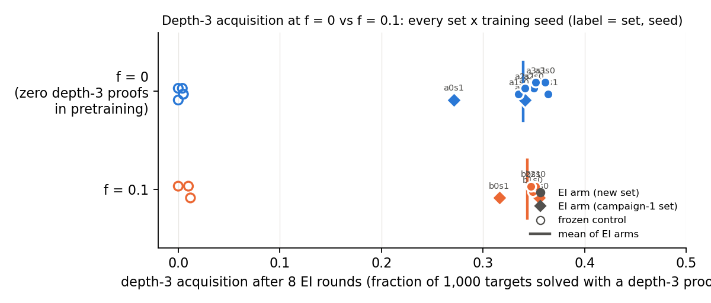
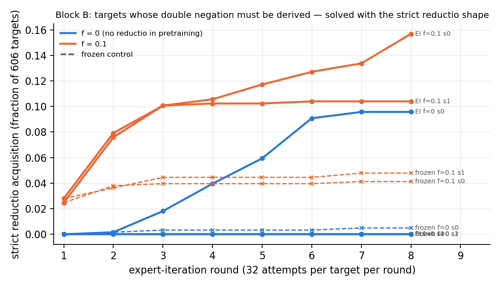

> **Review note (2026-09-16):** see `review_campaign.md`. Depth-3 f = 0 numbers re-derived independently and confirmed (first depth-3 proofs at rounds **3 / 5** per the found files). The reductio dial is uninformative: its classical-only targets need only `DN` on a given `( ~ ( ~ X ) )`. Seed spread is instability at n = 2, not bistability.

# Phase 2 — Controlled-coverage pretraining: does RL need the pattern in pretraining?

Three proof patterns, each defined as a predicate on the dependency-pruned proof (`patterns.py`, 12 verifier-checked
tests): **P1 derived-ORE** (an `ORE` whose disjunction line is not a `PR` line), **P2 reductio** (a `NEGI` box whose
hypothesis is `( ~ G )` followed by a `DN` yielding `G`), **P3 depth-3** (a box at depth ≥ 3). For each pattern,
Stage-1 sets of exactly 155,000 proofs were assembled from one large raw pool of the *unchanged* generator with the
pattern at frequency f ∈ {0, 10⁻⁴, 10⁻³, 10⁻², f_max} (f_max = 0.1 for P2 and P3, 0.02 for P1 — the generator's stream
only holds 3,531 distinct derived-ORE classes of ≤ 6 lines), the other two patterns held at the generator's natural
per-length rates, the length histogram flat (31,000 per length 2–6). f = 0 sets were verified to contain zero pattern
proofs by re-classifying the written file. Then Stage-1 identical to the take-home (4 layers, d = 256, 6,000 steps,
`abs` tokenizer with random start offset, cap 6 asserted at load), expert iteration identical to the take-home (k = 32,
8 rounds, retain 20k of the arm's own Stage-1 set) against 1,000 pattern targets, plus frozen controls with equal
attempts. All counts are start-index normalised. Metrics: `phase2_metrics.py` → `artifacts/p2/metrics_{pattern}.json`;
per-arm outputs `artifacts/p2/<arm>/`; numbers in `numbers.md`.

**Answer.** Whether RL needs the pattern in pretraining depends entirely on which pattern:

- **P3 depth-3 — RL composes it from nothing.** With zero depth-3 proofs in pretraining, expert iteration solves 34%
  and 27% of the depth-3 targets *with a depth-3 proof* (two seeds; 400 and 327 distinct depth-3 proofs), the same as
  at f = 10⁻³ (36%, 34%) and f = 0.1 (36%, 32%). The frozen f = 0 control produces 0 depth-3 proofs in 256 samples per
  target; under the f = 0 Stage-1 model all 610 depth-3 proofs the seed-0 arm found have probability < 10⁻⁵ (the most
  probable one 10⁻⁹·⁵, i.e. ~3·10⁹ samples); the first ones appear at rounds 2–5 out of models fine-tuned only on
  depth ≤ 2 successes. The surprisal of every one of them sits on the third `|`.
- **P1 derived-ORE — a steep dial between 0 and 10⁻³.** At f = 0 RL finds 9 and 2 target theorems with a derived-ORE
  proof (frozen control: 1); at f = 10⁻³ (155 proofs in 155k) it is already 25%, and 24–29% at f = 0.02. Every f = 0
  derived-ORE proof is the degenerate form — a disjunction `( X v X )` obtained by `IMPE`/`ANDE` and eliminated with two
  one-line boxes — which composes two things the f = 0 set does contain (deriving a disjunction; the one-line-box `ORE`
  template over a *premise* `( X v X )`, present 264 times); the strict variant (rule-derived disjunction with distinct
  disjuncts) is 0 at f = 0. The f = 0 base model assigns the easiest instance p ≈ 10⁻³ and produces the pattern in
  2 of 300 targets at 10⁴ samples: rare-but-present, amplified ~5× by RL.
- **P2 reductio — RL neither creates nor amplifies it.** 0 reductio proofs at f = 0 (two seeds, 0 in 3·10⁶ base samples on
  300 targets), 3 theorems at 10⁻⁴, 13/0 at 10⁻³, 11 at 10⁻², 13 at 0.1 — and the frozen control at f = 0.1 already has
  11 of those 13. The targets do not force the pattern (only 56/972 are classically-only), so RL solves them by other
  routes (18–63% solved) and the reductio template is never selected for.


*Main figure: fraction of pattern targets solved with a proof that contains the pattern after 8 rounds, vs the
pattern's frequency in the 155k pretraining set (f = 0 at the left edge; seed points, line through the seed mean;
frozen control dashed).*

## 1. Sets

Raw pool: 820,125 distinct renaming classes of ≤ 6-line proofs (102 generator shards, 12 CPU workers × ~18 min plus a
short 90-worker burst; only an output filter was applied, the generator's probabilities were not touched);
derived-ORE classes 3,531, reductio 158,590, depth-3 193,577. Baseline (held-fixed) rates come from the take-home's
unfiltered pool: reductio 17.3% / 16.7% of 5- / 6-line proofs, depth-3 18.3% of 6-line, derived-ORE 0.09% / 0.20%.

| set | derived-ORE | reductio | depth-3 |
|---|---:|---:|---:|
| reductio_f0 / f1e-4 / f1e-3 / f1e-2 / f0.1 | 88 (0.00057) | 0 / 16 / 155 / 1,550 / 15,500 | 5,687 (0.0367) |
| depth3_f0 / f1e-4 / f1e-3 / f1e-2 / f0.1 | 88 (0.00057) | 10,547 (0.0681) | 0 / 16 / 155 / 1,550 / 15,500 |
| derived_ore_f0 / f1e-4 / f1e-3 / f1e-2 / f0.02 | 0 / 16 / 155 / 1,550 / 3,100 | 10,547 (0.0681) | 5,687 (0.0367) |

(achieved counts after re-classifying each written 155,000-proof file; `data/p2/assemble_report.json`). One shared
held-out set of 5,000 (natural pattern rates), disjoint by class from every training set.

**Targets** (`make_coverage_sets.py targets`): from a fresh strict long pool (89,533 classes of 7–12-line theorems),
keeping only theorems for which `minlen.py` finds **no ≤ 6-line proof** (19,777 of 89,533), whose generating proof
uses the pattern; disjoint by class from the cap-6 pool, the held-out set and validation-36.

| pool | n | min_lines_ub 7 / 8 / none ≤ 8 | classical-only (`intuit.py`) | provably needs the pattern (bounded) |
|---|---:|---|---:|---|
| targets_derived_ore / transfer | 1,000 / 500 | 654 / 219 / 127 | 73 / 22 | 372 of the 873 with a ≤ 8-line proof have none when `ORE` is restricted to premise disjunctions (43%) |
| targets_reductio / transfer | 972 / 332 | 452 / 286 / 234 | **56 / 22** (the rest have an intuitionistic proof) | 56 |
| targets_depth3 / transfer | 1,000 / 500 | 575 / 240 / 185 | 47 / 22 | 142 of the 815 with a ≤ 8-line proof have none at box depth ≤ 2 (17%) |
| targets_none / transfer (control) | 1,000 / 500 | 608 / 252 / 140 | 38 / 18 | – |

The reductio pool is short of the 1,000 / 500 quota because few reductio-generated theorems lack a ≤ 6-line proof.
"Provably needs" is bounded: it means no ≤ 8-line proof exists in the restricted search space.

## 2. Runs and results

Row 1 (f ∈ {0, f_max} × 3 patterns × 2 seeds, 6 frozen controls), row 2 (f = 10⁻³ × 3 × 2), row 3 (f ∈ {10⁻⁴, 10⁻²} × 3
× 1): 30 Stage-1 models (val loss 0.082–0.085 for every set; the take-home's was 0.087) and 30 EI/frozen arms.
Acquisition = fraction of target theorems solved by ≥ 1 written proof whose dependency-pruned form contains the
pattern (the model's proof is classified, never the generating proof).

| pattern | f | seed | targets solved | **acquisition** (theorems / pattern proofs / first round) | transfer solved / acq | held-out greedy |
|---|---:|---:|---:|---|---|---:|
| depth-3 | 0 | 0 | 628/1000 | **0.341** (341 / 400 / r3) | 323/500 / 0.366 | 0.940 |
| depth-3 | 0 | 1 | 587/1000 | **0.271** (271 / 327 / r5) | 296/500 / 0.280 | 0.911 |
| depth-3 | 0 | frozen | 55/1000 | 0 (0 / 0 / –) | 30/500 / 0 | 0.874 |
| depth-3 | 10⁻⁴ | 0 | 605/1000 | 0.354 (354 / 433 / r2) | 314/500 / 0.368 | 0.959 |
| depth-3 | 10⁻³ | 0 | 631/1000 | 0.364 (364 / 443 / r1) | 324/500 / 0.384 | 0.964 |
| depth-3 | 10⁻³ | 1 | 660/1000 | 0.339 (339 / 429 / r2) | 333/500 / 0.366 | 0.952 |
| depth-3 | 10⁻² | 0 | 663/1000 | 0.363 (363 / 421 / r2) | 343/500 / 0.402 | 0.969 |
| depth-3 | 0.1 | 0 | 594/1000 | 0.355 (355 / 424 / r2) | 310/500 / 0.382 | 0.964 |
| depth-3 | 0.1 | 1 | 607/1000 | 0.316 (316 / 388 / r1) | 320/500 / 0.348 | 0.962 |
| depth-3 | 0.1 | frozen | 127/1000 | 0.012 (12 / 17 / r1) | 66/500 / 0.012 | 0.966 |
| derived-ORE | 0 | 0 | 364/1000 | **0.009** (9 / 9 / r3), strict 0 | 328/500 / 0.002 | 0.973 |
| derived-ORE | 0 | 1 | 330/1000 | **0.002** (2 / 2 / r7), strict 0 | 311/500 / 0.004 | 0.970 |
| derived-ORE | 0 | frozen | 180/1000 | 0.001 (1 / 1 / r1) | 193/500 / 0 | 0.971 |
| derived-ORE | 10⁻⁴ | 0 | 555/1000 | 0.222 (222 / 275 / r2) | 323/500 / 0.022 | 0.967 |
| derived-ORE | 10⁻³ | 0 | 583/1000 | 0.248 (248 / 281 / r1) | 327/500 / 0.028 | 0.968 |
| derived-ORE | 10⁻³ | 1 | 583/1000 | 0.245 (245 / 268 / r2) | 330/500 / 0.022 | 0.972 |
| derived-ORE | 10⁻² | 0 | 610/1000 | 0.272 (272 / 371 / r1) | 340/500 / 0.040 | 0.970 |
| derived-ORE | 0.02 | 0 | 572/1000 | 0.242 (242 / 294 / r1) | 329/500 / 0.022 | 0.965 |
| derived-ORE | 0.02 | 1 | 660/1000 | 0.293 (293 / 305 / r1) | 359/500 / 0.042 | 0.974 |
| derived-ORE | 0.02 | frozen | 136/1000 | 0.010 (10 / 11 / r1) | 134/500 / 0.002 | 0.967 |
| reductio | 0 | 0 | 609/972 | **0** (0 / 0 / –) | 222/332 / 0 | 0.886 |
| reductio | 0 | 1 | 170/972 | **0** (0 / 0 / –) | 68/332 / 0 | 0.885 |
| reductio | 0 | frozen | 96/972 | 0 | 39/332 / 0 | 0.886 |
| reductio | 10⁻⁴ | 0 | 203/972 | 0.003 (3 / 3) | | |
| reductio | 10⁻³ | 0 | 212/972 | 0.013 (13 / 13 / r4) | 82/332 / 0 | 0.953 |
| reductio | 10⁻³ | 1 | 374/972 | 0 (0 / 0 / –) | 156/332 / 0 | 0.948 |
| reductio | 10⁻² | 0 | 494/972 | 0.011 (11 / 11 / r4) | 190/332 / 0 | 0.966 |
| reductio | 0.1 | 0 | 193/972 | 0.013 (13 / 13 / r1) | 72/332 / 0 | 0.970 |
| reductio | 0.1 | frozen | 74/972 | 0.011 (11 / 11 / r1) | 24/332 / 0 | 0.968 |

Notes. (i) Solve rates on these hard targets are strongly seed-dependent (reductio f = 0: 609 vs 170; both Stage-1
models have the same val loss), because the number of round-1 successes seeds the whole EI trajectory; acquisition of
depth-3 and derived-ORE is much more stable across seeds than the solve rate. (ii) Held-out greedy is lower for f = 0
arms because the held-out set contains the natural 17% / 18% reductio / depth-3 proofs an f = 0 model has never seen.
(iii) The transfer pools show the same picture at lower levels; derived-ORE transfer acquisition is low (≤ 4%) because
that pool is dominated by 11–12-line theorems.

## 3. f = 0: reachability of what RL found (Phase-1 method, each arm's own Stage-1 model)

| pattern, f = 0 | RL pattern proofs | with base p (T = 0.8) < 1/256 / < 10⁻⁴ / < 10⁻⁵ | most probable | frozen control (256/target) | base pass@10⁴ on 300 targets |
|---|---:|---|---:|---:|---|
| depth-3, seed 0 | 610 | 610 / 610 / 610 | log p = −21.8 (round 4) | 0 depth-3 proofs, 55 solved | 3 solved, 0 with a depth-3 proof (3·10⁶ samples) |
| depth-3, seed 1 | 491 | 491 / 489 / 485 | log p = −7.1 (round 6) | – | – |
| derived-ORE, seed 0 | 10 | 10 / 8 / 8 | log p = −6.4 (round 3) | 1 derived-ORE proof, 180 solved | 3 solved, 2 with a derived-ORE proof (strict 0) |
| derived-ORE, seed 1 | 4 | 4 / 2 / 2 | log p = −6.3 (round 8) | – | – |
| reductio, both seeds | 0 | – | – | 0 reductio proofs, 96 solved | 82 solved, 0 reductio proofs |

`artifacts/p2/novelty_{pattern}_f0_s{seed}_proofs.jsonl`, `artifacts/p2/cov_{pattern}_f0_s0_targets.s0.jsonl`.

### Where the novelty sits (depth-3, f = 0, seed 0)

Max-surprisal token: the third `|` in 608 of 610 proofs; rule at the max line: `AS` 169, `IMPI` 90, `ANDI` 88, `DN` 68,
`ORI1` 66. Five examples (`artifacts/p2/depth3_f0_examples.md`), per-line surprisal under the f = 0 Stage-1 model:

```
 |- ( R > ( P > ( P > ( P v P ) ) ) )         round 3, log p_base(T=0.8) = -23.1
   0.01  N1 | R : AS
   0.00  N2 | | P : AS
   1.71  N3 | | | P : AS                        <- third box: 1.7 nats here, but
   8.24  N4 | | | ( P v P ) : ORI1 N3           <- the base model has never written a rule line at depth 3
   6.82  N5 | | ( P > ( P v P ) ) : IMPI N3 N4  <- nor closed a box from depth 3
   0.27  N6 | ( P > ( P > ( P v P ) ) ) : IMPI N2 N5
   0.02  N7 ( R > ( P > ( P > ( P v P ) ) ) ) : IMPI N1 N6
```
```
 |- ( ( ~ ( ~ ( S & R ) ) ) > ( S > ( ( ~ ( S & R ) ) > ( S v ( ( ~ S ) & P ) ) ) ) )   round 2, log p = -30.7
   0.00  N1 | ( ~ ( ~ ( S & R ) ) ) : AS
   0.07  N2 | | S : AS
   9.88  N3 | | | ( ~ ( S & R ) ) : AS
  10.37  N4 | | | ( S v ( ( ~ S ) & P ) ) : ORI1 N2
   2.04  N5 | | ( ( ~ ( S & R ) ) > ( S v ( ( ~ S ) & P ) ) ) : IMPI N3 N4
   0.08  N6 | ( S > ( ( ~ ( S & R ) ) > ( S v ( ( ~ S ) & P ) ) ) ) : IMPI N2 N5
   0.00  N7 ( ( ~ ( ~ ( S & R ) ) ) > ( S > ( ( ~ ( S & R ) ) > ( S v ( ( ~ S ) & P ) ) ) ) ) : IMPI N1 N6
```
The other three are in the artifact file; the shape is always the same — three nested `IMPI` boxes for a conclusion of
the form `A > ( B > ( C > D ) )`, with the surprise split between opening the third box and the first rule application
inside it. These are the same shapes that carried the take-home's frontier gain (Phase 1, §3).

### The f = 0 derived-ORE proofs

All 11 EI proofs (both seeds) and the frozen control's one proof have the form

```
N1 ( ( ~ P ) > ( R v R ) ) : PR ; N2 ( ~ P ) : PR ; N3 ( R v R ) : IMPE N1 N2 ;
N4 | R : AS ; N5 | R : AS ; N6 R : ORE N3 N4 N4 N5 N5 ; N7 ( R & R ) : ANDI N6 N6 ; QED
```
(`ORE` over a derived `( X v X )` with two one-line boxes citing their own `AS` line). The f = 0 set has 264 proofs with
exactly that `ORE` shape over a premise `( X v X )` and 1,544 ordinary `ORE`s over premise disjunctions; the composition
"derive the disjunction first" is the new part. Base probability of the easiest instance: 1.6·10⁻³.

## 4. Interpretation

Against the brief's guide: for **P3** acquisition is ≈ 0.3 at f = 0 with the base model's pass@10⁴ ≈ 0 for the pattern
and every found proof at p < 10⁻⁵ — RL composed an absent pattern, in 400 / 327 proofs of 341 / 271 theorems, first at
round 2 (seed 0) / round 4 (seed 1), and pretraining coverage from 10⁻³ to 10⁻¹ adds nothing. For **P1** acquisition
is ≈ 0 at f = 0 in the sense that matters (0 strict; 9 / 2 degenerate proofs that the base model already produces at
~10⁻³–10⁻⁴), rises to 25% by f = 10⁻³ and saturates — RL amplifies rare-but-present behaviour and does not cross f = 0.
For **P2** acquisition stays ≈ 1% at every f, equal to the frozen control at f = 0.1: RL does not select for reductio
because the targets do not require it. The three patterns differ in exactly the way that explains Phase 1: the pattern
RL creates is a *structural* one (one more nesting level of an operation the model already performs), the one it only
amplifies is a *lexical* one (a specific rule sequence), and the one it ignores is not needed by the reward.

## 5. Limitations

- **What "derived ORE" can mean in ≤ 6 lines.** 97% of the generator's own derived-ORE proofs of ≤ 6 lines (3,014 of
  3,100 in the f = 0.02 set) are the degenerate form — a `( X v X )` disjunction eliminated with two one-line boxes —
  because a non-degenerate derived ORE needs ≥ 7 lines. The arms learn exactly that distribution (f = 0.02 arm: 290 of
  294 derived-ORE proofs degenerate, 4 with an assumed non-degenerate disjunction; every f = 0 proof degenerate),
  while 511 of the 1,000 P1 targets were generated with a non-degenerate derived ORE. So the P1 dial measures the
  acquisition of the degenerate template; the non-degenerate derived ORE that De Morgan-style theorems need is
  essentially absent from every arm (≤ 4 proofs) at every f, consistent with the take-home's validation-36 result.

- One model size, one generator, 8 rounds at k = 32; row 3 has one seed. P1's dial stops at f = 0.02.
- Targets were filtered by a bounded (≤ 8-line, restricted formula space) minimal-length search; "provably needs the
  pattern" is likewise bounded.
- Base pass@10⁴ for the f = 0 models was run on the first 300 targets of each pool (3·10⁶ samples per model), not all
  1,000; the frozen controls cover the full pools.
- The `runq.sh` queue bug and pod CPU quota caused heavy GPU co-tenancy (up to 7 jobs per A40); this affects wall-clock
  only, not any result. One arm (depth-3, f = 10⁻⁴) crashed with a CUDA OOM at round 6 and was resumed from its
  round-5 checkpoint and cumulative found file.

---

# Follow-up (2026-09-16): replication of depth-3 at f = 0, a reductio test that can fail, and a cap-8 strict derived-ORE dial

Reason: `review_campaign.md` (n = 2 seeds everywhere; the reductio dial measured nothing). Plans and pre-registered expectations: `log.md` 01:40 / 01:47 / 02:03 UTC. Numbers with sources: `numbers.md` (follow-up sections). All counts start-index normalised; every "RL solved X" comes with the base model's reachability under the arm's own Stage-1 model.

## A. Depth-3 at f = 0 replicates: 8 arms on 4 sets, 6 arms on 3 sets

Three new f = 0 depth-3 sets (assembler seeds 1, 2, 3) and two new f = 0.1 sets (11, 12) were subsampled from a reconstruction of the campaign-1 pool (723,534 classes; the merged 820k pool was never pulled), same 155k / 31k-per-length recipe, campaign-1 held-out reused, every f = 0 set re-classified in written form (0 depth-3; independent counter agrees), reductio 10,547 and derived-ORE 88 in every set. Two training seeds per set; identical Stage-1 and EI (k = 32, 8 rounds, retain 20k); a frozen control (256 attempts per target) for every new model. Acquisition = fraction of the 1,000 depth-3 targets solved by a written proof whose pruned form has a box at depth ≥ 3.

| f | set | seed | arm | solved | **acquisition** (theorems / depth-3 proofs) | first round | transfer acq | held-out greedy | base reachability of the arm's depth-3 proofs: n / below 10⁻⁵ / max log p (T = 0.8) / theorems with p > 1/256 |
|---|---|---|---|---:|---|---|---:|---:|---|
| 0 | a0 | 0 | EI | 628 | **0.341** (341 / 400) | 2 | 0.366 | 0.940 | 400 / 400 / -22.6 / 0 |
| 0 | a0 | 0 | frozen | 55 | **0.000** (0 / 0) | – | 0.000 | 0.874 | – |
| 0 | a0 | 1 | EI | 587 | **0.271** (271 / 327) | 4 | 0.280 | 0.911 | 327 / 324 / -9.9 / 0 |
| 0 | a1 | 0 | EI | 645 | **0.335** (335 / 409) | 1 | 0.372 | 0.907 | 409 / 394 / -3.3 / 3 |
| 0 | a1 | 0 | frozen | 175 | **0.005** (5 / 5) | 1 | 0.004 | 0.883 | – |
| 0 | a1 | 1 | EI | 698 | **0.364** (364 / 426) | 1 | 0.366 | 0.930 | 426 / 413 / -1.8 / 3 |
| 0 | a1 | 1 | frozen | 175 | **0.005** (5 / 5) | 1 | 0.004 | 0.883 | – |
| 0 | a2 | 0 | EI | 589 | **0.350** (350 / 430) | 1 | 0.368 | 0.945 | 430 / 413 / -2.4 / 3 |
| 0 | a2 | 0 | frozen | 166 | **0.004** (4 / 4) | 1 | 0.004 | 0.894 | – |
| 0 | a2 | 1 | EI | 652 | **0.341** (341 / 426) | 3 | 0.358 | 0.903 | 426 / 423 / -7.3 / 0 |
| 0 | a2 | 1 | frozen | 144 | **0.000** (0 / 0) | – | 0.000 | 0.880 | – |
| 0 | a3 | 0 | EI | 605 | **0.361** (361 / 435) | 1 | 0.386 | 0.945 | 435 / 432 / -2.7 / 1 |
| 0 | a3 | 0 | frozen | 98 | **0.001** (1 / 1) | 1 | 0.002 | 0.874 | – |
| 0 | a3 | 1 | EI | 583 | **0.352** (352 / 425) | 1 | 0.378 | 0.919 | 425 / 406 / -1.3 / 9 |
| 0 | a3 | 1 | frozen | 127 | **0.010** (10 / 11) | 1 | 0.004 | 0.878 | – |
| 0.1 | b0 | 0 | EI | 594 | **0.355** (355 / 424) | 1 | 0.382 | 0.964 | – |
| 0.1 | b0 | 0 | frozen | 127 | **0.012** (12 / 17) | 1 | 0.012 | 0.966 | – |
| 0.1 | b0 | 1 | EI | 607 | **0.316** (316 / 388) | 1 | 0.348 | 0.962 | – |
| 0.1 | b1 | 0 | EI | 657 | **0.349** (349 / 426) | 1 | 0.388 | 0.964 | 426 / 413 / -1.0 / 3 |
| 0.1 | b1 | 0 | frozen | 172 | **0.005** (5 / 5) | 1 | 0.002 | 0.961 | – |
| 0.1 | b1 | 1 | EI | 484 | **0.122** (122 / 141) | 1 | 0.124 | 0.979 | 141 / 139 / -1.2 / 1 |
| 0.1 | b1 | 1 | frozen | 165 | **0.002** (2 / 2) | 1 | 0.002 | 0.976 | – |
| 0.1 | b2 | 0 | EI | 604 | **0.352** (352 / 410) | 2 | 0.388 | 0.965 | 410 / 408 / -9.5 / 0 |
| 0.1 | b2 | 0 | frozen | 137 | **0.000** (0 / 0) | – | 0.004 | 0.968 | – |
| 0.1 | b2 | 1 | EI | 596 | **0.347** (347 / 428) | 1 | 0.380 | 0.971 | 428 / 357 / -0.9 / 7 |
| 0.1 | b2 | 1 | frozen | 173 | **0.010** (10 / 10) | 1 | 0.014 | 0.967 | – |



- **f = 0, 8 arms:** 0.341, 0.271, 0.335, 0.364, 0.350, 0.341, 0.361, 0.352 — mean **0.339 ± 0.029** (SD), min 0.271. **f = 0.1, 6 arms:** 0.355, 0.316 (campaign-1 set), 0.349, **0.122**, 0.352, 0.347 — mean **0.307 ± 0.092** (0.344 ± 0.016 without the late-igniting b1 s1, whose depth-3 count went 1 / 2 / 2 / 2 / 2 / 5 / 27 / 122 over the rounds and was still climbing). The distributions overlap completely (6 of 8 f = 0 arms inside the f = 0.1 range and 5 of 6 f = 0.1 arms inside the f = 0 range; permutation test on the difference of means p ≈ 0.5); **no f = 0 arm is near zero**; the low outlier of the whole family is an f = 0.1 arm.
- **Variance decomposition** (one-way random effects, sets as groups, 2 seeds per set): at f = 0, between-set SD 0.012 vs between-training-seed SD 0.027 (set share 17%, F = 1.4 — indistinguishable from pure seed noise at 4 groups); at f = 0.1 between-set SD 0 (F = 0.9; the b1 s1 outlier is a seed effect, its set-mate is at 0.349). The pretraining draw does not matter; the training seed does — expert iteration on these targets can ignite late.
- **First depth-3 proof** (minimum round over all raw records of a proof; see the bookkeeping fix in log.md 05:10): at f = 0 rounds 1, 1, 1, 1, 1, 2, 3, 4 (median 1), at f = 0.1 rounds 1, 1, 1, 1, 1, 2.
- **Frozen controls (256 attempts per target):** depth-3 theorems a0 s0 0, a1 s0 5, a1 s1 5, a2 s0 4, a2 s1 0, a3 s0 1, a3 s1 10; f = 0.1: b0 s0 12, b2 s0 0, b2 s1 10, b1 s0 5, b1 s1 2. So the review's "expected 0" is *not* what the new controls show: four of the six new f = 0 models produce a three-nested-`IMPI` proof of the `A > (B > (C > D))` shape on 4–5 of the 1,000 targets within 256 samples.
- **Base reachability** (novelty.py, each arm's own Stage-1 model, T = 0.8, start-index marginalised, every depth-3 proof of the arm): 94–100% of each arm's depth-3 proofs are below 10⁻⁵ (table); but the *most* probable proof per arm ranges from log p −22.6 (campaign-1 model) to −1.3 (a3 s1: p ≈ 0.27, third-box `AS` line costing 0.4 nats), and the number of targets with any depth-3 proof above 1/256 is 0 / 0 / 3 / 3 / 3 / 0 / 1 / 9 across the eight f = 0 arms. The frozen controls find exactly those theorems (a1 s1: all 3 high-p theorems are among its 5 frozen finds).

**Reading.** The headline replicates and sharpens: with zero depth-3 proofs in pretraining, expert iteration reaches the f = 0.1 level in every one of eight arms. What changes is the mechanism's starting point. The campaign-1 model was one where the third box was a < 10⁻⁵ event everywhere (0 in 3·10⁶ base samples) and the first depth-3 proofs appeared at rounds 3 / 5 out of models fine-tuned on depth ≤ 2 successes; four of the six new models already assign 10⁻²–10⁻³ to a third box on a handful of targets and EI starts from those at round 1–2. Both routes end at 0.34. The honest one-line version is therefore: *the base model's willingness to open a third box is a rare, draw-dependent generalisation of the depth-2 nesting it was trained on (0 to 9 reachable targets per 1,000), and RL turns it into 340 targets in every case.* "The frozen control and the base model produce none" (campaign.md) holds for the campaign-1 model and for a2 s1 / b2 s0, not in general; it should read "produce at most a handful".

## B. A reductio test that can fail — and how it fails

**Pool.** The generator cannot supply it: 19,099 reductio-shaped long theorems without a `( ~ ( ~` sub-formula contain **7** classical-only ones (0.04%; a further 72-minute 180M-try run with an in-worker `intuit.py` filter found 85 more, too late to use). So `targets_reductio2` is built from 21 classical-only schemata without double negation (Peirce, excluded middle, Dummett, `~A>B, ~B |- A`, `~(~A&B), B |- A`, `~(A>B) |- A`, De Morgan `~(A&B) |- ~A v ~B`, converse contraposition, `A>B, ~A>B |- B`, …) with random sub-formulas (`reductio_pool.py`; every instance truth-table valid, `intuit.py` non-provable, no `( ~ ( ~` anywhere, class-disjoint from the reconstructed pool = every training set, the held-out set, the old reductio pools and validation-36; minlen bound 8, min_lines_ub ≥ 7 or None): **606 targets** (30 per schema + the 6 usable generator-native theorems; min_lines_ub 7 / 8 / None = 62 / 158 / 386) and **300 transfer**. Ten were printed and hand-checked (`log.md` 02:00): each needs the negated goal assumed. Since the only classical rule is DN and no double negation is given, every proof must apply DN to a derived (or assumed-and-discharged) `( ~ ( ~ G ) )`.

**Predicates on the model's proof:** strict = `patterns.reductio`; loose = `patterns.derived_dn` (a DN citing a rule-derived line); any-DN as an upper bound. Arms on the campaign-1 reductio sets: f = 0 seeds 0, 1 (existing models) and 2 (new Stage-1), f = 0.1 seeds 0, 1; frozen controls for all five; base pass@10⁴ on 300 targets for f = 0 seed 0.

| arm | solved / 606 | strict | loose | any-DN | first round | per round (strict) | transfer solved / strict (300) | schemata solved |
|---|---:|---:|---:|---:|---|---|---|---|
| EI f = 0 s0 | 58 | **58** (0.096) | 58 | 58 | 2 | 0 / 1 / 11 / 24 / 36 / 55 / 58 / 58 | 30 / 30 | nand_neg 29/30, negimp_to_pos 27/30, native 2/6 |
| EI f = 0 s1 | **0** | 0 | 0 | 0 | – | 0 … 0 | 0 / 0 | – |
| EI f = 0 s2 | **0** | 0 | 0 | 0 | – | 0 … 0 | 0 / 0 | – |
| EI f = 0.1 s0 | 95 | 95 (0.157) | 95 | 95 | 1 | 15 / 46 / 61 / 64 / 71 / 77 / 81 / 95 | 40 / 40 | nand_neg 30, negimp_to_pos 30, neg_both 22, chain_neg 11, native 2 |
| EI f = 0.1 s1 | 63 | 63 (0.104) | 63 | 63 | 1 | 17 / 48 / 61 / 62 / 62 / 63 / 63 / 63 | 30 / 30 | nand_neg 30, negimp_to_pos 30, chain_neg 2, native 1 |
| frozen f = 0 s0 | 3 | 3 | 3 | 3 | 2 | | 1 / 1 | nand_neg 3 |
| frozen f = 0 s1 / s2 | 0 / 0 | 0 | 0 | 0 | – | | 0 | – |
| frozen f = 0.1 s0 / s1 | 25 / 29 | 25 / 29 | | | 1 | | 15 / 10 | nand_neg 20 / 18, negimp_to_pos 5 / 11 |



- **Every solved target, in every arm, is solved by the strict reductio shape** (strict = loose = any-DN): there is no other way, which is what the pool was built for.
- **Base reachability.** f = 0 s0: base pass@10⁴ on 300 targets = **5 solved, all 5 by the strict shape** (92 hits in 3·10⁶ samples; per-sample rates 2·10⁻⁴–4·10⁻³; all instances of `~(~A & B), B |- A`; 0 depth-3 / derived-ORE samples); the 60 EI proofs have max log p −5.6 (p ≈ 4·10⁻³, the round-4 proof), median −21, 44 / 60 below 10⁻⁵, max-surprisal line NEGI (42) or DN (13). f = 0.1: 25–26 of the solved theorems have a proof above 1/256 under their base.
- **Reading against the pre-registered expectation** ("f = 0 stays ≈ 0 under both predicates and the solve rate ≈ frozen; if RL composes NEGI + DN, the loose predicate rises first"). Neither branch as written. Two of three f = 0 seeds are exactly the first branch (0 / 606, never trained). The third seed's Stage-1 model — trained on the *same* set — already produces the never-seen `NEGI(~G)…DN` sequence at ~10⁻³ on the easiest 7-line instances (its frozen control finds 3, base pass@10⁴ finds 5 of 300), and EI amplifies that to the two 7-line schemata (56 of 60 instances) and nothing longer; loose and strict rise together because the composed shape *is* the strict shape. So on a pool where reductio is genuinely required, RL does not invent the rule sequence: it amplifies it where the base model's own generalisation put it at 10⁻³, and stays at zero where it did not. The f = 0.1 arms (15,500 reductio proofs in pretraining) reach only 10–16%, confined to the four shortest schemata; Peirce, excluded middle, Dummett, De Morgan and converse contraposition are 0 / 30 in every arm including the f = 0.1 ones.

## C. Cap-8 dial for the non-degenerate derived ORE

**Pool.** Cap-8 raw pool from the unchanged generator's short mode with no per-length caps (`pool_cap8.jsonl`, 2,435,041 classes; strict derived-ORE = disjunction obtained by a rule, disjuncts differ: 2.4% of 7-line and 11.8% of 8-line proofs, ≈ 2% of a flat 2–8 set). Sets (`--simple`, 22,142 per length 2–8, new cap-8 held-out): strict derived-ORE **0 / 155 / 1,550** (f = 0 asserted in pruned and written form), everything else at its natural cap-8 rate conditional on non-strict: degenerate/other derived-ORE 743 / 732 / 676 (0.48%), reductio 5.4%, depth-3 7.1%. Stage-1 with `--cap 8` (val loss 0.08x), two seeds at f = 0, one at 10⁻³ and 10⁻². Targets (`targets_c8`, 500 + 250 transfer): strict-derived-ORE theorems generated at 9–16 lines for which minlen (bound 8) finds **no ≤ 8-line proof** — only 0.5% of the 9–14-line and 1.6% of the 12–16-line generator theorems qualify (the generator's strict ORE is, like its reductio, almost always redundant), 300 of the 500 are also depth-3 shapes. Like campaign 1's pools these are theorems whose *generating* proof uses the pattern, not theorems that provably need it.

| cap 8 arm | solved / 500 | **strict acquisition** (theorems / proofs) | first round | per round (strict theorems) | transfer solved / strict (250) | held-out (cap 8) greedy | strict proofs' base p: n / below 1/256 / below 10⁻⁵ / max log p |
|---|---:|---|---|---|---|---:|---|
| EI f = 0 s0 | 197 | **0.008** (4 / 5) | 1 | 2 2 2 3 3 3 3 4 | 120 / 1 | 0.926 | 5 / 2 / 0 / −1.2 |
| EI f = 0 s1 | 200 | **0.008** (4 / 5) | 1 | 2 3 4 4 4 4 4 4 | 118 / 1 | 0.936 | 5 / 2 / 0 / −2.9 |
| EI f = 10⁻³ s0 | 202 | **0.022** (11 / 17) | 1 | 2 2 4 4 5 7 8 11 | 124 / 1 | 0.929 | 17 / 13 / 5 / −0.6 |
| EI f = 10⁻² s0 | 218 | **0.022** (11 / 14) | 1 | 2 4 6 7 8 9 9 11 | 126 / 2 | 0.933 | 14 / 6 / 1 / −1.9 |
| frozen f = 0 s0 | 159 | 0.006 (3 / 4) | 1 | 2 2 2 2 2 3 3 3 | 94 / 1 | 0.918 | – |
| frozen f = 0 s1 | 161 | 0.004 (2 / 4) | 1 | 2 2 2 2 2 2 2 2 | 97 / 1 | 0.931 | – |
| base pass@10⁴, f = 0 s0, first 300 targets | 118 (87 within 512) | 7 targets with a strict proof (3,780 of 3·10⁶ samples; one target at p ≈ 0.37, others 10⁻⁴–5·10⁻³) | – | – | – | – | – |

**Reading.** The dial is flat: 1–2% strict acquisition at every f from 0 to 10⁻² (the latter being roughly the generator's own cap-8 rate), against my pre-registered 10–35% for f ≥ 10⁻³. The arms solve ~40% of the targets, three-quarters of them with depth-3 proofs, i.e. they route around the disjunction elimination. The few strict proofs that do appear are 9-line `ANDE/IMPE → ORE` with distinct disjuncts and are mostly *reachable* under their own base (max log p −0.6 to −2.9; 0–5 of them below 10⁻⁵); base pass@10⁴ for the f = 0 s0 model solves 118 of 300 targets and produces the strict shape on 7 of them (one at p ≈ 0.37) — the cap-8 base models, which have seen ORE over premise disjunctions and (at f = 0) 743 degenerate derived OREs, already generalise to a strict derived ORE on a few targets, and RL neither needs nor selects the pattern beyond that (EI: 4 of those targets). So the non-degenerate derived ORE behaves like reductio, not like depth-3: no composition across f = 0, and not even amplification when the reward does not require the pattern. This is a cap-8 result and is not pooled with the cap-6 dial.
