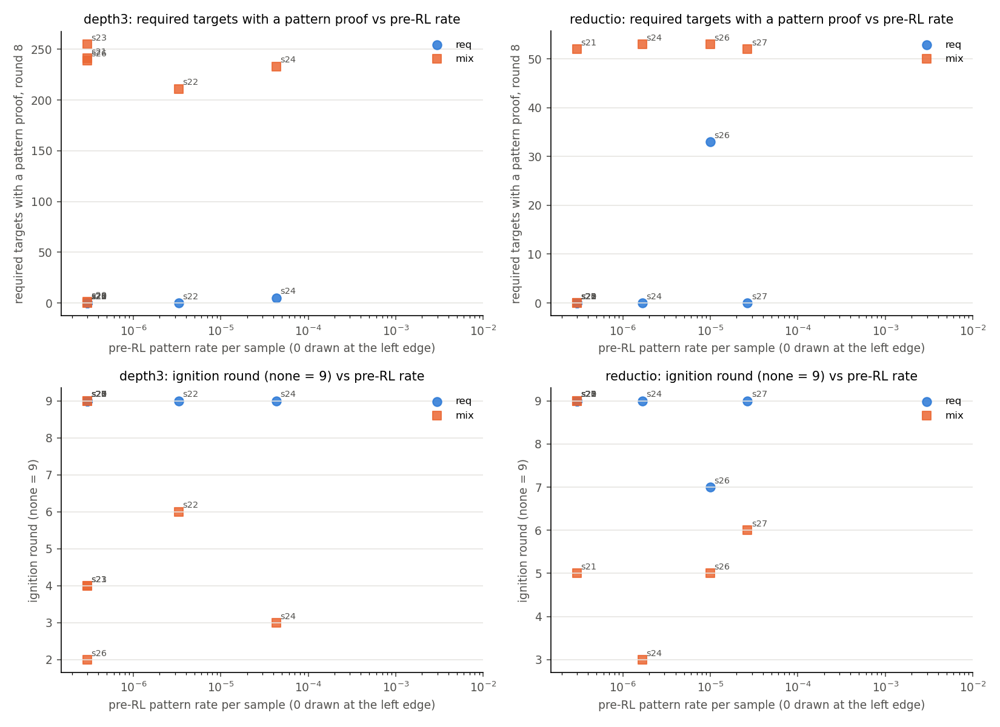
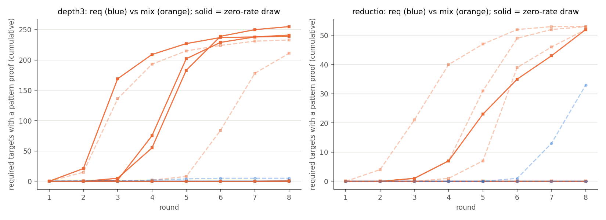
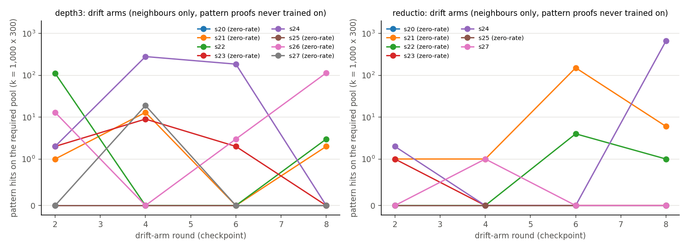

# Round 3, run 1: pool composition or pattern class?

Run 2026-09-18; numbers `numbers.md` §Round 3 run 1, expectations `preregistration/round3-run1.md`. **Question:** zero-rate reductio draws never ignited, three of five zero-rate depth-3 draws did. Pattern class, or the depth-3 pool's rewarded neighbours?

**Design.** Sixteen new Stage-1 draws (8 per pattern), each sampled 600k times on 300 *required* targets (depth-3: no depth-≤ 2 proof within 8 lines; reductio: run 5's pool). Expert iteration (k = 32, 8 rounds) on three pools: required only (`req`); required + 300 pattern-free neighbours (`mix`); neighbours only, pattern proofs never trained on (`drift`), sampled 300k times on the required pool at rounds 2/4/6/8. Reductio neighbours: `~~X` goals proved by the reductio box without its `DN`.

**n₀.** Zero pattern hits in 600k: depth-3 6 of 8 draws, reductio 5 of 8.

**Required only: nothing ignites from zero.** All 11 zero-rate `req` arms stayed at 0 / 300 without ever training (E2). Non-zero draws: depth-3 0 and 5 targets; reductio 0, 0, one ignition (round 7, 33).

**With neighbours both patterns ignite from zero.** Depth-3: 3 of 6 zero-rate draws (rounds 2, 4, 4; 239–255 targets; E3 held). Reductio: **1 of 5** (s21, round 5, 52 targets, the two 7-line schemata) — the proposer's 1–2, not the standing rule's 0. All non-zero draws ignited on `mix`. First pattern proofs followed ≥ 49 solved neighbours. No required target was solved without the pattern (48 arms); all 32,769 counted proofs re-verify.

**Drift: the prior moves before any pattern proof is rewarded.** Depth-3: 4 of 6 zero-rate drift arms reach ≥ 3 hits / 300k at some checkpoint (up to 114). Reductio, predicted ≤ 1 everywhere: s21 **151 / 300k on 8 targets at round 6** (6 at round 8), s22 4; the other three ≤ 1. Rates are bursty.

**Answer.** Clause (3) dies as pre-registered: without neighbours, structural ignition is as base-rate-gated as reductio. Clause (2) dies by its drift criterion (two zero-rate reductio arms reached ≥ 10⁻⁵ with no pattern proof in training); on `mix` it got 1 igniter (threshold 2). The asymmetry was the pools: expert iteration composes an absent pattern only through rewarded neighbours. Whether reductio's ladder is narrower is open (1 / 5 vs 3 / 6; Fisher p = 0.55).

**Misses.** Non-zero draws were expected to ignite on `req` (0 of 2, 1 of 3); one `mix` arm solved 35 % of neighbours (floor 40 %).

