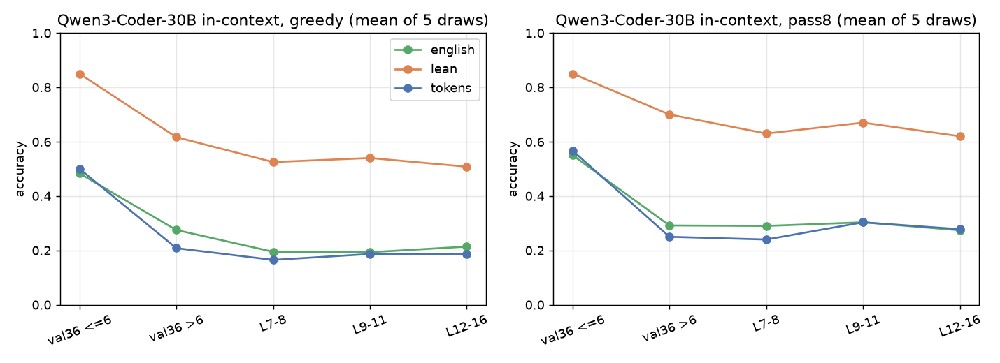
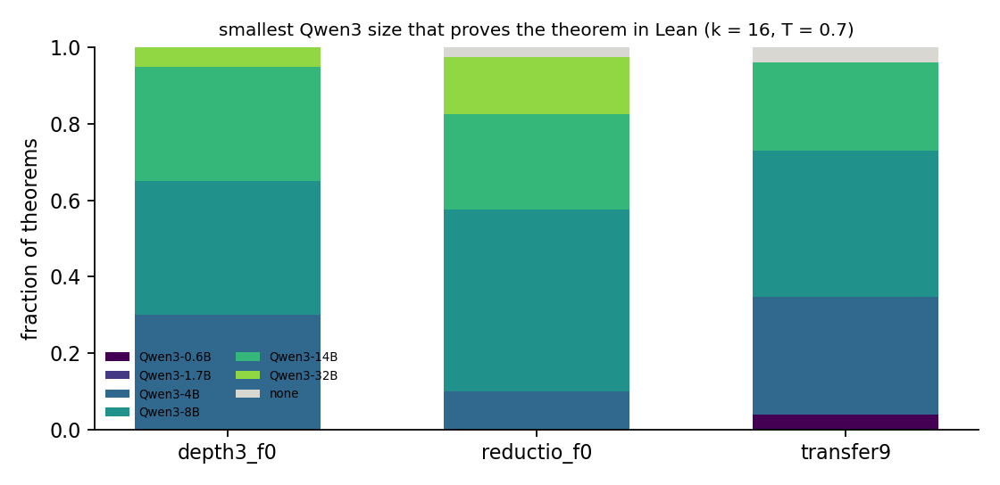

# Run 1: natural deduction in Lean, and novelty by model scale

Run 2026-09-17/18; numbers in `numbers.md` §Round 2 — Run 1. **Questions:** does an independent checker agree with `nd_verify`; does writing the same proofs as Lean 4 change what a pretrained code model can do in context; and can "the smallest model that proves it in Lean" serve as a novelty measure?

**Step 1 — `nd2lean.py`.** Deterministic translation of spec.md proofs into Lean 4 (core, no Mathlib): atoms as `Prop` variables, premises as hypotheses, each line a `have`, boxes as typed lambdas, `Or.elim`, `False.elim`, `Classical.byContradiction`; the verifier's structural rules (consecutive indices, box closing, citation scope, final line) mirrored where Lean would not enforce them. Agreement with `nd_verify` on every pool checked: **0 disagreements** on 21 examples, 5,000 held-out, 3,000 RL targets, 1,638 transfer, 10,000 training proofs, the 36 validation reference proofs, 75,085 RL-found transfer proofs (all start indices) and the round-2 found proofs; **4,012 / 4,012 corrupted proofs rejected by both** (citation, rule, atom, box and dropped-line mutations). Two Lean facts cost time: Lean 4.34 stops reporting after ~100 errors per file, and diagnostics come as `error(lean.code):` — both handled in `lean_check`. The project has a second checker.

**Step 2 — in-context v0 (Qwen3-Coder-30B-A3B-Instruct, vLLM on one A100, no hosted API).** 20 worked examples, one fresh theorem, greedy + 8 samples at T = 0.7; three surface forms of the same theorems and the same examples (Lean 4, the take-home tokens, plain-English rule names as control); validation-36 + 200 transfer theorems stratified by length; 5 example-set draws.

| form | greedy | pass@8 | val-36 `> 6` greedy |
|---|---|---|---|
| Lean 4 | **0.563** [0.53, 0.59] | **0.675** [0.65, 0.70] | 0.458 |
| tokens | 0.258 [0.23, 0.28] | 0.326 [0.30, 0.35] | 0.158 |
| English | 0.292 [0.27, 0.32] | 0.386 [0.36, 0.41] | 0.100 |

Paired Lean − tokens over 236 theorems: **+0.31 [0.26, 0.35] greedy, +0.35 [0.30, 0.40] pass@8** (bootstrap over theorems). The gain is largest on the shortest theorems (+0.34 at 7 generating lines, +0.15 at 16) — the opposite of the proposal's prediction that Lean helps most where boxes nest. The English control sits with the tokens, so the token format's cost is not opacity of the rule names but the whole calculus-as-string; Lean's `have`/`fun` scaffolding is the form the model has seen.

**Step 3 — novelty by scale.** PENDING (Qwen3 0.6B–32B, k = 16, Lean form, on 40 depth-3 f = 0 theorems, 40 required-reductio theorems and the 26 transfer theorems with 9-line RL proofs).

