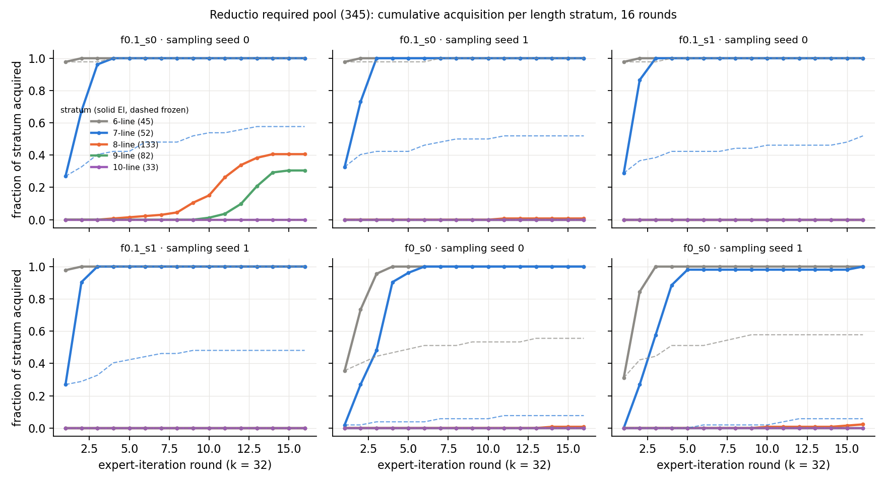
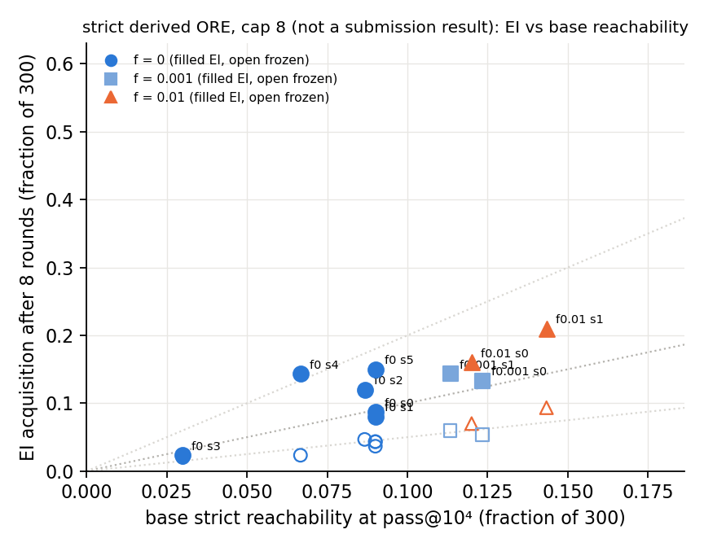
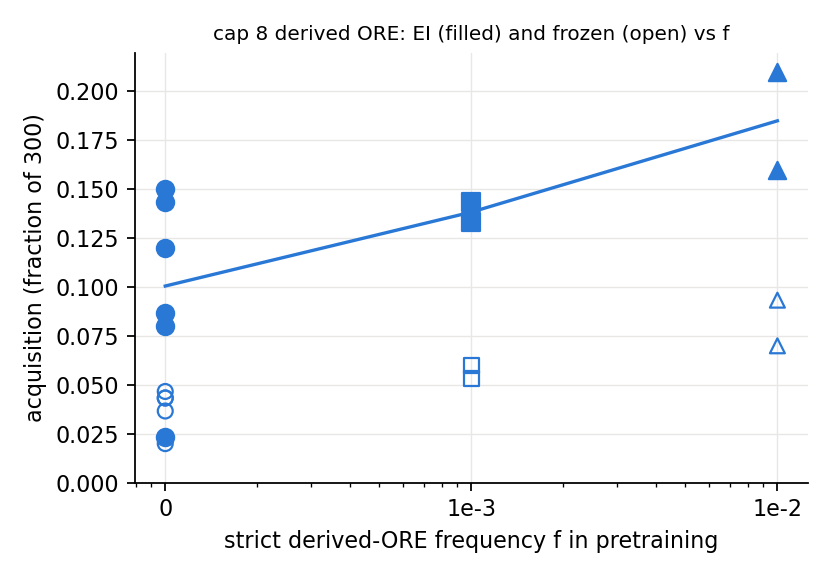

# Round 3 run 2: the 8-line reductio stratum and the derived-ORE base-rate dependence

Run 2026-09-18; pre-registration `preregistration/round3-run2.md`; numbers and source files in `numbers.md` §Round 3 run 2;
method and deviations in `log.md`. **Question:** after RL enters reductio at 7 lines, does the 8-line stratum ignite with a
measurable per-run probability, and is that governed by rounds, samples or f? Does a 6-line stratum change the zero-rate
draws? Is strict derived-ORE acquisition (cap 8, **not a submission result**) proportional to base reachability?

**Reductio** (345 required targets: run 5's 300 plus 45 six-line `nor_neg_ante` instances; 21 arms; 0 oracle violations).
- **E1 predicted 3–5 of 6 sixteen-round arms ignite the 8-line stratum: 1 of 6 did.** `f0.1_s0`, sampling seed 0: 54 of 133
  eight-liners (first proof round 4, ten by round 9), then 25 of 82 nine-liners. The same checkpoint with seed 1 and the four
  other arms: 0–3 eight-liners in 512 attempts. f is irrelevant; the 10-line stratum stays at 0.
- **E2 held:** k = 64 × 8 rounds ignited 0 of 3 — the crossing needs training rounds, not samples.
- **E3 falsified.** The "zero-rate" draws s1, s2 emit strict reductio on 13 and 26 of the 45 six-liners at pass@10⁴
  (10⁻⁴ and 5·10⁻³ per sample; run 5 saw 0 and 1 hit in 3·10⁶ samples at 7–10 lines). Both enter through the six-liners,
  reach the 7-line stratum (51 and 52 of 52), and s2 crosses to 8 lines (27 of 133, round 7) and 9 lines (25 of 82) — the
  draw that scored 0 of 300 in run 5. Frozen controls: 0 eight-liners in all 8. **E5 held** (7-line curves reproduce run 5).

**Derived-ORE, cap 8** (10 draws). E4: f = 10⁻³ acquisition **0.133 / 0.143** (in band); EI means 0.101, 0.138, 0.185 at
f = 0, 10⁻³, 10⁻², frozen 0.036, 0.057, 0.082. Base reachability spans 9–43 targets and EI follows it (Pearson 0.81; EI / base
0.78–1.47 in eight draws), but two f = 0 draws with base 20 and 27 acquire 43 and 45 (2.2 × and 1.7 ×, frozen 7 and 13)
with 26 and 25 targets the base never reaches; EI-only ≥ 20 in 3 of 10 draws. The kept fresh draw (base 9) acquires 7:
proportional, but only 1.2 × frozen.

 

**Answer.** Run 5's "7-line wall" was a length-gated entry, not a pattern gate: every draw has a non-zero base rate at the
schema's shortest instance, RL elicits it there and carries it one stratum up in every arm, but the 7 → 8 crossing is a rare
per-run event (2 of 11 trained arms, 0 of 8 frozen) that needs rounds rather than samples or f; once crossed, the 9-line
stratum follows within four rounds. Clause (2) must be read at the shortest instance: the base rate there gates entry, and
after entry RL produces schemata and lengths the base never emits, with per-run probability ≈ 0.2 in 16 rounds. Derived-ORE
amplification is proportional to base reachability on average — f raises the base rate, not the multiplier — but the multiplier
varies 0.8–2.2 × between draws of equal reachability: "in proportion" is a trend, not a per-draw law.
