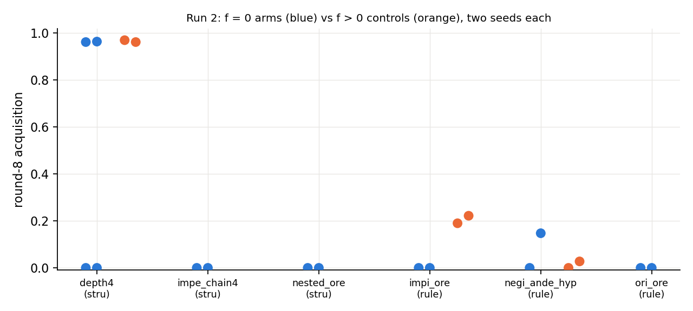
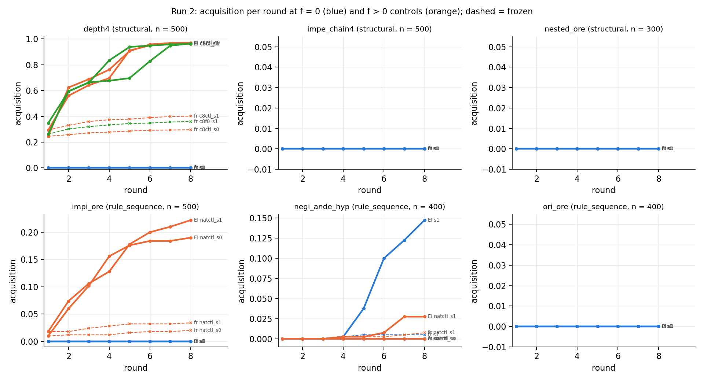

# Run 2: six new patterns, classes pre-registered

Run 2026-09-17/18; numbers in `numbers.md` §Round 2 — Run 2; classes and expectations in `log.md` 19:47 UTC (before any set was assembled). **Question:** does "RL crosses zero coverage for a structural repetition of a learned move, not for a new rule sequence" survive six patterns chosen in advance?

**Setup.** Cap-6 pretraining sets of 155,000 generator proofs: a uniform draw (`struct`, which has zero proofs of box depth 4, IMPE chain ≥ 4 or nested ORE because no ≤ 6-line proof can contain them) and three draws with one rule-sequence pattern removed (`impi_ore`, `negi_ande_hyp`, `ori_ore`; f = 0 asserted on the written files). Target pools of 300–500 theorems whose shortest found proof uses the pattern (`necessity.py`; the required subset flagged), two Stage-1 seeds, expert iteration (k = 32, 8 rounds), frozen controls, pre-RL pass@2,000. The generator cannot make three of the shapes, so depth-4 candidates came from it with the box-depth cap raised to 5, IMPE chains and nested OREs from schemata (disclosed in `QUESTIONS.md`).

| pattern (class) | f = 0 acquisition, 2 seeds | pre-RL rate | f > 0 control |
|---|---|---|---|
| depth-4 (structural) | **0 / 0** of 500 | 0, 0 in 600k | cap-8 f = 0 models: 0.97 / 0.96 (base rate 0.13!) |
| IMPE chain ≥ 4 (structural) | 0 / 0 of 500 | 0 | — |
| nested ORE (structural, 11–13 lines) | 0 / 0 of 300 | — | — (length-limited, as pre-registered) |
| IMPI containing ORE (sequence) | 0 / 0 of 500 | 0, 0 | natural-rate models (130 / 155k): 0.19 / 0.22 |
| NEGI with ANDE on its hypothesis (sequence) | 0 / **0.147** of 400 | 0, 5·10⁻⁶ | natural-rate models (11 / 155k): 0 / 0.03 |
| ORI consumed by ORE (decoration control) | pending | | |

**What happened.** Nothing at f = 0 crossed zero except negi_ande_hyp seed 1, whose base already emitted the shape at 5·10⁻⁶ (2 targets in 600k) — elicitation, as the ignition rule predicts; its round-4 checkpoint, trained once on the first proof, emits the shape on 28 / 300 targets at 8.6·10⁻³ (the drift measurement: no drift before the first proof, because nothing was trained before it). The two "structural" negatives are length, not structure: a fourth box needs ≥ 8 lines, two beyond cap 6, and the cap-6 base never writes one; at cap 8 the base models — trained with **zero** depth-4 proofs — already write a fourth box in 13 % of samples on these targets and RL takes them to 96 %. The pre-registered "structural → acquired" held at cap 8 and failed at cap 6; the "rule sequence → ≈ 0 unless the base generalised" held in 5 / 5 arms with a zero base rate and in the one arm with a non-zero rate.

**Restated rule.** Zero-coverage acquisition needs a base rate above zero, and the base rate of a structural repetition is above zero only when the proof length it needs is inside the pretraining cap; rule sequences get a non-zero base rate only by draw-level generalisation. The class labels predicted the outcome only through the base rate, which is the ignition study's variable, not the pattern's syntax.

