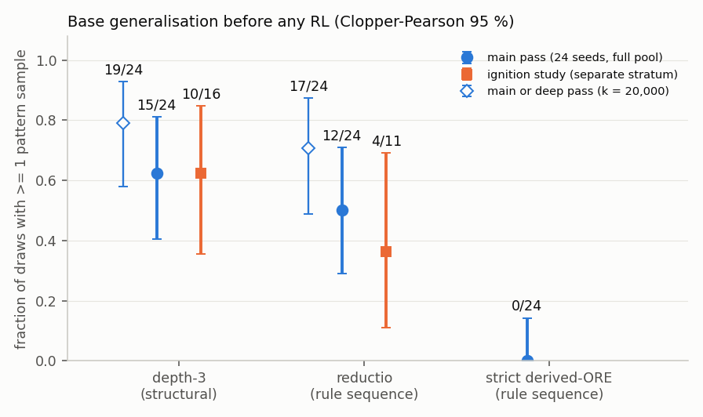
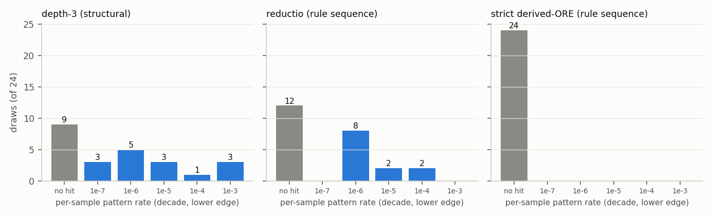
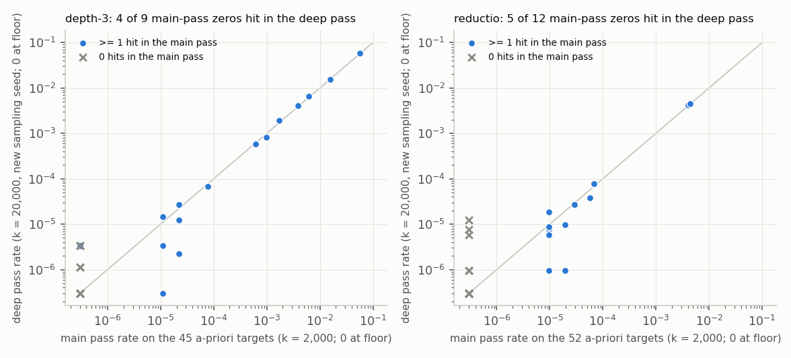
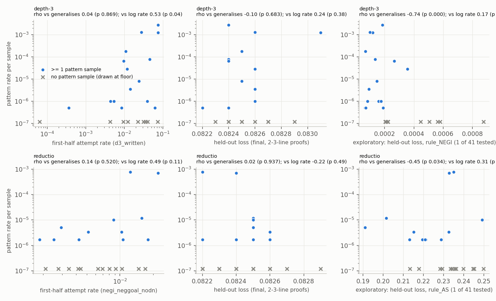

# Round 3, run 3: base generalisation by pattern class (72 Stage-1 draws, no RL)

2026-09-18; numbers: `numbers.md` §Round 3 — Run 3; pre-registration: `preregistration/round3-run3.md`. **Question:** how often does a cap-6 model trained without a pattern (f = 0) emit it before any RL, and do pattern classes differ?

**Setup.** 24 seeds per set. Main pass: 2,000 samples per target over the whole pool (depth-3 1,000 targets; reductio 300; strict derived-ORE 300, 25 oracle-required). Deep pass (pre-registered addendum, new sampling seed): 20,000 per target on 45 depth-3 and 52 reductio targets fixed in advance.

**Results.**
- Draws with ≥ 1 verified pattern sample: depth-3 **15 / 24** (95 % 0.41–0.81), reductio **12 / 24** (0.29–0.71), strict derived-ORE **0 / 24** (0–0.14). Main or deep pass: 19 / 24 and 17 / 24.
- The depth-3 and reductio intervals overlap in both passes: "structural patterns are generalised more readily by the base" is dropped. Strict derived-ORE, also a rule sequence, is never emitted; none of its 25 required targets is ever solved.
- "Zero-rate" depends on the budget: 4 of 9 depth-3 and 5 of 12 reductio main-pass zeros hit in the deep pass (rates 10⁻⁶–10⁻⁵). Rates span 3–4 orders of magnitude and repeat within 0.83–1.12; five depth-3 and seven reductio draws are zero in both passes.
- The full depth-3 pool changed nothing: 99 % of hits and all 15 generalisers lie in the 300 shortest targets. Every reductio hit is on a 7-line `nand_neg` or `negimp_to_pos` target.
- Predictors: held-out loss is flat (0.0821–0.0831) and uninformative. First-half attempt rates exceed verified rates ≥ 16× but do not predict which draws generalise (ρ 0.04, 0.14); zero-hit depth-3 draws write third boxes in up to 7 % of samples. Exploratory (1 of 41): NEGI-line loss vs depth-3 generalisation, ρ = −0.74.

**Expectations vs outcomes.** E1: depth-3 12–18 ✓; reductio 5–11 ✗ (12; falsifier 14); derived-ORE 18–24 ✗ (0; my number was the degenerate `X v X` form's). E2 ✗. E3 ✓. E4: loss ✓, first-half ✗. E5, E6 ✓. E7: ratio ✓, zero-hit attempts ✗. DA1–DA4 ✓; DA5 triggered (7 / 24 reductio draws zero in both passes).

**Consequence.** "Or nothing" fits a minority of depth-3 and reductio draws and every strict derived-ORE draw: the pattern, not its class, sets the base rate.

**Caveats.** One training set per pattern; NEGI predictor unreplicated; gate 0 confounded by a sibling's pod (`QUESTIONS.md`); `run3.md` is round 2's, hence this file name. Pods ≈ $14.

