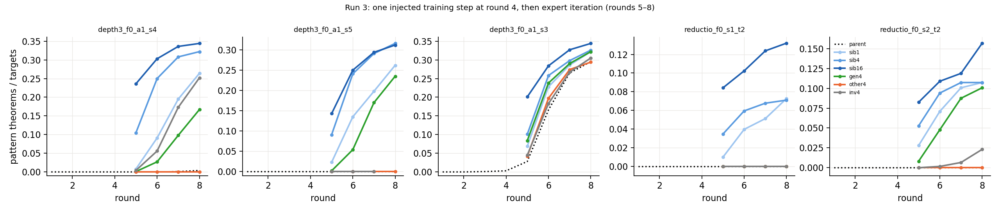

# Run 3: how little outside data ignites an arm

Run 2026-09-17/18; numbers in `numbers.md` §Round 2 — Run 3; plan and expectations in `log.md` 22:14 UTC. **Question:** one training step on a sibling's whole found set ignited 11 / 11 dead arms. What is the minimum, and must it be the pattern itself?

**Setup.** Round-4 states that had not ignited: depth-3 f = 0 draws s4 and s5 (s3, a self-igniter, as reference) and reductio zero-rate draws s1 and s2 (their round-4 state is the Stage-1 model). One 600-step fine-tuning step from that state on the arm's own found proofs + 20k retained records + the injected records (×4), then rounds 5–8 of expert iteration. Conditions: 1 / 4 / 16 sibling pattern proofs; 4 generator-made 6-line proofs with the pattern on unrelated theorems (`gen4`); 4 generator proofs of the *other* pattern (`other4`); 4 strings with the pattern's surface tokens and a corrupted citation, rejected by the verifier (`inv4`; the fine-tune step does not verify, so the control ran — these are not proofs). Ignition = ≥ 2 % of targets with a pattern proof.

**Cumulative pattern theorems at rounds 5–8** (parents: 0–4 throughout):

| | depth-3 s4 | depth-3 s5 | reductio s1 | reductio s2 |
|---|---|---|---|---|
| sib1 | 8 / 91 / 195 / **264** | 23 / 135 / 198 / **262** | 6 / 24 / 31 / **44** | 17 / 43 / 61 / **65** |
| sib4 | 105 / 250 / 308 / 322 | 91 / 241 / 291 / 316 | 21 / 36 / 41 / 43 | 32 / 57 / 65 / 65 |
| sib16 | 236 / 303 / 336 / 344 | 143 / 250 / 294 / 312 | 51 / 62 / 75 / 80 | 50 / 66 / 72 / 95 |
| gen4 | 1 / 27 / 98 / 167 | 2 / 54 / 170 / 235 | 0 | 5 / 29 / 53 / 61 |
| other4 | 0 | 0 | 0 | 0 |
| inv4 | 4 / 56 / 173 / 252 | 0 (r5–7) | 0 | 0 / 1 / 4 / 14 |

**One proof is enough.** A single verifier-valid sibling proof ignites 4 / 4 arms (0.26 depth-3, 0.07–0.11 reductio by round 8); 16 proofs reach the plateau a round earlier. It must be the right pattern: the other pattern ignites 0 / 4. Four short generator instances of the shape ignite 3 / 4. And four *invalid* strings that merely carry three box bars ignite depth-3 s4 (0.252, not s5), while for reductio they barely move s2 and not s1: for the structural pattern the seed can be a token statistic, not a proof. Expectations R3-E1–E3 held; R3-E4 (invalid strings never ignite) was wrong for depth-3.

