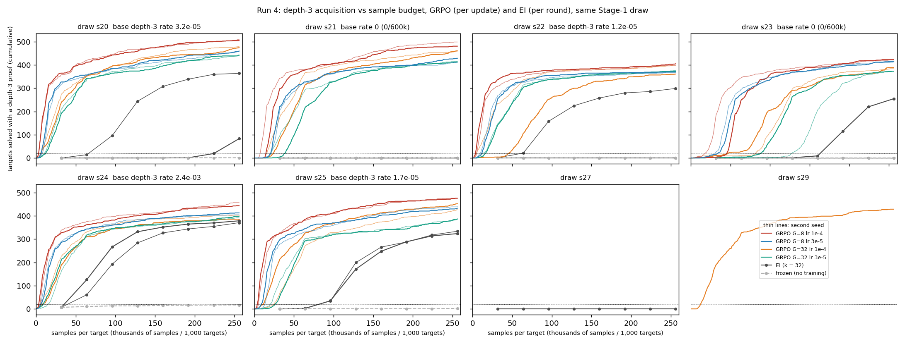
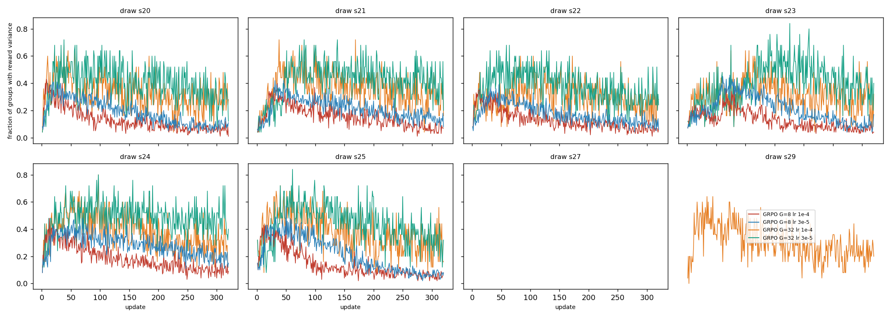
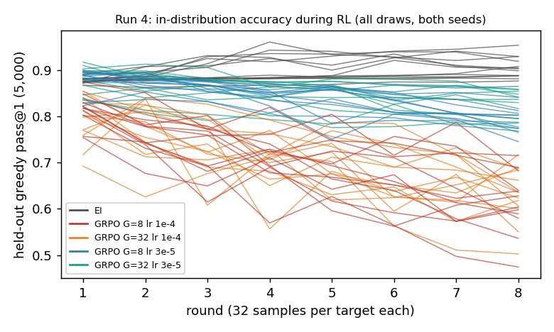

# Run 4: does GRPO ignite from zero coverage? — yes, faster than expert iteration

Run 2026-09-17/18 (pre-registration `preregistration/run4-grpo.md`, commit 49ecc8a at 23:00 UTC before the first pod at 23:01; three dated amendments before the arms they concern). The brief's Stage-1 checkpoints (`ckpts/p2/`, sets a1–a3) no longer existed anywhere, so six fresh draws of set `a1` (s20–s25, ignition-study command) were trained and every arm — GRPO, paired expert iteration (EI), frozen control, base rate — ran on the same new draw. The 85M / relative-codec arm was not run (code not here). Numbers: `numbers.md` §Run 4; per-update traces `artifacts/r4/grpo_*/updates.jsonl`.

**GRPO** (`grpo.py`, on-policy, groups G ∈ {8, 32}, binary verifier reward, group-mean baseline, fixed divisor, no KL, AdamW constant lr, 800 samples per update, 320 updates = EI's 8 × 32 samples per target) **ignited the depth-3 pattern on every draw, seed and primary setting: 30 of 30 arms**, including the strictly zero-rate draws s21 and s23 (0 depth-3 samples in 600,000 from the base) and the extension draws s27, s29 (0 in 600,000; XXX). Ignition (≥ 20 of 1,000 targets solved with a depth-3 proof) came at update 5–110 (4,000–88,000 samples); round-8 acquisition 0.36–0.48. **Paired EI on the same draws ignited in 6 of 10 arms** (s20 late; s22 seed 1 never / seed 2 round 2; s23 seed 1 round 6 / seed 2 never; s21 seed 1 never …), round-8 acquisition 0.25–0.38 where it ignited, 0 otherwise. Every depth-3 proof GRPO found is unreachable by sampling from its own Stage-1 model (base log p < 1/256 for 100 % of 4,300+ proofs on the five low-rate draws, medians −39 to −66 nats; on s24, base rate 2.4·10⁻³, 10 theorems are above 1/256) — the same "reached by training, not by sampling" picture as EI.

**Reward variance.** At update 1, 7–32 % of groups carry any variance (the base solves 7–15 % of targets within 8–32 attempts); it rises to 0.3–0.5 within 20 updates on every draw, then falls under lr 1e-4 as groups saturate. Depth-3 successes first appear at update 1–24, before or right after the first movement on depth ≤ 2 successes.

**What limits it: the step size, not the group size.** lr 1e-4 costs in-distribution accuracy (held-out greedy 0.54–0.72 at round 8 vs 0.88–0.93 for EI); lr 3e-5 keeps 0.75–0.86 and still ignites every arm; lr 1e-5 ignites (s20: 322 targets by round 2); lr 3e-4 collapses (G = 32: held-out 0.17). G = 32 ignites later than G = 8 at the same lr (update 11–110 vs 5–57). The sprint-sized budget (3,200 samples, 4 groups × 8 per update) reaches 24–60 depth-3 targets on 4 of 6 draws at lr 1e-4 and 0–10 at the sprint's lr 1e-5: the sprint's null result reproduces on budget and lr alone.

**Expectations vs outcomes.** E1 held (2 of 6 zero-rate draws). E3, E4, E6 wrong in the opposite direction: GRPO ignites from zero coverage, earlier than EI, and solves more targets. E5 held (variance rises past 0.3 in igniting arms; there were no non-igniting arms). E7 failed at lr 1e-4 (held-out drops > 0.05), held at 3e-5 for 5 of 8 arms. E8 held. E2 wrong on seed agreement (EI's two sampling seeds disagree on 3 draws). **Answer to E9:** crossing zero coverage is a property of RL against a verifier, not of EI's keep-any-success rule; EI's supervised step (with 20k retained cap-6 records per round, XXX noretain) is the slower path. Caveat: one pretraining set (`a1`), one model size, held-out accuracy is traded for it at lr ≥ 1e-4.
