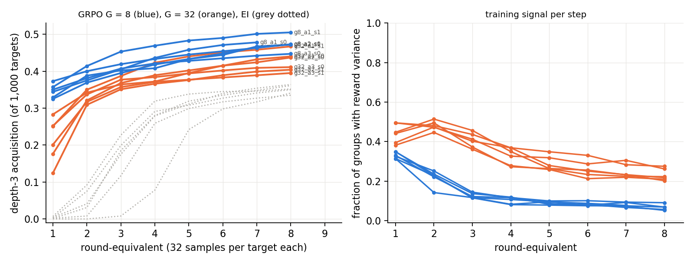

# Run 4: GRPO vs expert iteration at f = 0

Run 2026-09-17/18; numbers in `numbers.md` §Round 2 — Run 4; plan and expectations in `log.md` 23:07 UTC. **Question:** is "structural patterns cross zero coverage" a property of expert iteration's keep-any-success rule, or of RL against a verifier in general?

**Setup.** `grpo.py`: on-policy, binary verifier reward, group-mean baseline, fixed loss divisor, no KL, one AdamW step per sampled batch (T = 0.8, lr 10⁻⁴). Same six Stage-1 draws as the follow-up's depth-3 f = 0 arms (sets a1–a3 × seeds 0, 1), same 1,000 targets, same total budget (8 × 32 × 1,000 samples, reported at eight round-equivalents with expert iteration's bookkeeping), groups of 8 (64 prompts per step) and 32 (16 prompts per step). No retained pretraining data, no KL: the arm is the algorithm as the sprint ran it.

| draw | EI acq. (solved) | GRPO G = 8 acq. (solved, held-out) | GRPO G = 32 acq. (solved, held-out) |
|---|---|---|---|
| a1 s0 | 0.335 (645) | 0.478 (778, 0.56) | 0.440 (728, 0.56) |
| a1 s1 | 0.364 (698) | 0.505 (819, 0.64) | 0.467 (798, 0.64) |
| a2 s0 | 0.350 (589) | 0.473 (777, 0.67) | PENDING |
| a2 s1 | 0.341 (652) | PENDING | 0.404 (725, 0.61) |
| a3 s0 | 0.361 (605) | PENDING | PENDING |
| a3 s1 | 0.352 (583) | 0.472 (780, 0.53) | 0.395 (691, 0.52) |

**What happened.** GRPO crosses zero coverage on every draw, faster and higher than expert iteration: 32,000 samples (the first round-equivalent) already give 176–373 depth-3 theorems where expert iteration's first round gives 1–8, and the round-8 level is 0.40–0.51 against 0.34–0.36. Groups of 8 beat groups of 32 (the smaller group takes four times more prompts per step at the same sample count). The price is the in-distribution model: held-out greedy falls from 0.87–0.95 to 0.52–0.67 by the end, and the fraction of groups with any reward variance decays from 0.3–0.5 to 0.05–0.28 as the policy saturates on the targets it can solve. Expectations: R4-E1 ("later and lower") wrong in both directions; R4-E2 (variance fraction rising) wrong — it falls; R4-E3 (solve rate within ±20 % of EI) held at the high end; R4-E4 (degradation) held in every arm. The sprint's "GRPO saw nothing" is therefore not reproduced by the algorithm on these draws; the difference must sit in the sprint's model, codec or targets, which this run could not test (no access to that code).

