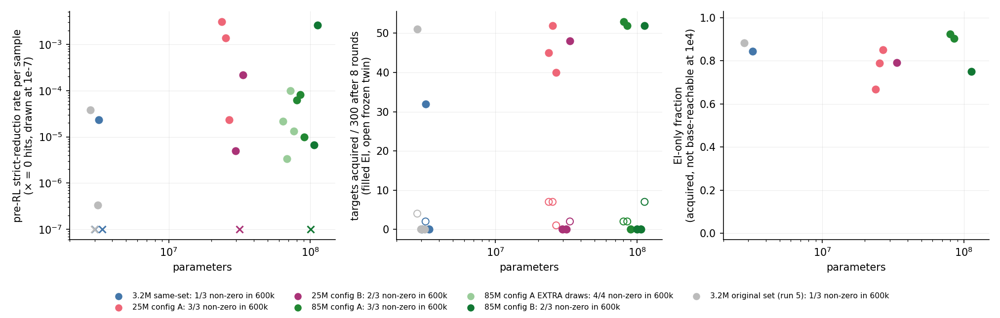
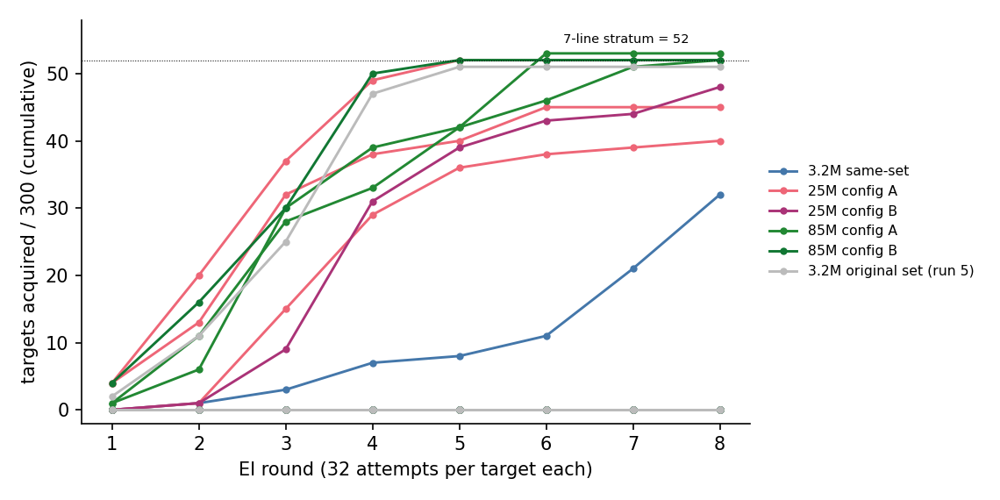

# Run 4a: does "or nothing" survive model size? (reductio, required pool)

**Setting.** 3.2M / 25M / 85M models, cap-6 set with zero strict-reductio proofs, 300 pattern-requiring targets (7–10 lines); per draw 600k pre-RL samples, EI 8 × 32, frozen twin, base pass@10⁴ on acquired targets. **Deviations:** the original f = 0 set was unreachable — rebuilt with the same assembler, plus three same-set 3.2M draws. The 0.93 held-out gate is unreachable for f = 0 models (14 % of held-out theorems are reductio-labelled; elsewhere 25M / 85M reach 0.98–0.99); both the first (A) and the retry (B) configuration were run in full (log.md).

| size | non-zero draws | rates | draws ≤ 10⁻⁵ after EI | igniting: acquired | EI-only fraction |
|---|---|---|---|---|---|
| 3.2M | 1 / 3 (run 5: 1 / 3) | 2.3·10⁻⁵ | 0 / 300 (2 draws) | 32 | 0.84 (run 5: 0.88) |
| 25M | 5 / 6 | 5·10⁻⁶ – 3.1·10⁻³ | 0 / 300 (2) | 40, 45, 48, 52 | 0.67, 0.79, 0.79, 0.85 |
| 85M | 9 / 10 (4 coverage-only) | 3·10⁻⁶ – 2.6·10⁻³ | 0 / 300 (3) | 52, 52, 53 | 0.75, 0.90, 0.92 |

- Bigger bases emit the pattern more often, not always: one 85M draw has 0 hits and stays at 0 / 300, never training. Median non-zero rates ≈ 2·10⁻⁵ / 2·10⁻⁴ / 2·10⁻⁵; seeds span three orders of magnitude.
- Draws at ≤ 10⁻⁵ also end at 0 in 8 rounds; one, continued (exploratory), lands a proof in round 13 and reaches 49 by round 16.
- Every pre-RL hit is a 7-line target. EI saturates that stratum (52) and acquires **at most one** of 133 eight-line targets, none longer: size did not move the wall. Frozen twins ≤ 7; 0 pattern-free solves.
- The EI-only fraction does **not** fall with size; it tracks base rate (> 10⁻³: 0.67–0.79; lower: 0.79–0.92).

**Expectations.** Held: P1, P3, P6, P7, "no 10× per step". Wrong: P5 / brief's E4 (predicted ≤ 0.5–0.7 at 85M; observed 0.75–0.92); P4 (8-line ignition at 85M 0 of 3; 3 of 8 arms below 45 seven-liners; a 1.0·10⁻⁵ draw never ignited); my rate band (25M-A median 1.4·10⁻³). Brief's "3 / 3 at 85M": A 7 / 7, B 2 / 3.

Numbers: `numbers.md` §Round 3 — Run 4a.

**Answer.** "Or nothing" survives to 85M but applies to ≈ 1 draw in 10 instead of 2 in 3. What RL adds is unchanged: it spreads a base-emitted 7-line shape across two schemata and stops; the EI-only fraction is instance-level spread, not longer composition. Caveats: three draws per cell; rebuilt set.

