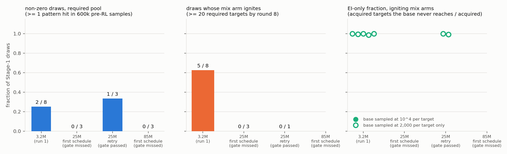
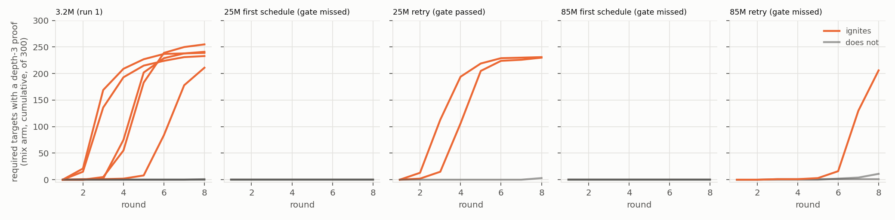
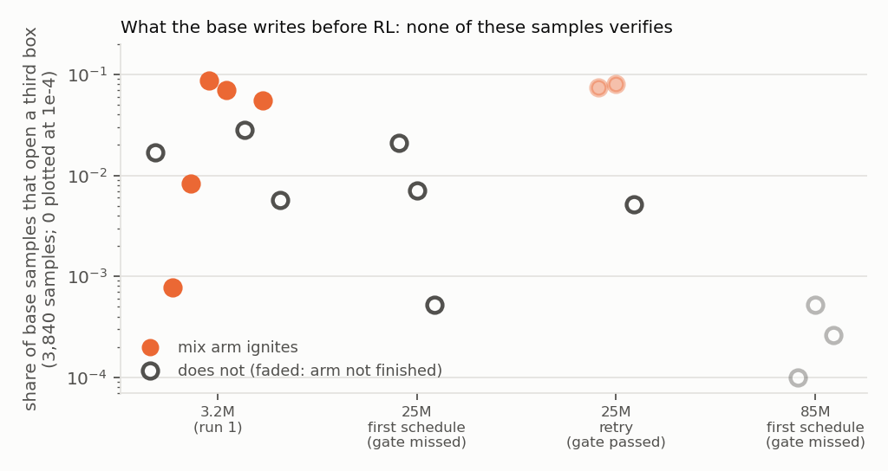

# Round 3, run 4b: does "or nothing" survive model size? (depth-3)

Numbers: `numbers.md` §Round 3 run 4b; expectations: `preregistration/round3-run4b.md`. **Question:** at 25M and 85M parameters, same cap-6 f = 0 data: how often does a Stage-1 draw emit depth-3 proofs before RL, and how much does expert iteration add beyond the base's reach?

**Design.** Three seeds per size on run 1's *required@8* pool (like-for-like 3.2M row: 2 / 8 non-zero draws, no `req` ignition; the brief's 10 / 16 and 0.30–0.36 are the optional pool). Per draw: 600k pre-RL samples, `req`, frozen, `mix` (required + 300 depth-≤ 2 neighbours), pass@10⁴ for igniters. Both sizes missed the quality gate; the pre-registered retry (12,000 steps, lr 1e-4) adds a second set.

**Size bought nothing.** Greedy 0.885–0.891 at 25M and 85M (3.2M: 0.871–0.893); the deficit is always the 6-line bin; validation loss 0.082 for all twelve. The retry lifts 25M to a median 0.911 (passes) and 85M to 0.897 (**reported as gate-missing**).

**Larger bases are zero-rate more often, not less.** Non-zero draws: 25M 0 / 3, 25M-retry 1 / 3, 85M 0 / 3, 85M-retry 0 / 3 — 9 hits in 7.2·10⁶ samples. Optional pool, first schedule: 0 / 6 (3.2M: 10 / 16). Samples that open a third box: 3–337 of 3,840 at 3.2M, 0–2 at 85M.

**"Or nothing" holds at every size on the required pool:** 11 of 11 zero-rate draws stayed at 0 / 300 without a training step; no `req` arm ignited.

**With neighbours, ignition follows the schedule, not the size.** `mix` igniters: 3.2M 5 / 8; first schedule 0 / 3 and 0 / 3; retry 2 / 3 at 25M (230, 231 targets) and 1 / 3 at 85M (206; another at 11 and rising).

**EI-only fraction ≈ 1 at every size:** 230 / 230, 230 / 231, 206 / 206; those bases reach 0, 1, 0 targets in 3·10⁶ samples — flat in size. All 14,580 counted proofs re-verify; none bypasses the pattern.

**Answer.** Scale does not retire the clause; these bigger bases had *less* to elicit. What EI acquires comes through rewarded neighbours, beyond base reach at 10⁴, gated by Stage-1 quality.

**Expectations.** E1, E2, E5 (85M), E6 wrong — mine and the brief's; E3, E4d, A3 held. **Caveats:** three seeds per cell; schedule effect post hoc; pool needs 7–8 lines, cap is 6 (depth and length confounded); samples resumed after my OOM mistakes (`log.md`). Spend ≈ $23.5.

