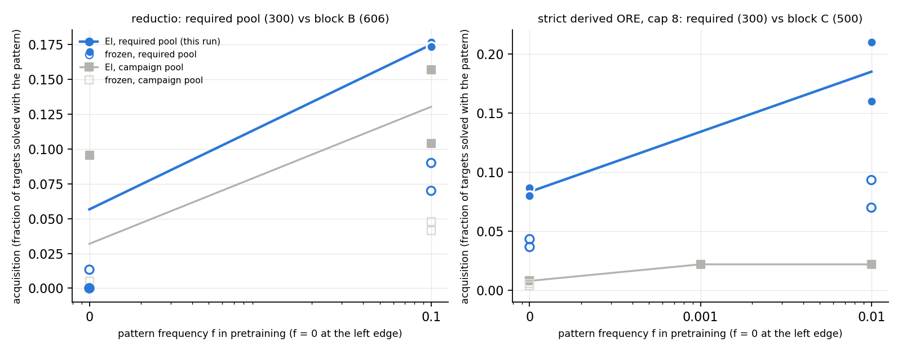
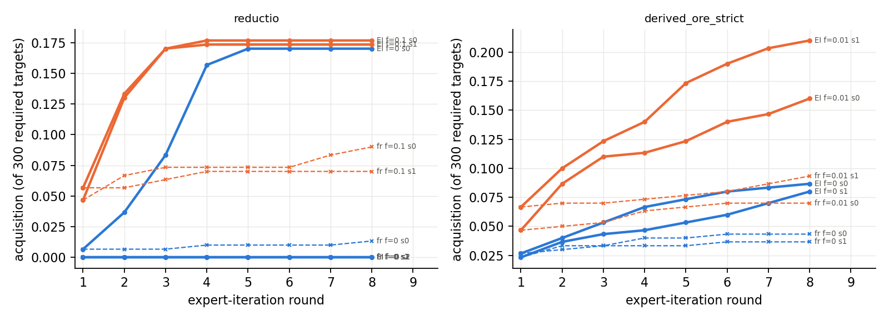

# Run 5: when the target pool *requires* the pattern

Run 2026-09-17; numbers in `numbers.md` §Round 2 — Run 5, method in `log.md`. **Question:** the campaign's reductio and cap-8 derived-ORE dials were read on pools where the pattern was optional. What do they show on pools where every target needs it?

**Oracle.** `minlen.py --forbid` restricts the bounded prover (no `DN`; no `ORE` over a derived, non-hypothesis disjunction). A theorem *requires* the pattern if the unrestricted search finds a ≤ 10-line proof and the restricted one fails within the bound with no timeout. Both pools are class-disjoint from every training set; ten targets per pool were hand-checked; on the arms, every solved target must be solved *with* the pattern — **0 violations in 9,600 target-arm pairs**, so the oracle held.

**Reductio (300 classical-only schema instances, 7–10-line proofs, no `~~` in the sequent).** f = 0 draws s1 and s2 solve **0 / 300** in 256 attempts per target (their base models emit the shape 0 and 1 times in 3·10⁶ samples); draw s0 (base rate 3.8·10⁻⁵, 6 targets at pass@10⁴) reaches **51 / 300**, and f = 0.1 reaches 53 / 52 — but all of it is the two 7-line schemata (`~(~A & B), B ⊢ A`; `~A > B, ~B ⊢ A`: 26 + 26 targets). The 8–10-line schemata (neg_both, chain_neg, contraposition-converse, nand_to_imp, excluded middle, Peirce, …) stay at **0 / 26 each in every arm, including f = 0.1 with 15,500 reductio proofs in pretraining**. Frozen controls: 4 / 0 / 0 and 27 / 21. Block B's numbers on the 606 pool (0.096 / 0 / 0; 0.157 / 0.104) were therefore the same phenomenon: elicitation of a base-draw generalisation confined to the shortest schema, extended by RL to its 7-line sibling and no further.

**Strict derived ORE, cap 8 (300 generator theorems, 9–10-line proofs).** Block C's dial was flat at 0.008 / 0.008 / 0.022 because the models solved 40 % of the targets by other routes. On the required pool: f = 0 **0.087 / 0.080**, f = 10⁻² **0.160 / 0.210**, frozen 0.043 / 0.037 and 0.070 / 0.093, monotone in f and 10× block C at f = 0. The base f = 0 model produces the strict shape on 27 / 300 targets at pass@10⁴ (5.7·10⁻³ per sample, concentrated on a few targets); EI s0's 26 solved targets are 18 base-reachable + 8 EI-only. So the pattern was never absent — it was never *selected* when a shorter route existed; when required, RL amplifies it (2× the frozen control at f = 0, rising with f) and adds a handful of targets the base does not reach at 10⁴.

**Answer.** With necessity enforced, reductio at f = 0 is exactly the ignition study's rule (base rate 0 → 0 / 300; base rate > 0 → elicitation) and is length-limited at 7 lines for every f; derived ORE is amplification that block C under-measured by an order of magnitude. Neither pool shows composition of an absent rule sequence; the campaign's one-line conclusion stands, with block C's "not acquired at any f" corrected to "acquired in proportion to f and to the base rate, once required".

