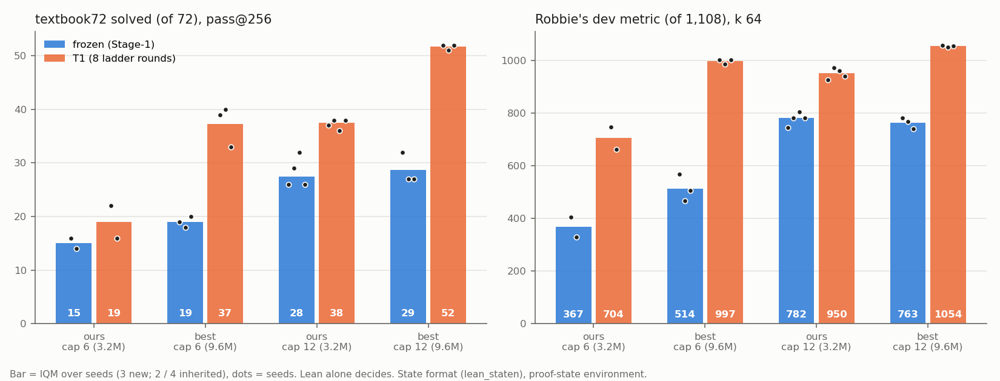

# run best-state — Robbie's network and pretraining recipe in the proof-state format, cap 6 and cap 12

**Question.** With the proof-state interface and the T1 ladder fixed, does Robbie's recipe beat our 3.2M recipe? The recipe
is his `pretrain_best.py` (6 × 384 Peri-LN, ALiBi/NoPE, Muon, MTP), ported as `state_train.py --recipe best`.
**Lean alone decides.**
- **New:** 9.56M params, `lean_staten`, from scratch, 1,200 s Stage-1 on an A40 (pilot rule: held-out greedy 0.963 vs
  0.942 at 300 s), 3 seeds per cap.
- **Ours:** inherited SN-v2 cap-6 (2 seeds) and SN-cap12 (4 seeds), 3.2M params.

Sources and per-seed values: `numbers.md` § best-state.

| IQM | ours cap 6 | **best cap 6** | ours cap 12 | **best cap 12** |
|---|---|---|---|---|
| textbook72 /72, frozen → T1 | 15 → 19 | **19 → 37.3** | 27.5 → 37.5 | **28.7 → 51.7** |
| dev metric /1,108, frozen → T1 | 367 → 705 | **514 → 997** | 782 → 951 | **763 → 1,054** |
| rr600 Q /380, T1 | 65 | **345** | 306 | **376** |
| transfer_long2 /21, T1 | 0 | **17.7** | 14.5 | **20.7** |
| held-out greedy, frozen / T1 | 0.964 / 0.971 | 0.962 / 0.994 | 0.976 / 0.975 | 0.927 / 0.992 |

**Findings (unreviewed).**
1. **Frozen (Stage-1 only), the recipe adds little.** On textbook72, best − ours is +4.0 at cap 6 and +1.2 at cap 12, both
   inside the MDD. On the dev metric it is +147 at cap 6 (beyond the MDD of 88) and −18 at cap 12.
2. **After the same RL, the bigger network wins at both caps, beyond the MDD.** On textbook72, T1 best − ours is +18.3 at
   cap 6 and +14.2 at cap 12. At each cap, every best T1 seed beats every ours T1 seed on every pool. best-cap6 T1 matches
   ours-cap12 T1.
3. **Cap 12 still adds on the best network, but less than on ours** (+14.3 vs +18.5), as predicted. best-cap12 T1 solves
   51–52 of the 72 textbook problems. Robbie's combined model solves 30–32 (Lean ∧ `nd_verify`, whole-proof).
4. **Not compute-matched.** Attempts are equal by protocol, but each best ladder used ≈ 2× our GPU-seconds. So the RL
   gain is not separated from compute per sample.

**Expected vs outcome.**
- **Frozen predictions hit:** textbook72 19 / 28.7 (predicted 19 / 30); dev 514 / 763 (predicted 480 / 830).
- **Every T1 prediction missed high:** textbook72 37.3 / 51.7 (predicted 24 / 39); dev 997 / 1,054 (predicted 780 / 950).
  The prediction of "≈ 0 at cap 12 T1" was wrong.
- **best-cap12 frozen held-out greedy ≥ 0.96: miss** (0.927).
- **The pre-registered "supported" condition holds.**

**Caps.** Truncated actions reach 1.9 % (best-cap12 T1 on textbook72). At `max_action` 1,024 / `max_steps` 192 the four worst reads
still truncate 1.0–1.8 % (non-terminating actions); their solved sets gained +2 / +1 / 0 / 0, so best values are slightly low.

**Spend and port.** 60.7 pod-hours, $29.76 (A40). The port is in CI; an independent review found no result-changing bug.
