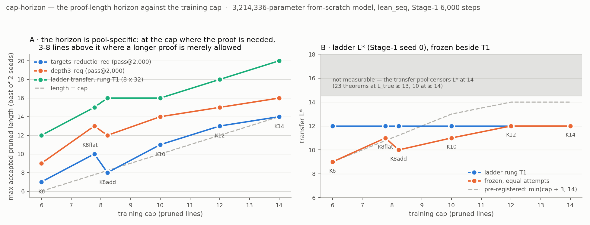
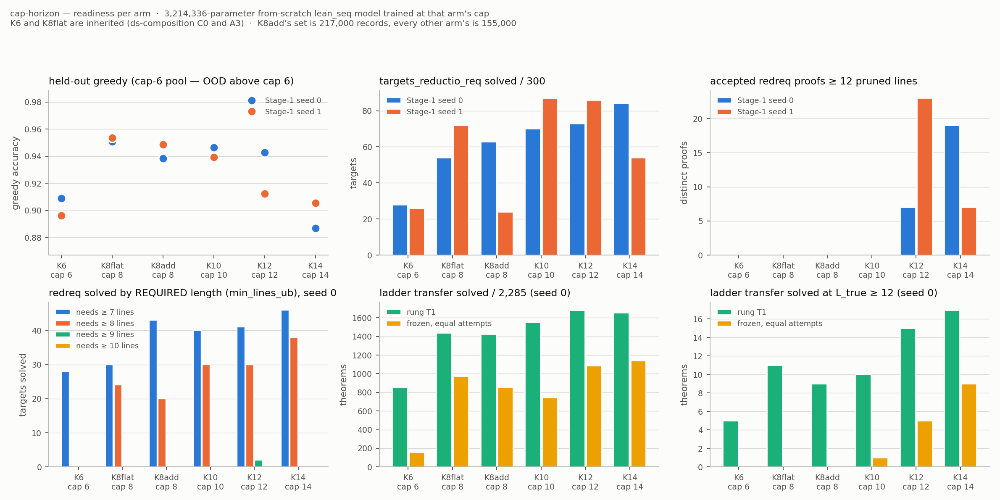

# `cap-horizon` — is the proof-length horizon a property of the training cap?

Pre-registration `2091f78`, 17.6 min before the first pod; numbers and scoring in `numbers.md`
§ cap-horizon (K0–K9). **Every arm is the same 3,214,336-parameter from-scratch `lean_seq` model,
Stage-1 6,000 steps at that arm's cap**; K6 (`ds-composition` C0) and K8flat (A3) are **inherited,
not retrained**, K8add/K10/K12/K14 are new with two seeds each. **Every arm above cap 6 is outside
the take-home's rule; none is proposed for adoption.**

## The cap sets how long a proof the model *writes*, not how hard a target it can *crack*

**It keeps moving.** Max accepted pruned length on `targets_reductio_req` =
**0.91 × cap + 1.39, R² 0.944** over 12 arm × seed cells. Accepted proofs ≥ 12 lines: **zero at
caps 6, 8, 10; 7–23 at cap 12; 7–19 at cap 14.** No plateau through cap 14.

**And it plateaus.** Solved-by-*required*-length stops at cap 8. Cap 6 solves only the ≥ 7-line
stratum; cap 8 adds the ≥ 8 stratum (0 → 20–30 of 133); **caps 10, 12, 14 add nothing** — stratum 9
at most 2 of 82, stratum 10 **zero on every arm**. T1 transfer `L*` is **12 on all six arms**.

**The two reconcile: the extra length is redundant.** Of 53 accepted proofs ≥ 10 lines, **none
proves a target needing more than 8 lines.** K14's longest — 14 lines for a 7-line target — pads via
`Or.inl` into an `Or.elim` re-deriving the same conjunction in both branches. And the horizon is
**pool-specific** (reviewer B5, reproduced across six arms): on the ladder pool *every* arm, cap 6
included, writes accepted proofs **6–8 lines above its own cap**.

## Expectations vs outcomes

`c_maxlen = +2`: **missed**, measured **+0.50** — the horizon sits *at* the cap. Frozen `L*` = cap+3:
**missed above cap 8** (9/11/10/11/12/12; offset falls to −2). T1 `L*` 13–14: **missed on all three
new caps**. Held-out: met except K8add — but `noise-floor`'s floor for it is **±20.9 pp at n = 2**,
so no held-out gap here is real.

**Falsifier 1 not triggered** (K12: frozen `L*` 12, max length 13). **Falsifier 2 triggered**: K8add
— adds long proofs, removes nothing, 217,000 records — matches K8flat within its own seed spread and
is better at nothing. Adding long proofs is the effect; what A3 removed below the cap is not. The
sibling has published no coverage/ladder floor yet, so that is "within their own spread", not
resolved equality.

**Checker.** 386,467 counted proofs, **all accepted by both Lean 4.34 and `nd_verify`, 0
disagreements**; 24.0 M samples gated; 453 Lean-only acceptances (32/M, one-directional) affect no
counted proof. A pre-registered `max_new` 768 diagnostic returned **byte-identical accepted-proof
sets** — the frontier is not truncation-bound.
