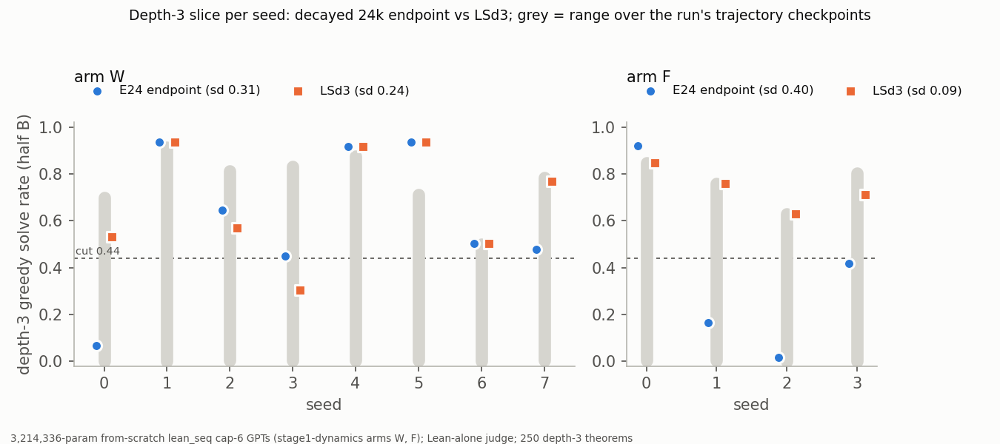

# ckpt-avg: does checkpoint averaging remove the seed "modes"? No.

**Model:** `stage1-dynamics`' 3,214,336-param from-scratch `lean_seq` cap-6 WSD checkpoints: arm W
(8 seeds, 155k control set), arm F (4 seeds, 572k fresh set). Lean-alone judge, greedy, on **half B**
of the held-out set (2,500; 250 depth-3). Selection used only half A. See `numbers.md` § ckpt-avg.

**Uniform weight averaging makes depth-3 worse and no quieter.** On W, averaging the last 2/4/8
stable-phase checkpoints gives depth-3 0.31/0.26/0.23, against 0.62 for the decayed endpoint (E24).
The sd doesn't shrink (0.34–0.37 vs 0.31). For K8 the paired difference is −39 pp [−64, −14]. Easy
bins are intact. On depth-3, though, an average lands between its constituents' extremes and above
their mean in only 2/8 seeds: the oscillation alternates between distinct solutions, and averaging
doesn't smooth it out. Averaging across the decay (T24_3/5) ≈ E24.

**Loss-based selection helps, but not enough on W.** Picking the checkpoint with the lowest half-A
depth-3 or 6-line loss (LSd3/LS6) raises W's depth-3 mean by +7/+8 pp (CIs span 0) and cuts its sd
only 1.28×/1.30×. LS6 picks E24 itself in 5/8 seeds. On F (n = 4), LSd3 cuts the sd 4.3×
(0.40 → 0.09), but costs 5 pp on len5.

**Expectations:** averages not broken, met. Averages fail the rule, met, but they land above their
constituents' mean in 2/8 seeds, not ≥ 6/8. LSd3 meets the rule: **missed** on W (sd 0.24, len4/5
−2.6/−2.8 pp). T24 ≈ E24, met; control identical.

**Adoption rule: met by no variant.** No new Stage-1 standard. The quietest *readout* is the mean
over a run's trajectory evaluations (depth-3 sd 0.11 on W). It's a different quantity (mean 0.27), so
it's a candidate for comparing arms, not a model to ship.

Also: arm R proofs now carry text (0/50,000 verdicts changed). Cost: 0.86 A40-hours,
$0.42.
