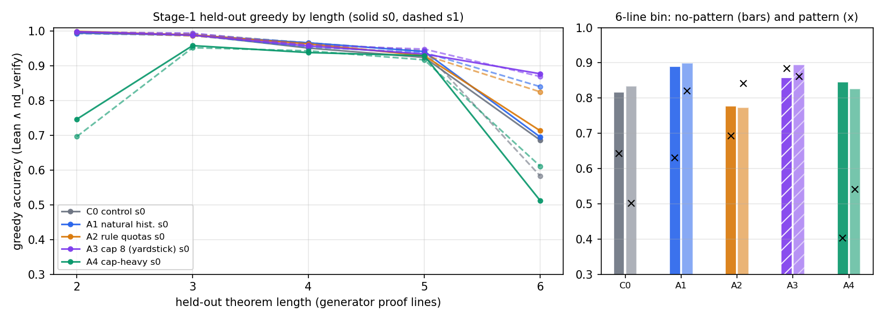
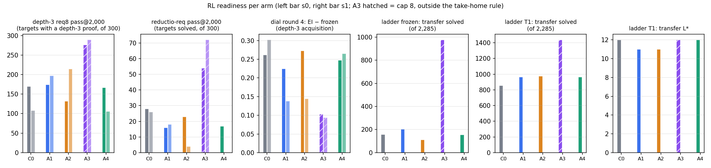

# ds-composition — does the set's *composition* buy what the cap buys?

One change each to the control, all else fixed (generator, rendering, 3.3M from-scratch `lean_seq` model, schedule,
155,000 proofs, depth-3 f = 0 filter): **A1** the pool's own length histogram (10/13/16/21/41 %, vs flat 20 %),
**A2** rule quotas (`ORE` ≥ 10 %, `ANDE` ≥ 8 %, `BOTE` ≥ 5 %), **A3** cap 8 (yardstick, **outside the cap-6 rule,
labelled everywhere**), **A4** cap-heavy 0/5/15/30/50 %. Two seeds per arm; a proof counts only if Lean **and**
`nd_verify` accept it. `numbers.md` § ds-composition has every number and its file.

**The histogram is a lever in distribution — more than pre-registered.** A1's 6-line no-pattern bin is **+7.3 / +6.5 pp**
over the control on both seeds (pre-registered +2 to +5), *above* the cap-8 yardstick's +4.0 / +6.1; its frozen ladder
solves +30 % (205 vs 158), `L*` +1. The "histogram is not a lever" null is rejected.

**The cap still sets the horizon.** Frozen ladder transfer solves: C0 158, A1 205, A4 156, **A3 (cap 8) 976**. A1 reaches **5.7 %** of
A3's gain and A4 **0 %**, against the ≥ 70 % its falsifier needed; neither matches A3's frozen `L*` (11).
Cleanest signature: **only cap 8 writes an accepted reductio proof of ≥ 8 lines** (29 / 33 vs **0** in every cap-6 arm).
Finding 1 survives.

**Finding 2's rule-mix account stands.** A2 moved **one** schema from < 5 to ≥ 5 T1 solves (disjunctive syllogism 3 → 29),
not two — though A1 and A4 each moved two, so composition is not inert. 14 of 19 stay ≤ 2 in **every cap-6 arm**.

**Finding 3 gets no counter-example, and a sharper claim.** EI round-4 acquisition lands at **0.38–0.44 in every cap-6
arm** though the frozen base rate ranges 0.117–0.270: a higher base rate buys a *smaller* EI − frozen (A1 +0.225 / +0.138
vs C0 +0.262 / +0.302), and cap 8 gains least (+0.10) while ending highest (0.68).

**No arm replaces the control.** A1 is better in distribution, on depth-3 and on the ladder, but its required-reductio
pass@2,000 is **worse on both seeds** (16 / 18 vs 28 / 26) — the "none worse" clause fails. A4's 2-line bin collapses to 0.75 / 0.70.

**Checker of record:** 124,952 counted proofs, all accepted by both checkers, **0 disagreements**.

Deviations (`log.md`): ladder cut to seed 0, 8 rounds; A40 / A6000 pods (no RTX 3090 in stock); the first session's
`artifacts/` and `ckpts/` were lost to a cleanup, so every number is re-measured. **25.70 pod-hours, $12.84** of $18.

