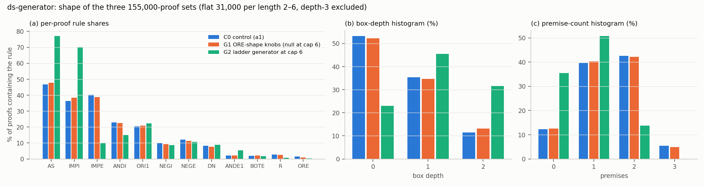
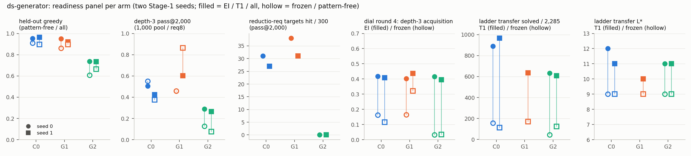

# Run `ds-generator` — changing the generator's proof-shape distribution

**Both accounts this run tested are dead, for the same reason: the manipulation is smaller than the noise.**
Three 155,000-proof cap-6 sets (flat 31,000 per length 2–6, depth-3 excluded) differing only in `gen.py`'s knobs;
two Stage-1 seeds each; every model a 3.3 M-parameter from-scratch GPT in `lean_seq` Lean format; every counted
proof accepted by Lean **and** `nd_verify`. Numbers and sources: `numbers.md` § ds-generator.

**The transfer wall is not the shape distribution.** G2 *is* the ladder transfer pool's own generator at cap 6, so
if shape were the wall its base model should read that pool far better. Frozen ladder solves of 2,285 (8 × 32,
equal attempts): **C0 158 / 114, G1 170 (s1), G2 44 / 125** — pre-registered at 450–760. G2 is at or below C0 on
both seeds; G1, whose shape table is the control's up to sampling noise, is *above* both C0 seeds.
Under EI (T1): C0 890 / 965 (`L*` 12 / 11), G1 916 / 635 (12 / 10), G2 632 / 607 (11 / 11). **G1's own two seeds,
916 and 635, bracket the entire C0–G2 gap.** `L_true` ≥ 13 is 0 solves in all eleven ladder runs.

**The textbook wall is not the rule shape.** Of 19 schemata × 40, **10 are at 0 solves in every arm and seed**;
only contraposition, disjunctive syllogism and export ever reach 5. G1 and G2 leave 17–19 of 19 at ≤ 2 on every
seed — the pre-registered falsifier. The brief predicted G1 would open an `ORE`-needing schema from the dilemma /
De Morgan / distribution families: those are **0 in all six arm-seeds**. Disjunctive syllogism (which does need
`ORE`) reaches ≥ 5 in C0 s1, G1 s0/s1 and G2 s0 alike — a draw effect, not a knob effect.

**The noise floor is what this run measured well.** Retraining Stage-1 from the same set and seed on different
hardware moves held-out greedy **−4.44 to +5.96 pp**, all in the 6-line bin; the control — byte-identical
checkpoint, new GPU, new decode path — moves **+0.00 / +0.08 pp**. Held-out: C0 0.909 / 0.897, G1 0.861 / 0.896,
G2 0.608 / 0.665. G2's collapse is real; the ±1–1.5 pp bands I pre-registered for G1 were never testable.

**Expectations vs outcomes.** Falsified: G2's frozen ladder, G2's depth-3 and reductio base rates (predicted above
C0, below on both seeds), G1's `ORE` schema. Held: both pre-registered deviations, and Lean vs `nd_verify` —
**0 disagreements on 57,013 counted proofs**. My own C0 ladder band was wrong: it quoted `lean-format` figures
measured on `stage1_full_seq_s0`, a model trained on a different set.

**Finding 3 keeps its counter-example:** G2's depth-3 base rate is far below C0's (frozen dial 0.032 / 0.034 vs
0.163 / 0.116) yet its EI − frozen is larger on both seeds (+0.383 / +0.362 vs +0.255 / +0.292), to the same
round-4 end point.

**Cost.** 21.34 pod-hours, **$13.02** of $14; 11 of 12 ladder jobs (`la_frozen_g1_s0` dropped, `QUESTIONS.md`).
3090s and A40s were out of stock, so the pods were an A6000 and a 4090 — one seed per pod, all three arms on it.
