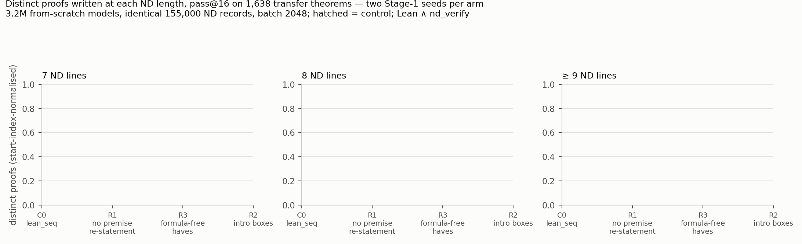
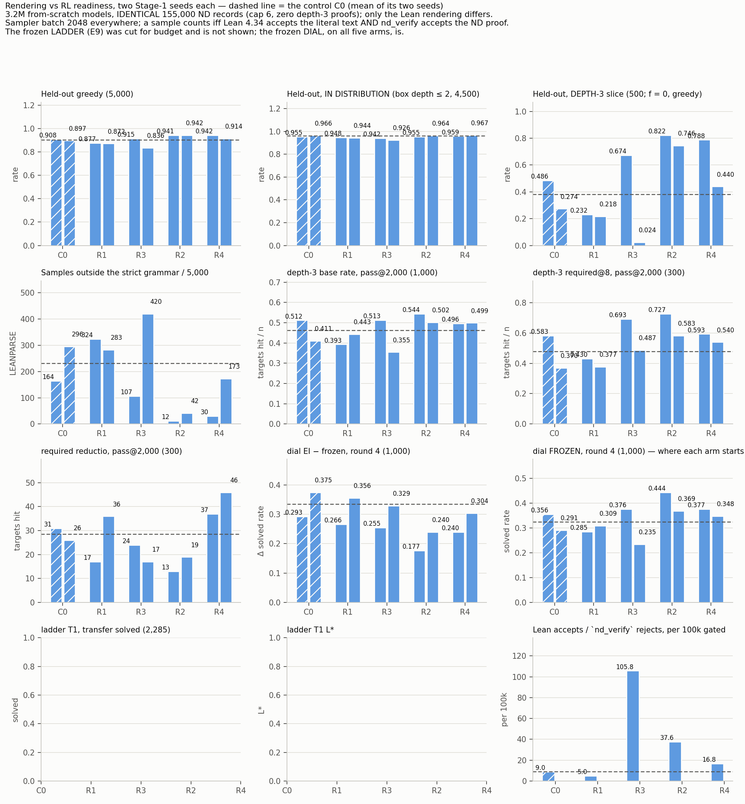

# ds-rendering — does the Lean rendering change what a from-scratch model learns?

**Question.** Proofs, model, schedule and pools fixed; only the *Lean rendering* varies. Does that change held-out
accuracy by length and RL readiness? Sharply: is the **"cap + 1" horizon a property of the text, or of the ND
proof's structure?**

**Setup.** Five renderings of the *same* 155,000 ND records (cap 6, no depth-3 proofs): **C0** `lean_seq`
(control), **R1** no premise re-statement, **R3** formula-free `have`s, **R2** `intro` boxes, **R4** bare-`fun`
boxes (addendum 1, to split the two things R2 changes at once). 3.2M from-scratch models, 2 seeds through the full
plan, 6 through Stage-1. A sample counts only if **Lean 4.34 accepts the literal text and `nd_verify` the denoted
ND proof**. `examples/` shows one proof in all five.

## The horizon is not text length

**R1 writes the shortest text (−21 %) and is the worst arm everywhere** — 7-line pass@16 ×0.70/×0.78 of C0,
below C0 at every premise count, at EI *and* frozen. The pre-registered falsifier wanted a lower base rate **and** a
larger EI − frozen; R1's is *smaller* on both seeds. Shortening the text makes the model worse and RL does not
recover it. **The horizon belongs to the ND proof's structure.**

## Rendering buys almost nothing in distribution

In-distribution held-out (box depth ≤ 2) spans **2.28 pp** across all five at n = 6. Everything below lives in the
out-of-distribution slices.

## Where it does matter, and why n = 2 lied to me

On pass@2,000 pools **R4 is the only arm above the control on all three** (×1.08, ×1.15, ×1.46). **R2 and R4 are
the same length**, differing only in which piece of the typed binder goes, yet they are **opposite on required
reductio (×0.56 vs ×1.46)** — that cost is the `intro` tactic, not the missing type. R2 fails proposal 10's rule
("none worse"); R4 passes on pool means.

My leading hypothesis — that R2's box removes the seed lottery — **was an artefact of n = 2**. A 24-model sweep put
R2's across-seed sd at **0.310, second largest**, with a 0.034 seed. Greedy depth-3 is high-variance; the
pass@2,000 numbers carry the weight.

## Lean alone is not a sufficient checker

Over **3.1M** pairs the two disagree **1,094 times, always Lean being too permissive** (`BOTE` as `.elim`
resolving to `Not.elim`); Lean has **never once** caught what `nd_verify` missed. The conjunction is load-bearing — and
**R3 is fooled an order of magnitude more often than the control**, a
cost no accuracy number shows.

