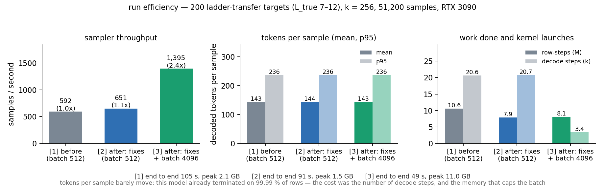

# Run `efficiency` — make sampling and checking cheap, measured before and after

**2.35× on the sampler, 2.16× end to end, on a provably identical set of accepted proofs.** Fixed workload: the
`lean_seq` Stage-1 model `stage1_full_seq_s0.pt`, 200 ladder-transfer targets of `L_true` 7–12, k = 256 (51,200
samples), T 0.8, RTX 3090. Before 592.5 samples/s and 105.45 s end to end; after 1,394.8 and 48.89 s. Sources:
`numbers.md` §1–10, `log.md`.

**The brief's premise is wrong for this model.** It rests on `ds-composition`'s "97 % of base-model samples on
7–12-line Lean targets never emit `<eos>`". Measured: **99.988 %** emit it, mean 143 decoded tokens, KV cache
2.1 GB (not 16–23), 1.7 ms per sample (not 10.5). Step 2's four causes are all excluded from data: P(`<eos>`) at
the true end is **1.0000** (400 held-out proofs, and the 42 accepted ladder proofs), 5,000/5,000 training
renderings end in `<eos>`, **0 %** of target prompts exceed the training maximum, and 93 % of rows emit `<eos>`
right after a top-level `exact n<k>`. `QUESTIONS.md` asks whether that figure came from a pretrained model; I
proceeded on the default and finished the from-scratch work.

**Where the cost is.** A decode step costs the same whatever fraction of the batch is live, so early stopping and
compaction buy nothing alone (compaction: 1.42× less work, **1.01×** wall). What pays is fewer decode steps:
memoised RoPE 1.07×, `max_new` 512 → 288 1.05×, batch 512 → 4,096 **2.13×**. Compaction is kept because it makes
the batch a lever — unchanged, batch 4,096 is *slower* than 512 (511 vs 580 samples/s) at 16.2 GB. Gate:
canonicalise once per distinct text, 19.03 → 12.18 s.

**Dropped, with numbers** (§4, §7, §9): the top-level-`exact` stop (0.92×) and the goal-reached terminator (0.72×)
— 1–3 tokens saved, more spent on per-step kernels; both kept behind `early=`. Worker-sized Lean chunks (12.18 →
19.66 s, reverted). A persistent Lean server (≈ 5 s of 49) and re-packing (≤ 1.87×, at 4× the KV memory that caps
the batch) — analysed, not built.

**Correctness gate, 51,200 samples, three times:** accepted sets **identical** — 2,022 samples, 56 distinct proofs,
31 targets, symmetric difference 0. `nd_verify` agrees with Lean 56/56. The longest accepted sample is 255 tokens,
which licenses the 288 cap; it truncated 36 rows, none ever accepted.

**Co-tenancy:** 690 / 895 / 961 / 964 samples/s at 1–4 jobs. *At most 3 jobs per GPU, and prefer one job at batch
4,096 — it beats four co-tenants at batch 1,024 (1,395 vs 964).*

**Expectations vs outcomes.** E5, E6, E9 held; E2 trivially. E1, E3, E4, E7 falsified — no terminator problem
exists here. E8 half: 0 targets lost, 1.00× accepts not ≥ 1.5×. E10 falsified on process time (35.9 %, not < 10 %)
though its conclusion survives on wall clock. E11 near: the knee is 3, not 2.
