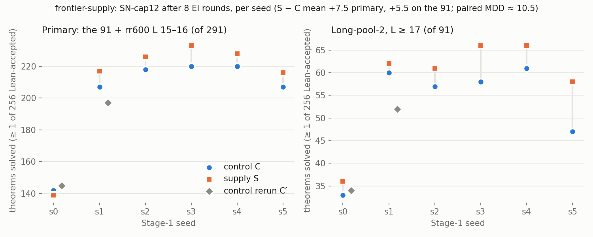

# frontier-supply — new EI targets just past the frontier

**Model:** SN-cap12 (`lean_staten`, 3.2 M params, from scratch, Stage-1 on K12). Lean alone decides. Numbers are in
`numbers.md` § frontier-supply (FS-1…6); pre-registration `preregistration/frontier-supply.md` (+ 02:12 deviation).

**Design.** Six Stage-1 seeds. From each: control **C** (state-cap12's T1 ladder: 8 rounds, k 32 on `rl_targets`) and
supply **S** (the same, but 25 % of every round's 143,840 attempts go to filtering 1,123 fresh candidates × 32).
Candidates: (a) mutations of this round's solves aimed at upper bounds `L*`+1…+4; (b) open goals of failed attempts.
Kept if p̂ ∈ (0, 1/4]; their Lean-accepted proofs join the replay. **C′** (C with a new EI seed; s0, s1) measures the
no-treatment spread. Compute matched: equal attempts and fine-tune steps, GPU-seconds within ±5 %.

| | expected | outcome |
|---|---|---|
| filter pass rate | ≥ 5 % (forecast 10 %) | **12.8 %** of 53,904; (a) 15.8 %, (b) 9.8 % |
| S − C on the primary (291) | > MDD (brief); forecast +8 | **+7.5** mean (−3, +10, +8, +13, +8, +9) |
| MDD | provisional 23 | **10.5** from C′ − C (+3, −10) |
| C vs C′ per seed | ≤ 12 | 3, 10 |

**Verdict under the pre-registration:** the filter works (12.8 % ≫ 5 %), but **S − C is inside the MDD**, so the
falsifier is met. There is no demonstrated frontier gain.

**What the data do say:**
- The direction is consistent. S beats C on the 91 long theorems (`L` ≥ 17) in 6 of 6 seeds (mean +5.5; exact-17
  +4.0), and on the primary in 5 of 6. The S − C differences vary less (sd 5.5) than the two no-treatment pairs
  (+3, −10) suggest.
- The MDD rests on two C′ pairs; C′ on all six seeds would settle whether +5 to +8 is real.
- Supplied targets are rare but **short** (kept proofs: median 9–15 lines, below the 17+ read-out): the filter
  selects rarity, not length.
- Proof length in the read-out is unchanged: median 20–22 lines, term size 14–17, in S and C alike.

**Caveats:**
- C s0–s3 are state-cap12's ladders (control path smoke-checked byte-identical; re-reads match long-pool-2 ± 1).
- Stage-1 bases read on the 91 only (7–25 solved; budget).
- 6.9 pod-hours lost to a host-watchdog deletion at 04:00; all ladders rerun. Cost 39.0 pod-hours, $19.10.
