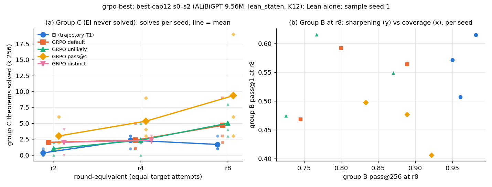

# run grpo-best — GRPO against expert iteration from the same checkpoints (UNREVIEWED)

**Models.** These are `trajectory`'s best-cap12 s0–s2 (ALiBiGPT, 9,560,832 params, `lean_staten`), trained from scratch on K12 for 1,200 s.
- **EI** is `trajectory`'s T1 ladder (inherited).
- **GRPO** is `grpo_state.py` from the same base, at equal sampled attempts (561 updates × 2,048 rollouts). Settings: G 8, AdamW 3e-5, no KL.
- **Judge:** Lean alone.
- **Group C** is EI's seed-0 failures. The headline therefore uses a fresh draw (sample seed 1).



| at r8, k 256 (per seed) | EI | default | unlikely | pass@4 |
|---|---|---|---|---|
| group C solved, sample seed 1 (MDD 3.5) | 3 / 1 / 1 | 2 / 9 / 3 | 3 / 8 / 4 | **6 / 19 / 3** |
| all 322 solved, sample seed 1 (MDD 9.3) | 288 / 284 / 290 | 278 / 278 / 279 | 277 / 277 / 279 | 286 / 301 / 285 |
| only this arm vs only EI (322 × 3, both sample seeds) | — | 15 vs 38 (p 0.002) | 15 vs 44 (p 0.0002) | 33 vs 20 (p 0.10) |
| group B pass@1 / pass@256 | .56 / .96 | .54 / .81 | .55 / .79 | .46 / .88 |
| held-out greedy | .985 / .992 / .994 | .992 / .984 / .990 | .990 / .988 / .989 | .985 / .980 / .985 |
| dev metric (1,108, k 64) | 1,053 | 1,026 | 1,027 | 1,058 |

**Findings.**
1. **GRPO reaches theorems that EI from the same checkpoint does not.** All three arms do, but only pass@4 by more than the MDD (IQM 9.3 vs 1.7).
   Pooled over seeds and both sample seeds, the arms solve 17, 16 and 33 C theorems, against EI's 5.
   40–50 % of those (EI: 2 of 5) have an accepted proof using ⊥-elimination and double negation (`gb_peirce.py`), as in Peirce's law below.
2. **Default and unlikely trade theorems rather than adding them.** Over all 322 theorems, EI solves more that they miss (38 and 44) than the reverse (15 each), and their dev metric is 26 lower.
   pass@4 is level with EI or ahead: 33 vs 20, p 0.10, not resolved.
3. **pass@4 trades sharpening for coverage.** It has the lowest pass@1 on A and B but the highest pass@256 on C (0.27 vs EI's 0.05).
   About 0.4 of its groups keep reward variance through r8; default falls to 0.07.
4. **Unlikeliness ≈ default**, as E2 predicted; but pass@4 − default (4.7 on C) exceeds the MDD, which E2 said it would not.

pass@4, s0, r8 (230 / 256 accepted), term size 10:
```lean
theorem t (P Q R S : Prop)  : (((P → Q) → P) → P) := by
  have n11 : (((P → Q) → P) → P) := (fun (n1 : ((P → Q) → P)) => by
    have n9 : (¬(¬P)) := (fun (n2 : (¬P)) => by
      have n6 : (P → Q) := (fun (n3 : P) => by
        have n4 : False := n2 n3
        have n5 : Q := n4.elim
        exact n5)
      have n7 : P := n1 n6
      have n8 : False := n2 n7
      exact (n8 : False))
    have n10 : P := Classical.byContradiction (fun hh => n9 hh)
    exact n10)
  exact n11
```

**Expected vs outcome.**
- **E1 missed** for pass@4: +7.7 on C, beyond the MDD, and its per-seed counts exceed the predicted 0–5.
- **E3 hit.**
- **E4 mostly hit:** A pass@1 for default and unlikely came in higher than predicted.
- **E5 missed upward:** held-out greedy rose 2.5–7 pp above Stage-1.
- **E6 missed:** the variance fraction averages 0.17.
- **E7 missed on training tokens:** GRPO used 0.17–0.37× EI's.
- The "changes the story" condition (C beyond the MDD *and* all-322 p < 0.05) is **not met**.

**Limits.**
- n = 3.
- EI also replays 20,000 K12 records each round.
- Six out-of-memory crashes (two ladders per 48 GB card). Among the pre-registered arms, default s2 was resumed twice (`--resume_round`; fresh, then saved AdamW state) and pass@4 s2 once (fresh AdamW state).
- The distinct arm was stopped at r4 for budget. At r4 it solved C 2 / 2 / 3, no more than EI.
- Spend: 68.1 pod-hours, $35.27 (budget $45).
