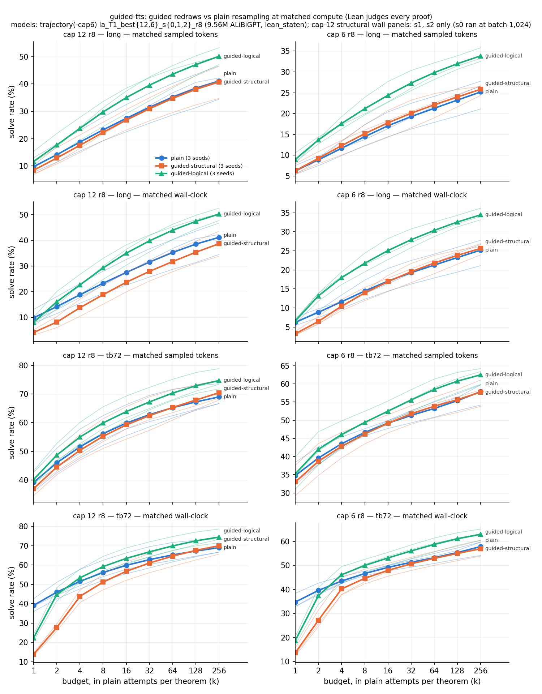

# run guided-tts — guided redraws vs plain resampling at test time, matched compute (UNREVIEWED)

**Models:** `trajectory` cap-12 and `trajectory-cap6` cap-6 T1 r8 checkpoints, seeds 0–2 (9.56M ALiBiGPT, `lean_staten`,
Robbie's recipe). **Problems:** textbook72 + Charles's release (259). **Lean alone judges.** No training.

**What ran.** k 256 attempts per theorem, T 0.8, three arms on one sampler: *plain* (a rejected action ends the attempt),
*guided-structural* (environment rejections redrawn), *guided-logical* (also redraws steps a per-step check rejects).
Redraws are exact sampling without replacement (Robbie's `_swor_shift`), ≤ 10 per attempt. The checker
(`step_check.py`, `lean_prefilter`'s rules per step) agreed with Lean on all 314,541 tested steps: 0 false rejects,
0 misses. Every Lean-rejected plain/structural proof was flagged.

**Result (matched sampled tokens, long = release theorems > 10 lines, k 64 plain-equivalent):** guided-logical beats
plain in **6 / 6** models: +5.2 to +10.3 pp (IQM +9.1 cap 12, +8.3 cap 6; MDD 2.7). Matched wall-clock agrees
(+9.1 / +8.8), except at k ≤ 2, where a guided attempt costs more than one plain attempt. Guided-structural ≈
plain everywhere (−0.8 / +0.8). The falsifier is not met.

**Expectations vs outcomes.** Brief's expectation: ✓ on long, Roy and batch3 (Pelletier: n = 8, intervals touch 0).
✓ structural ≈ plain. ✗ "little gain ≤ 10 lines" at cap 6 (+9.7 pp; cap 12 +2.6 ✓). My own prediction that
structural captures half the gain: ✗. Rescued attempts often still carry a logically
wrong step (20,525–30,613 Lean-rejected proofs per read vs plain's 9,346–17,303). Gain at k 256 exceeded the
predicted +2 to +8 (+3 to +13). Predicted smaller wall-clock gain ✗. A with-replacement redraw would repeat a rejected step with probability 0.32–0.40
(cap 12) and 0.51–0.54 (cap 6). Guided proofs are no longer (lines, term size). Cost: 9.07 A40-hours, $4.45.
`numbers.md` § guided-tts.
