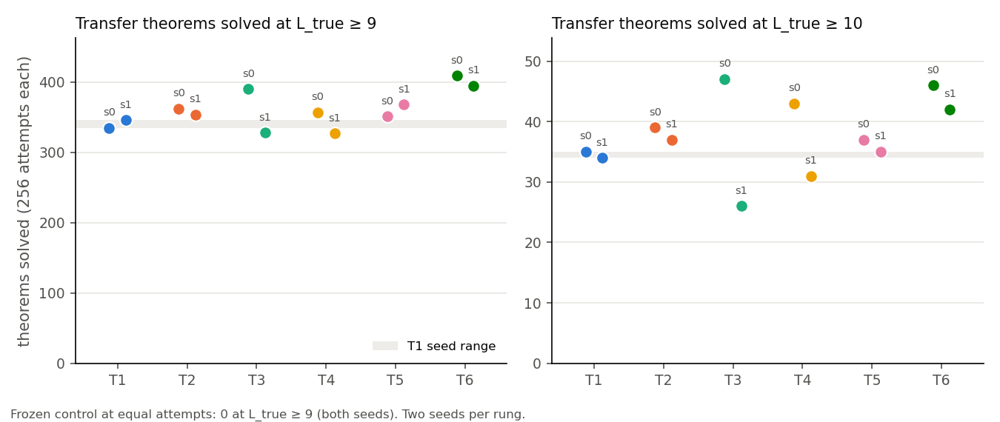
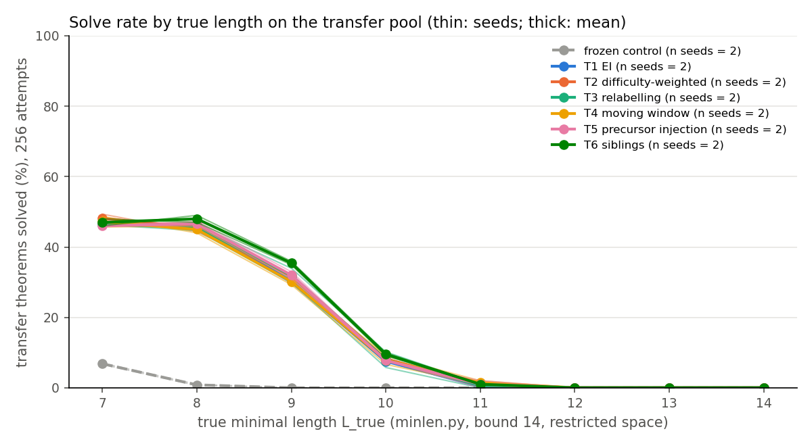

# ladder-A — RL technique ladder, Phase A (T1–T6)

**Question.** Which EI variant raises the true-length frontier `L*` of the cap-6 `abs` model most on a never-trained transfer pool, at equal budget (256 samples per target, 8 rounds, two seeds), against a frozen control? (`ladder.md`, `numbers.md`.)

**Result.** Every rung reaches the same frontier: transfer `L*` = **10** on both seeds, frozen control **7** (+3 everywhere). The wall is at 11: ≤ 2 of 99 transfer theorems at `L_true` 11, none of 125 at 12–14, in any arm. T4 spent 706 samples on each of 221 targets at `L_true` 11–13 and solved 3 and 0.

**Expectations vs outcomes.**
- Frozen `L*` 7: held (7 % solved at 7; predicted 25–35 %).
- T1 `L*` 9: **wrong** — 10 (30 % solved at 9, 7.5 % at 10). "No rung reaches +3": **wrong**; all do, T1 included.
- "No rung beats T1's `L*`": held only because `L*` saturates. By transfer theorems solved at `L_true` ≥ 9, **T6** alone beats T1 on both seeds (409 / 395 vs 335 / 346; paired p < 0.001 twice); single siblings at half the transfer attempts reach 357–376.
- T2 / T4 target-pool `L*` above T1's: **wrong** (all 10).
- T5 schemata + 5 points: **wrong** (85, 82 vs 83, 83 of 760); schemata beyond `contraposition` / `export` stay unsolved everywhere.
- Base reachability: none of the 327–409 transfer theorems solved at `L_true` ≥ 9 has base p ≥ 1e-5 (held); at 7, 37–42 % do (predicted 40–60 %). Held-out greedy ≥ 0.953 (held).

**Caution.** T3 adds ≈ 50 by-products to ≈ 12,000 RL records — effectively T1 — yet its seeds are the best single-policy arm (390) and nearly the worst (328). Run-to-run spread (round-3 counts 16–58) exceeds the T1 seed gap; two seeds rank nothing except T6.

**Interpretation.** Plain EI moves a never-trained frontier three lines past what 256 frozen samples reach, with proofs the base assigns < 1e-5, all generator-shaped at ≥ 9. Reallocation, relabelling and cap-6 precursors do not move the wall; co-trained siblings solve more beneath it.

**Deviations.** Target pool v2 (amendment before any result). Session cut off ≈ 08:00 UTC; T3 s0 crashed in round 6 (`relabel` bug) and was resumed from its round-5 checkpoint — the only rerun (its lead predates the resume). 42 labels are one line too long; `L*` unchanged. Cost ≈ $39 of $50, ≈ $32 idle pods during the outage.
