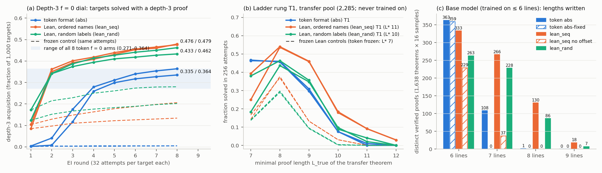

# Run lean-format — Lean as the training format for the from-scratch model (proposal 8)

**Verdict (pre-registered rule): not worse on all three — for `lean_seq`. Worse on one (in-distribution accuracy) for `lean_rand`, the scheme I had named primary.** On depth-3 and length generalisation Lean is *better* than tokens. Sources: `numbers.md` § lean-format.



Same model, schedule and data; text = `nd2lean.py`'s rendering, one symbol per token (1.23× longer). `nd2lean`'s names are line indices, so two naming schemes were fixed beforehand: random labels (`lean_rand`), first-appearance order plus random offset (`lean_seq`).

| prediction | token | `lean_seq` | `lean_rand` |
|---|---|---|---|
| P1 Stage-1 held-out greedy (a1 seeds; full set) | 0.883 / 0.883; 0.948 | 0.909 / 0.896; 0.936 ✔ | 0.882 / **0.790**; **0.830** ✘ |
| P2 depth-3 f = 0 acquisition (band ≥ 0.27) | 0.335 / 0.364 | **0.476 / 0.479** ✔ | **0.433 / 0.462** ✔ |
| P3 ladder transfer `L*` (band ≥ 10) | 10 / 10 | **11 / 11** ✔ | 10 / 10 ✔ |

**Expectations vs outcomes.** I expected "roughly neutral, `L*` stays 10". Wrong: `lean_seq` reaches `L*` = 11 in both seeds (12 / 13 theorems at `L_true` ≥ 11 vs 1 / 0; 794 / 839 transfer theorems vs 612 / 623), the proposal's "result that would matter". `lean_rand` loses 9–12 pp in distribution (wrong-name citations; I expected ≤ 5). Checker disagreements: 33 per million (expected ≤ 10).

**What matters for the project's question.** The Lean *base* models already do what the token model needed RL for: frozen controls write depth-3 proofs for 13–28 % of targets (token frozen: 0.5 %) and have transfer `L*` 9–10 (token frozen 7); the Stage-1 model writes 266 seven- and 130 eight-line proofs at pass@16 (token 108 / 1). EI still adds +0.18 to +0.35 acquisition over frozen. So part of the token format's "new capability from RL" was a surface-form barrier. Hypothesis (untested): box depth as a unary `| | |` prefix is unseen at depth 3, whereas a nested `fun … => by` looks locally the same at every depth. The name-offset barrier is format-independent: `lean_seq` without offsets drops to 37 / 0.

A depth-3 proof from a *frozen* Lean model (round 1):
```lean
theorem t (P Q R S : Prop) : ((¬(¬(¬R))) → (R → (Q ∨ (((Q ∨ Q) → R) → ((Q ∨ Q) → R))))) := by
  have n7 : … := (fun (n1 : (¬(¬(¬R)))) => by
    have n6 : … := (fun (n2 : R) => by
      have n4 : (((Q ∨ Q) → R) → ((Q ∨ Q) → R)) := (fun (n3 : ((Q ∨ Q) → R)) => by exact n3)
      have n5 : (Q ∨ (((Q ∨ Q) → R) → ((Q ∨ Q) → R))) := Or.inr n4
      exact n5)
    exact n6)
  exact n7
```

**Checker.** Reward = Lean accepts the sampled text ∧ `nd_verify` accepts the denoted proof. 13.9 M distinct samples checked by both: 0 "`nd_verify` yes, Lean no"; 460 "Lean yes, `nd_verify` no" (206 from `nd2lean`'s BOTE rendering `na.elim`, which Lean resolves to `Not.elim` on negations — fix proposed in `QUESTIONS.md`; 137 `¬A ≡ A → False`; 117 unrestated premises). All 41,840 counted proofs pass unmodified `nd2lean.py` + Lean. Lean is ≈ 170× slower per core; solo round time 1.5–2.2× the token round (stop rule 3×).

**Caveats.** One Stage-1 model per scheme on the ladder; `L_true` = 7 theorems are solved less often by Lean arms (unexplained). Cost ≈ $6.2 of $30.
