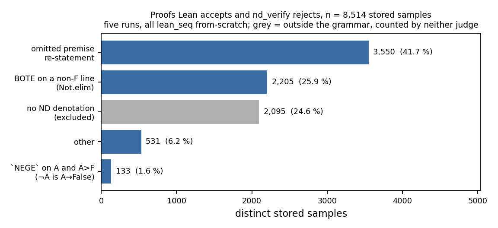
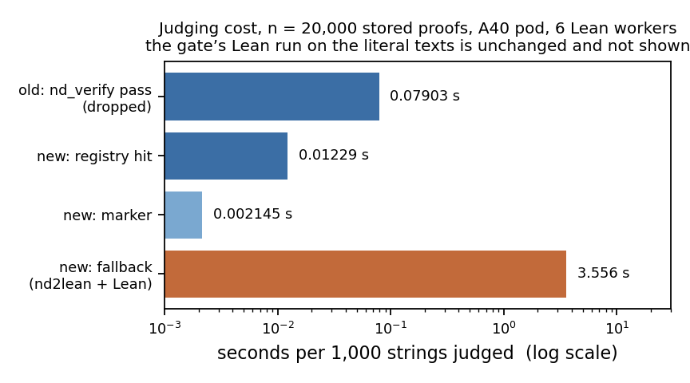

# Run `lean-judge` — Lean alone decides

**Question.** Can `nd_verify` be removed from every judging path on the fork's `dan` branch without
losing a proof the old Lean ∧ `nd_verify` gate counted, without leaking a verdict marker into
expert-iteration training text, and without making the in-loop judge slower?

**Answer: yes, on all three.** `lean_judge.py` is the judge now; `lean_gate.py` no longer calls
`nd_verify`; the six loop files import the Lean judge and batch their calls; `lean_check.py` admits
`Not.elim`. `LEAN_JUDGE.md` has the details.

## Expectations vs outcomes

| test | expected | got |
|---|---|---|
| 1 no judging path calls `nd_verify` | 0 of 8 files | **0**; 26/26 checks, VPS and pod |
| 2 zero regressions | 0 losses, ≥ 50,000 records | **0 losses** on **281,817** distinct proofs the old gate counted (100.000 % accepted). 1,195 further collected records are not ND proofs (run `efficiency` stores literal Lean text in `proof`) and are excluded; `nd_verify` rejects all 1,195 |
| 3 Lean-only class counted | 100 %; > 80 % omitted premise re-statement | **6,419/6,419 = 100 %**; class is 41.7 % omitted premise, 25.9 % `Not.elim` — the > 80 % figure was `ds-generator`-specific, **wrong** over five runs |
| 3b normalise-then-judge | 0 disagreements | **0** of 6,419 (literal text vs `nd2lean(nd)` vs `nd2lean(norm(nd))`) |
| 4 line counts agree | 100 % | **281,817/281,817 = 100 %** |
| 5 no marker in training data | 0; acceptance ≥ old; ≥ 1 relabel by hand | **0/0/0** markers; 2,348 = 2,348 on 3,506 samples (0 losses, 0 excess; the 0.01–0.07 % rate predicts 0.4–2.5); **166** hindsight relabels accepted, one shown in Lean |
| 6 throughput | hit < 0.05 s/1k; fallback 10–120 s/1k | hit **0.0123 s/1k** (dropped `nd_verify` pass: 0.0790), fallback **3.56 s/1k**, 3–34× better |
| 7 `lean_check --selftest` | all pass; canonical example both paths | **39/39**, Lean 4.34.1 and 4.34.0; accepted by both |

## The one deviation worth knowing

The brief's design would have **rejected the largest class the decision is about**.
`nd2lean.translate` refused to translate a proof re-stating fewer premises than the theorem declares
(`TranslationError('missing PR')`) — 41.7 % of the Lean-only class. I added
`translate(..., require_all_pr=False)`, used only from the judge. Sound: `lean_tok.inverse` accepts
`h`-citations only as a prefix `h1…hk` in order, so the k-th `PR` line is still the k-th declared
premise, and the unused premises stay declared, which cannot make a false theorem provable. Without
it test 3 would have failed at 58 %.

Two smaller findings. All 29,070 stored disagreements are `nd_rej & lean_ok`: the old gate's
`LEANREJ` path never fired in five runs. And 2,095 are run `efficiency`'s `no-denotation` class —
Lean accepted a text the strict grammar rejects. The new judge does **not** count those either (the
grammar is the allowlist), so they are excluded from test 3, not expected to pass.

**Model labels.** Tests 2–4 and 6 are properties of stored samples from `cap-horizon`, `noise-floor`,
`ds-rendering`, `efficiency`, `lean-format` (all `lean_seq`, from-scratch, ~19 M params); test 5 is on
`ds-composition` `stage1_a3_s0.pt`. Stored verdicts: Lean ∧ `nd_verify`; everything new: Lean alone.
Counts and sources in `numbers.md` § lean-judge. One A40 pod (`lj1`, $0.49/h).
