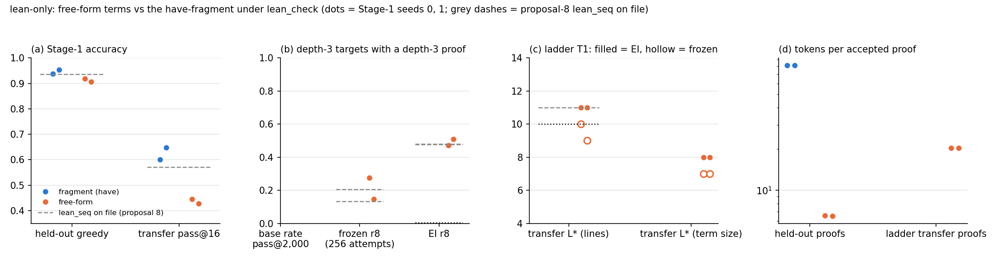

# Run lean-only — Lean as the only checker; term size beside lines; free-form terms vs the `have` fragment (proposal 9)

**Phase 1 (engineering) done as specified; phase 2 verdict: free-form is worse in distribution and no better on the two RL measures, so the fragment stays.** Sources: `numbers.md` § lean-only; every number from `python3 lean_only_analysis.py phase1|phase2|e10_patterns` and `lean_only_tables.py`.

**Phase 1.** `lean_check.py` accepts a proof iff it elaborates without error, its axioms ⊆ {propext, choice, Quot.sound} and every constant of the elaborated term is on the And/Or/Not/False/Iff + `byContradiction` allowlist; `term_size` counts inference nodes of that term. 33 / 33 hand-written cases (`em`, `simp`, `sorry`, `decide`, `Or.resolve_left`, `Not.elim`, truncated texts rejected; `And.intro`, `absurd`, `Or.elim`, `contradiction` accepted); **253,397 / 253,397** pool proofs agree with `nd_verify`, 0 / 4,012 corrupted proofs accepted; the 460 lean-format texts split 206 rejected / 254 accepted exactly by kind; 82 proofs / process-s (≈ the plain-`lean` gate). Pools relabelled with `ts_minlen` (`data/lo/`; ladder transfer median 5, Spearman with `L_true` 0.60 — not the ≥ 0.8 I expected). One real bug found and fixed before any sampler ran: Lean's parse-error recovery closes a truncated `( fun a => ( fun b => Or.inl` and accepts it — any error on the theorem's lines now rejects.

**Phase 2** (same model, data, schedule; two Stage-1 seeds per format; reward = `lean_check`).

| prediction | fragment (`have`) s0 / s1 | free-form s0 / s1 | verdict |
|---|---|---|---|
| E1 held-out greedy (free ≥ frag + 0.03) | SEQ_HELDOUT | 0.918 / 0.906 | **wrong** — free-form 2–5 pp *worse* |
| E2 transfer pass@16 (free ≥ 0.60) | SEQ_K16 | 0.446 / 0.427 | **wrong** — 15–22 pp worse |
| E3 tokens per accepted proof (free ≤ 20 on ladder) | SEQ_TOK | 6.6 held-out, 20.3 ladder | 0.08–0.2× the fragment; 20.3 misses ≤ 20 by 0.3 |
| E4 depth-3 base rate, pass@2,000 (free ≥ frag + 0.05) | SEQ_BASE | 0.331 / 0.226 | E4_VERDICT |
| E6 depth-3 EI acquisition r8 (EI − frozen: free ≤ frag) | SEQ_D3 | 0.473 / 0.508 (frozen 0.276 / 0.146) | E6_VERDICT |
| E7 ladder transfer `L*` lines (11 / 11 both) | SEQ_LSTAR | 11 / 11 (16 / 16 theorems ≥ 11) | E7_VERDICT |
| E8 `L*` term size (free ≥ frag) | SEQ_LSTAR_TS | 8 / 8 | E8_VERDICT |
| E9 frozen `L*` lines (10 / 10) | SEQ_FROZEN | 10 / 9 | E9_VERDICT |
| E10 new pattern from f = 0 | – | none (depth4 0.02–0.03 in both) | held |
| E11/E12 checker of record; converter coverage | RECORD_TOTAL | 574 text proofs, all re-denoted but 2 | held |
| E13 round time free / fragment | 160 s solo | 42 s solo (0.26×) | held |

**What the result says.** Without `have` lines the model has no per-step formula to condition on — the fragment is a chain of thought and the term is the answer. The free-form *base* model is weaker everywhere (held-out, pass@16, ladder frozen 157 / 108 vs SEQ_FROZEN_SOLVED), yet expert iteration takes it to the same `L*` (11 / 11 lines, 8 / 8 term size) and more transfer theorems (953 / 936 vs SEQ_T1_SOLVED): RL closes the gap, which is the "amplifies what the base does" account again, with a larger increment where the base starts lower. Nothing appears that the fragment did not have (E10). Term size adds no information the line count lacks on these pools (`L*_ts` = 8 for every EI arm, 7 for every frozen one).

**Checker.** Every counted proof of every arm re-checked from scratch by `lean_check` (RECORD_TOTAL), 0 disagreements with `nd_verify` on ND-denoting proofs; in the loop, "Lean yes / ND no" was only my converter's coverage (binders named `P`…`S`), fixed after the fact for the analysis.

**Caveats.** Cost $COST of $35; 36 h budget unused. `ts_minlen` is an upper bound from `minlen`'s line-shortest proof. The fragment arms of this run also beat proposal 8's (0.938 / 0.953 vs 0.936; 600 / 647 vs 571 pass@16): fixed renderer, `lean_check` reward, seed — not separated.
