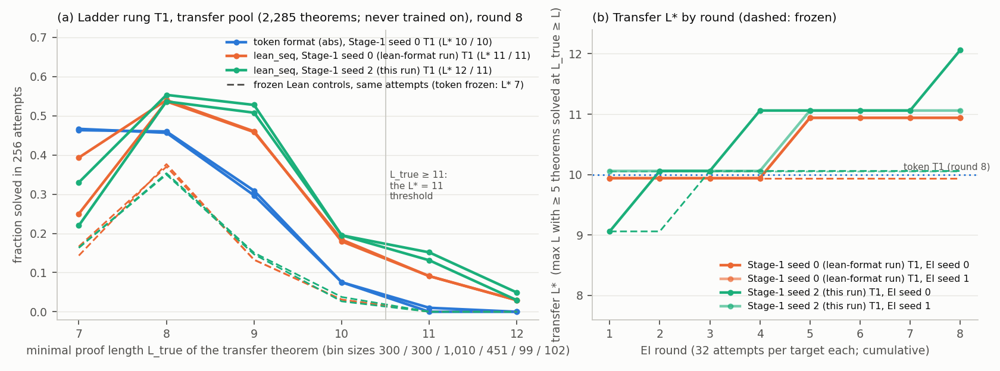

# Run lean-seed2 — second `lean_seq` Stage-1 seed on the ladder rung, after the BOTE fix

**Verdict: `L*` = 11 on the ladder transfer pool now rests on two independently trained Stage-1 models.** The seed-2 model's two EI arms reach transfer `L*` **12 / 11** (seed 0: 11 / 11; token format 10 / 10; all frozen Lean controls 10). Sources: `numbers.md` § lean-seed2, `artifacts/ls2/summary.json`.



| quantity (pre-registered expectation) | seed 0 (lean-format) | **seed 2 (this run)** | token |
|---|---|---|---|
| Stage-1 held-out greedy (0.925–0.945) | 0.936 | **0.944** | 0.948 |
| transfer `L*`, EI seeds 0 / 1 (11 / 11, P ≈ 0.55; ≥ 12 P ≈ 0.1) | 11 / 11 | **12 / 11** | 10 / 10 |
| transfer theorems at `L_true` ≥ 11 (6–20 per arm) | 12 / 13 | **20 / 16** | 1 / 0 |
| transfer solved / 2,285 (700–900) | 794 / 839 | **906 / 844** | 612 / 623 |
| frozen control `L*`, solved (10; 250–350) | 10 / 10; 304 / 309 | 10 / 10; 314 / 324 | 7 / 7; 22 / 24 |
| pass@16, 7- / 8-line proofs (0.53–0.60; 200–320 / 90–170) | 0.571; 266 / 130 | **0.595; 275 / 109** | 0.447; 108 / 1 |

**Expectations vs outcomes.** Every number landed in its pre-registered band; the one low-probability case I named — `L*` ≥ 12 in one arm — happened, at the edge of the rule (exactly 5 theorems at `L_true` ≥ 12; the `L_true` ≥ 11 counts are the robust comparison). No pool label is contradicted by a shorter accepted proof.

**BOTE fix (step 1).** `nd2lean.py` and `lean_tok.py` render BOTE as `False.elim nA` (was `nA.elim`, which Lean resolved to `Not.elim` on negations). The 206 known `.elim` disagreements are now rejected by Lean; 137 `¬A ≡ A → False` and 117 unrestated-premise texts remain Lean-accepted (the latter are structural rejections in `nd2lean --check`); 20,000 / 20,000 sampled pool proofs agree. In this run's loop: 5.28 M distinct samples checked by both, **0 `.elim` disagreements**, 61 of the two remaining kinds (11.6 per million; was 33), 0 the other way. Checker of record on all 20,735 counted proofs: 20,735 / 20,735.

**Deviation.** The seed-2 model saw the fixed rendering (1.9 % of training proofs); BOTE occurs in none of the `L_true` ≥ 11 proofs of any arm.

An `L_true` = 12 transfer theorem solved by the seed-2 model (EI s0, round 7; frozen control and token arms: never):
```lean
theorem t (P Q R S : Prop) (h1 : (S ∨ S)) (h2 : (S → (S ∨ P))) : (R → ((¬(¬Q)) → (R → (S ∨ P)))) := by
  have n1 : (S ∨ S) := h1
  have n2 : (S → (S ∨ P)) := h2
  have n5 : S := Or.elim n1 (fun (n3 : S) => by exact n3) (fun (n4 : S) => by exact n4)
  have n12 : (R → ((¬(¬Q)) → (R → (S ∨ P)))) := (fun (n6 : R) => by
    have n11 : ((¬(¬Q)) → (R → (S ∨ P))) := (fun (n7 : (¬(¬Q))) => by
      have n10 : (R → (S ∨ P)) := (fun (n8 : R) => by
        have n9 : (S ∨ P) := Or.inl n5
        exact n9)
      exact n10)
    exact n11)
  exact n12
```

Cost ≈ $2.3 of $10 (two RTX 3090, 4.5 pod-hours); 2 h 32 min wall-clock from run start to pods deleted.
