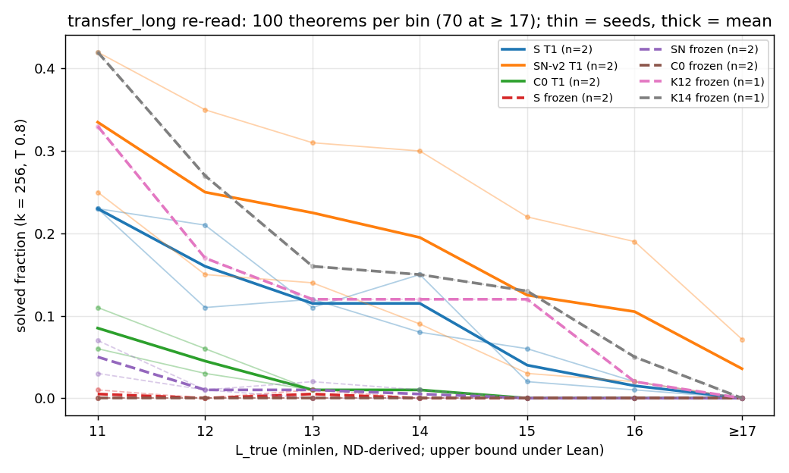

# long-pool: a transfer pool that can measure the length frontier

**Pool.** `data/ladder/transfer_long.jsonl` has 1,913 theorems at `L_true` 11–16: 373 / 428 / 341 / 340 / 300 / 131. Another 70
(no proof ≤ 16 lines) are in a separate file. The sources are the ladder's strict generator (only the length
filter was raised) and its textbook schemata. Labels: four-stage `minlen.py`, timeouts unknown (0.2–7.6 %
per stage). Lean accepts every label proof, and no renaming class is shared with 117 training/evaluation files. See
`data/ladder/POOLS.md`. Cost: 8.44 pod-hours, $6.25 of $8.

**Re-read** (k = 256, 100 theorems per bin, Lean decides; models: `numbers.md` LP6):

| `L*` s0 / s1 | S T1 | SN-v2 T1 | C0 T1 | S frozen | SN frozen | C0 frozen | K12 / K14 frozen |
|---|---|---|---|---|---|---|---|
| | 14 / 15 | ≥ 17 / 15 | 12 / 12 | < 11 | 11 / < 11 | < 11 | 15 / 16 |

**The wall at 13 was mostly the old pool.** 17 of its 23 theorems at ≥ 13 are textbook instances. Here textbook instances
are solved 10 times in 73 × 14 reads, while T1 state models solve 1–34 % of generator theorems per bin at 13–16. SN-v2 T1
s0 solves 19 / 100 at 16. The cap-14 Stage-1 model, with no RL, reaches `L*` 16. No accepted proof is shorter than its label,
and Lean re-accepts all of them.

**Expected vs outcome.** I predicted state-T1 `L*` 13 and ≤ 13 elsewhere. C0 and SN frozen s0 matched; the other T1 and
cap-12/14 models came out higher, S frozen lower.

**Caveats.** The seed spread is large (SN-v2 T1 179 vs 68 of 600), with no floor measured on this pool; K12/K14 are n = 1;
bins 15–16 are generator-only; `L_true` is an ND upper bound under Lean; not comparable with
`transfer.jsonl`.
