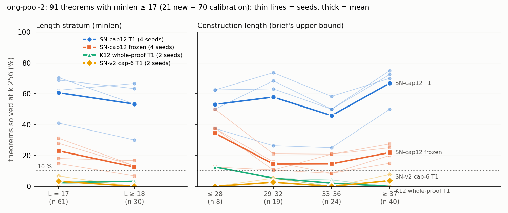

# long-pool-2 — theorems past length 17; SN-cap12's frontier is still not in sight

**Question.** Where does SN-cap12 T1's success fall off with proof length? (Model: `la_T1_SN12_s{0-3}_r8.pt`, 3,216,384 params,
`lean_staten`, from scratch, K12 Stage-1 + 8 ladder rounds. Checker: Lean alone. Sampling: k 256, `max_steps` 96.)

**Pool.** A pilot before any pod showed that the brief's construction-length bins 17–24 cannot be filled. The generator's
proofs run 15–30 lines above minimal (23–49 lines for ≥ 17 theorems), and pruning removes nothing. I labelled with
`minlen` bounds 17 and 18 instead: **exact 17 / exact 18 / ≥ 18**. Result: 21 new theorems plus 70 calibration theorems
(61 / 5 / 25). All 91 are disjoint by renaming class, and every upper-bound proof is Lean-accepted. Yield missed the
pre-registered 120–300 for three reasons: small-CPU pods, 5–8 GB per search, and my overlapping chunk seeds (34 of 55
candidates were duplicates).

| model (seeds) | L = 17 (n 61) | L ≥ 18 (n 30) |
|---|---|---|
| SN-cap12 T1 (s0–s3) | 41 / 70 / 62 / 69 % | 30 / 53 / 67 / 63 % |
| SN-cap12 frozen (s0–s3) | 15 / 18 / 28 / 31 % | 7 / 17 / 13 / 13 % |
| K12 whole-proof T1 (s0/s1) | 3 / 2 % | 3 / 3 % |
| SN-v2 cap-6 T1 (s0/s1) | 7 / 0 % | 0 / 0 % |

**Expected vs outcome.**
- The brief's falsifier fired, as I predicted: SN-cap12 T1 solves ≥ 25 % in every filled bin on every seed.
- Its rate *rises* with construction length. The L17 − L≥18 gap (+7.5 pp) is inside my predicted 0–20 pp and below the
  ≈ 30 pp this pool can detect.
- Model rates were met.
- Missed: pool size, stage-E timeouts (0 vs 15–45 %), and s3's ≥ 17 count at 96 steps (41 vs 46 ± 4).
- The step-cap question is closed: s2/s3 read rr600 471 / 468, and no sample needs more than 89 steps.

**Conclusion.** Up to length 18, SN-cap12 T1 shows no measurable fall-off. This generator cannot supply longer labelled
theorems; the frontier needs theorems whose length is known by construction (e.g. chained lemmas).
