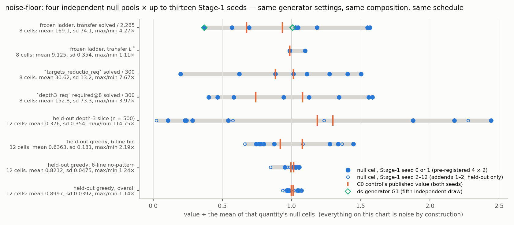
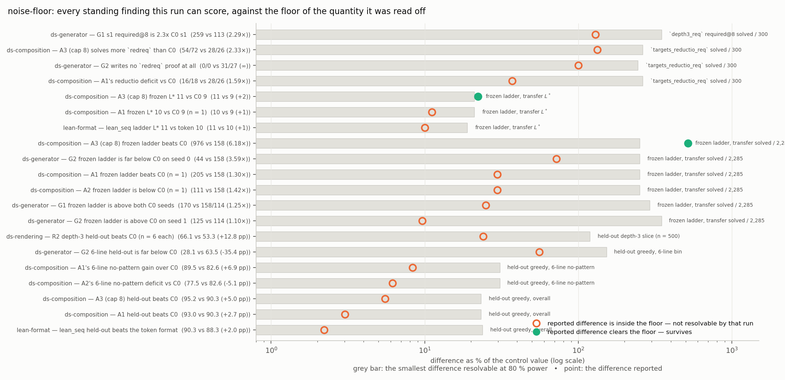

# run `noise-floor` — what difference can this project resolve?

Four raw pools from the **control's own generator settings** (`gen.py`, no knob flags; seeds
21000–24000), assembled to its composition (flat 31,000 × lengths 2–6, depth-3 excluded), trained
with its schedule, × up to thirteen Stage-1 seeds. Every difference is noise by construction. Acceptance is Lean ∧ `nd_verify`: 0 disagreements on 39,137 counted proofs.
`numbers.md` §§ N1–N10; standing reference **`NOISE_FLOOR.md`**.

**The premise holds.** The pools agree with each other to ≤ 0.26 pp and with the control's published
shape table to ≤ 0.4 pp on every share, with **0** class collisions against the nine evaluation pools.

**The floor is far larger than assumed.** Eight null cells span **62–265** solved transfer
theorems on the frozen ladder (**4.27×**, sd 43.8 % of the mean): the smallest difference two seeds
resolve is **±235 %**. `targets_reductio_req` spans **6–46** (7.67×), `required@8` **61–242** (3.97×), held-out greedy
12.1 pp over 52 cells (**±16.3 pp**); the 6-line bin and its depth-3 slice are **not resolvable at
n = 2 at all**. Every frozen-ladder value proposal 10 reported sits **inside** the null range.

**Expectations vs outcomes.** Seven met, two partly, nine missed, one not run — and the misses that
matter all go one way: **the floor is bigger than I predicted** (E1, E2, E5, E6, E8, E10). Two miss
favourably: `L*` moves by **one** point, not two (E9); the pools overlap 5.8 %, not 30–70 % (E14). **The falsifier — frozen-ladder
max/min under 1.2×, which would have revived the shape account — did not fire, by 3.6×.**

**It is the training run, not the data and not the seed.** In a balanced 4 × 13 decomposition, the
**pool** variance component is *negative* on every quantity and the seed component a few per cent of
the residual: ≈ 99 % of the spread is the individual Stage-1 run. Two runs measuring the
byte-identical control checkpoint on different pods both got **158**.

**Two n = 1 gaps closed.** `ds-generator`'s `la_frozen_g1_s0` is **62** against its arm-mate's **170**
— that arm's own seeds bracket C0 and G2 entirely. `ds-composition`'s A1 at seed 1: T1 **847** (vs
C0's 965, so "A1 beats C0 on T1" **reverses**) and frozen `L*` **9** ("10 vs 9" **dies**).

**Of twenty standing findings, two survive** — both the cap-8 arm. The training cap is still the only manipulation
this project has made that clears its noise. Cost: 28.3 pod-hours, **$13.88** of $21, two A40s at $0.49/h.

