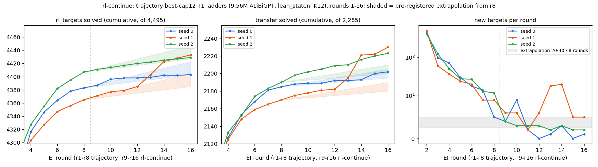

# run rl-continue — is the cap-12 RL saturated? (UNREVIEWED)

**Models:** `trajectory`'s best-cap12 T1 ladders (9.56M, `lean_staten`, K12), seeds 0–2, continued r8 → r16 with
identical settings (checkpoint md5s and found sets verified). Lean alone.


*Left and middle panels zoom to r4+ (r1–r3 lie below the axis).*

| | s0 | s1 | s2 | expected |
|---|---|---|---|---|
| new targets r9–r16 | +20 | **+68** | +22 | +20 to +40 |
| new transfer r9–r16 | +17 | **+60** | **+33** | +10 to +20 |
| textbook72 pass@256, r8 → r16 | 48 → 51 | 48 → 57 | 53 → 56 | ±3 |
| group C pass@256, r8 → r16 | .083 → .167 | .029 → .486 | .036 → .143 | flat |

**Expected vs outcome.** Targets matched the extrapolation on s0 and s2; s1 added +18 and +20 at r13–r14. Transfer
beat it on s1 and s2. Falsifier 1 (≥ 60 targets on ≥ 2 seeds): **not met**. Falsifier 2: **met**, group C rose on 3 / 3
seeds (+0.22 mean vs r8 seed spread 0.055). The RL is not saturated on the hard theorems.

**Finding:** s1's jump is one skill: 34 new targets are excluded-middle instances (s0 solves 1 of them at r16, s2 9).
Its new group C solves are classical too (A ∨ ¬A, Peirce's law, (P→Q)∨(Q→P)). s1's r16 proof of a holdout250 instance, Lean-accepted:

```lean
theorem t (P Q R S : Prop) : ((R ∧ S) ∨ (¬(R ∧ S))) := by
  have n8 : (¬(¬((R ∧ S) ∨ (¬(R ∧ S))))) := (fun (n1 : (¬((R ∧ S) ∨ (¬(R ∧ S))))) => by
    have n5 : (¬(R ∧ S)) := (fun (n2 : (R ∧ S)) => by
      have n3 : ((R ∧ S) ∨ (¬(R ∧ S))) := Or.inl n2
      have n4 : False := n1 n3
      exact (n4 : False))
    have n6 : ((R ∧ S) ∨ (¬(R ∧ S))) := Or.inr n5
    have n7 : False := n1 n6
    exact (n7 : False))
  have n9 : ((R ∧ S) ∨ (¬(R ∧ S))) := Classical.byContradiction (fun hh => n8 hh)
  exact n9
```

**Limits.** n = 3; the burst is on one seed. Budget cuts: rr600 13–16 at k 64, r12 reads at one sampling seed.
0–0.54 % of read samples hit the caps. Spend 29.96 pod-hours, $14.68. Details: `numbers.md` § rl-continue.
