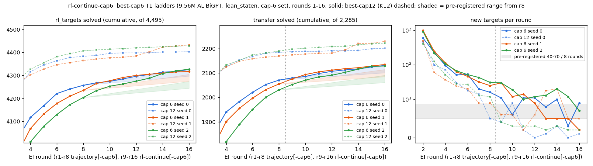

# run rl-continue-cap6: the cap-6 ladders, rounds 9–16 (UNREVIEWED)

**Models:** `trajectory-cap6`'s best-cap6 T1 ladders (9,560,832-param ALiBiGPT, `lean_staten`, from scratch, cap-6
set), continued r9–r16 on the same 4,495 `rl_targets`. Dashed: best-cap12 (K12; `trajectory`, `rl-continue`). Lean
alone. Sources: `numbers.md` § rl-continue-cap6.

| s0 / s1 / s2 | pre-registered | outcome |
|---|---|---|
| new targets r9–r16 | +40 to +70 | **+69 / +82 / +123** |
| new transfer | +30 to +60 | **+60 / +80 / +98** |
| `targets_cum` r16 | below cap 12's r8 (4,365–4,407) | 4,326 / 4,317 / 4,327, **below** |
| group C pass@256 (seed 1) | unchanged (r8 spread 0.038) | 0.077 / 0.038 / 0.050 → **0.192 / 0.154 / 0.183** |
| textbook72 (seed 1) | ±3 of r8 | 43 / 43 / 39 → 45 / 41 / 40 |

1. **Falsifier 2 falsifies "saturating"; falsifier 1 does not.** Only 1 of 3 seeds reached ≥ 100 new targets. Every seed
   solves more of its group C: 23 distinct theorems, 17 of them never solved at r8. Every shortest proof passes
   `lean_check` (6–24 lines, term size 4–20). Holdout250 is in the transfer pool, which is sampled but never trained on.
2. **Cap 6 stays below cap 12.** Over r13–r16, cap 6 adds 2–20 targets per round and cap 12 adds 0–5 (except s1:
   18 and 20). At r16, cap 12 (4,403–4,433) is 77–116 targets ahead.
3. Cost: 23.93 A40 pod-hours, $11.73. To stay in budget, holdout250 was read only on group C.
