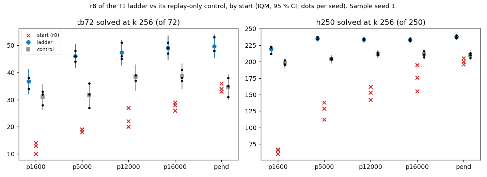
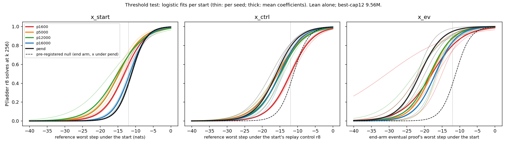

# rl-from-ckpt: RL from earlier checkpoints finishes what pretraining *plus the ladder's own replay* started

**Models:** `trajectory`'s best-cap12 seeds 0–2 (ALiBiGPT, 9.56 M, `lean_staten`, scratch on K12). 15 new T1 ladders from
Stage-1 steps 0–16,000; pend (end) ladders inherited. Lean alone. Numbers: `numbers.md` § rl-from-ckpt.

**Added control (pre-registered deviation).** Each ladder round also fine-tunes on 20,000 replayed K12 records (more
training than Stage-1 overall). Replay-only controls separate that from RL.



**Results** (sample seed 1, k 256, per seed):
- **Step 0:** 0 / 4,495 targets accepted in rounds 1–2, all seeds; stop rule fired.
- **Replay alone recovers pretraining.** The control from step 1,600 reaches 28–33 / 72 and 195–202 / 250.
  (pend start: 33–36, 196–205).
- **r8:** textbook72 34–38 (p1600), 44–51 from p5000 on (pend 48–53); holdout250 212–223, then 232–238. Only p1600
  is resolvably below pend; all inside pre-registered ranges.
- **RL adds to replay at every start:** +6 to +15 textbook72, +21 to +31 holdout250 (IQM).



**Threshold test.**
- **On x under the start (the brief's form)** the curves do not coincide. p5000 and p12000 move 3.6 and 4.2 nats
  below the end arm's x50 of −11.1. 131 pairs are solved from below −12 nats, where the end-arm curve predicts 49.
  The falsifier fires, as predicted.
- **The replay-corrected form also fires (+126), but it is miscalibrated.** The controls put lower log p on the
  reference proofs, so it fires on the pend arm itself (+42). With a null on the same scale (pend ladder against x
  under its control; post hoc) the excess is −9.2. On `trajectory`'s eventual proofs it is −44.
- **Reach (no selection).** Per seed, an early-start ladder solves 1–7 theorems the end-arm ladder never solves; the
  end arm solves 4–38 it misses. Group C looks better from p5000–p16000 (2–6 per seed vs pend 1–3), but its
  definition biases pend down.

Lowest-x solve reached by neither start nor control (p12000 s0; x −26.05 at start, −17.35 under control; 102 / 256;
8 actions, `lean_check` term size 5, as the reference):

```lean
theorem t (P Q R S : Prop) (h1 : ((Q ∨ (¬P)) ∧ (¬(¬(P ∨ Q))))) : (¬((Q ∨ (¬P)) → (¬(P ∨ Q)))) := by
  have n1 : ((Q ∨ (¬P)) ∧ (¬(¬(P ∨ Q)))) := h1
  have n7 : (¬((Q ∨ (¬P)) → (¬(P ∨ Q)))) := (fun (n2 : ((Q ∨ (¬P)) → (¬(P ∨ Q)))) => by
    have n3 : (¬(¬(P ∨ Q))) := n1.2
    have n4 : (Q ∨ (¬P)) := n1.1
    have n5 : (¬(P ∨ Q)) := n2 n4
    have n6 : False := n3 n5
    exact (n6 : False))
  exact n7
```

**Reading.** Consistent with elicitation once the ladder's replay counts as pretraining. No
selection-free measure shows an early start reaching beyond the end arm. RL substitutes for pretraining
expensively: a ladder costs 19–27 k GPU-s, 14–20× all of Stage-1 (1,350 A40-s).

**Misses.** I predicted larger x50 shifts (p1600 −22; observed −13.1) and that the replay-corrected test would not
fire (it fired, through a scale mismatch I did not anticipate). C ≤ 4 per seed was exceeded in 5 of 12 seed-start pairs (5–6).
Truncation at RL checkpoints reached 4.3 % in one stratum (0.09 % overall).

**Limits.** n = 3; ladders train on 1.3–1.6× the control's tokens; calibrated null post hoc. 120.9 pod-h, $63.72.
