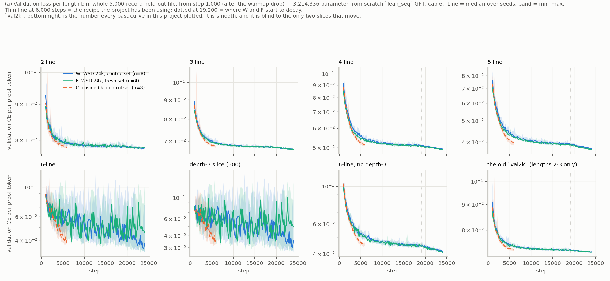
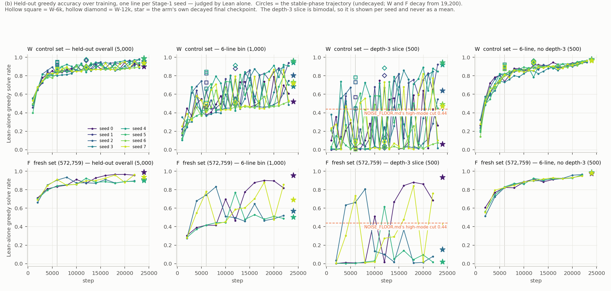
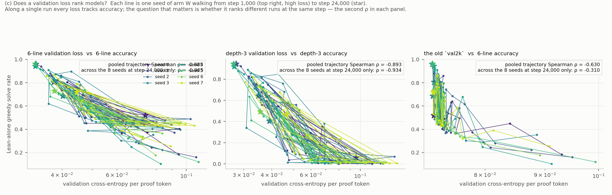

# stage1-dynamics: Stage 1 is not near saturation, and its "seed variance" is a checkpoint lottery

Every number: a **3,214,336-parameter from-scratch `lean_seq` GPT, cap 6, bs 128**, judged by
**Lean alone**, greedy, 5,000 held-out theorems. Sources: `numbers.md` § stage1-dynamics.

**The blind spot was real.** `train.py`'s validation loss read the first 2,000 records of a
length-sorted file: lengths 2 and 3. All five bins cost **4.7 %** of training time.

**Q1 — 6,000 steps is not saturation.** Within seed, 6k → 24k moves the 6-line bin by a median
**+16.1 pp** (7/8 seeds) and depth-3 by **+25.6 pp**; 2- and 3-line move +0.2 and +1.1 pp. The
falsifier needed 6 of 8 seeds flat. **None** were.

**Q2 — the depth-3 "mode" is never decided.** All twelve 24,000-step runs visit both modes: after
step 6,000 each one's depth-3 rate spans ≈ 0.01 to 0.49–0.92 and crosses the 0.44 cut **1–10 times**
(figure b). Checkpoints sit in the high mode **37 %** of the time against `NOISE_FLOOR.md`'s 0.462
across 52 *runs*: the cross-run bimodality is that oscillation sampled once. pass@8 moves with it (0.892 → 0.392 and 0.026 → 0.884 within runs), so competence is really
lost and regained.

**Nor is it the seed.** Arm R ran the *same command line* five times at two seeds: the 6-line bin
spans **0.490–0.802**, depth-3 **0.064–0.736**. Three same-command runs at 24,000 steps reproduce
nearly the whole 52-cell floor (6-line sd **0.155** vs 0.152; depth-3 **0.311** vs 0.305): that floor
is mostly nondeterminism inside one command, not seed or data variance.

**Q3 — schedules are indistinguishable.** C and W-6k see identical batches; median Δ −0.3 pp overall,
−2.3 pp at 6 lines, 4/8 each way, inside that floor.

**Q4 — steps, not data.** 572,759 fresh proofs (5.4 epochs) match 155,000 seen 19.8 times on every
trajectory-robust estimator (best depth-3 loss 0.0286 vs 0.0283, best rate 0.823 vs 0.820).

**Q5 — per-length loss ranks runs, `val2k` does not.** Across 8 seeds at 24,000 steps, Spearman
**−0.905** (6-line) and **−0.934** (depth-3) against **−0.310** for `val2k`, which moved 0.002 all
run while the 6-line bin moved up to 45 pp (figure c).

**Expectations (22):** 10 met, 6 partly, 6 missed — five misses (E2, E8, E11, E12, E19) say the
oscillation and floor are *larger* than predicted; E16, that instrumentation is cheaper.
**8.74 pod-hours, $4.29** of 30 h / $15; four A40s, real rate $0.49/h, deleted.

**Change three things:** log per-length loss; train past 6,000 steps; stop reading one checkpoint's
long-proof rate as a run's property.

