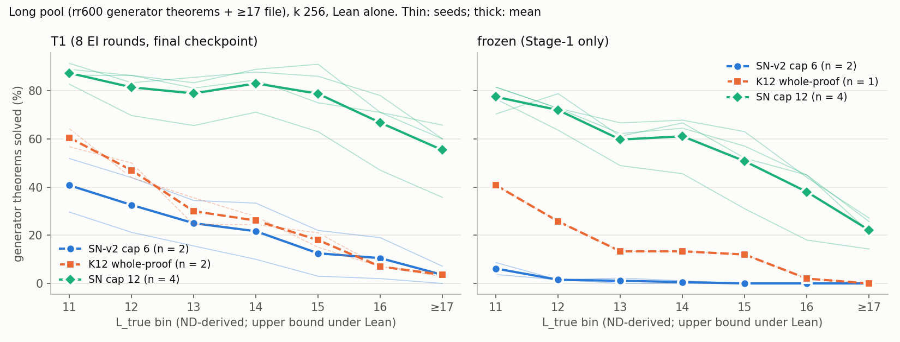

# state-cap12: the proof state and cap-12 training proofs, together

**Question.** Does SN-v2 (proof state, environment-assigned names) trained on K12's cap-12 proofs move the long-proof
frontier beyond either lever alone? All models: 3.2 M parameters, from scratch.
- SN-cap12: `lean_staten`, 4 seeds.
- Comparators: K12 whole-proof T1 (re-run here, 2 seeds) and SN-v2 cap-6 T1 (`long-pool`'s files, 2 seeds).

Lean alone decides; `L_true` is an ND-derived upper bound. Sources: `numbers.md` § state-cap12.

**Result: the levers compound, far beyond the pre-registered detection limit.** Readout: rr600, k 256, final checkpoints. Q = generator theorems solved at `L_true` 13–16 (of 380).

| arm | Q per seed | ≥ 17 file /70 | `L*` |
|---|---|---|---|
| SN-cap12 T1 | 233 / 295 / 320 / 317 | 25 / 42 / 42 / 46 | ≥ 17 ×4 |
| SN-cap12 frozen (Stage-1) | 134 / 212 / 228 / 216 | 10 / 15 / 19 / 18 | ≥ 17 ×4 |
| K12 whole-proof T1 | 79 / 72 | 3 / 2 | 16 / 16 |
| SN-v2 cap-6 T1 | 102 / 28 | 5 / 0 | ≥ 17 / 15 |

- SN-cap12 T1 mean 291 vs K12 T1's 75.5: **+216**, against an MDD ≈ 119. Every SN-cap12 seed beats every comparator seed.
- Over C0 T1's Q of 2, the state alone adds ≈ +63 and the cap alone ≈ +74; **together +289**, i.e. super-additive.
- The untrained SN-cap12 models already beat every comparator's T1. RL adds +83 to +101 per seed on top.
- Textbook theorems go from ≤ 6 solved (any model `long-pool` re-read) to 27–30 of 82.

**Checks.**
- Gates on K12: 0 failures.
- Contamination: 0 shared renaming classes.
- Literal-text `lean_check`: 3,280 / 3,280 accepted; 2,400 / 2,400 negative controls rejected.
- Held-out greedy: 0.969–0.978.

**Expected vs outcome** (`preregistration/state-cap12.md`).
- Hits: K12 T1 (Q 79 / 72 within 30–90); SN-cap12 T1 `L*` ≥ 17 on 4 / 4; original-pool T1 `L*` 13; held-out; gates.
- Misses, all too low:
  - T1 Q 60–200 → 233–320.
  - Frozen Q 15–80 → 134–228.
  - Generator rates at 13–16 (≤ 50 %) → 47–91 %.
  - ≥ 17 file 2–20 → 25–46.
  - Original pool 1,500–1,900 → 1,960–2,027.
- Also missed:
  - K12's original-pool `L*` came out 13, not 12.
  - Step-cap hits: 0.13–0.31 %, not 0. A `max_steps` 96 re-read (seeds 0–1) moved solves by ≤ 7, both directions.
- The brief's falsifier fires by construction (ceiling), as pre-registered.

**Limits.**
- n = 4 vs 2. The significance is parametric: an exact permutation test cannot go below p = 0.13.
- The original pool saturates at `L*` 13, and the long pool is near its own ceiling. Bins ≥ 17 are needed next.
- SN-cap12 and K12 T1 replay K12; SN-v2 replays cap 6. That is part of the manipulation.

Spend: 30.2 pod-hours, $14.91. Pods deleted.
