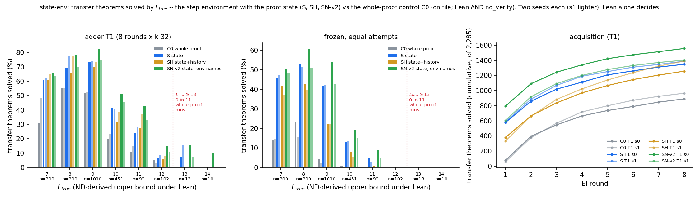

# run state-env — does a proof state move the length wall?

**Models:** 3.2 M-parameter, from-scratch, trained on `data/p2/train_depth3_f0_a1.jsonl` (155 k, cap 6). **S** sees
only the Lean tactic state and writes one step. **SH** also sees the proof so far. **SN-v2** (post-hoc) is S with the
environment naming new hypotheses. **C0** is the whole-proof `lean_seq` control on file (Lean ∧ `nd_verify`).
Lean alone decides; two seeds each. Details: `STATE_ENV.md`, `numbers.md` § state-env.

**The state lifts everything below the wall and barely moves the wall.** Transfer solved after T1: S 1,348 / 1,389,
SN-v2 1,557 / 1,403, SH 1,257 / 1,390, C0 890 / 965. With **no RL**, S solves 779 / 787; C0's frozen control solves
158 / 114. `L*` is **12 in every T1 run**. At `L_true` ≥ 13, S solves 1 / 2 and SN-v2 3 / 1 (whole-proof runs: 0 in
11). That is only 3 distinct theorems, all nested `fun` introductions: 13+ ND lines, term size 8–13. The held-out
depth-3 slice moves most: S 0.922 / 0.882 vs C0 0.488 / 0.272.

| S, pre-registered | predicted | outcome |
|---|---|---|
| held-out greedy | 0.85–0.95 | 0.958 / **0.801** — missed both ways |
| held-out 6-line | ≥ 0.60 | 0.904 / 0.678 (C0 0.686 / 0.584) |
| T1 solved | 700–1,250 | 1,348 / 1,389 — above |
| T1 `L*`; ≥ 13 | 12; 0–3 | 12 / 12; 1 / 2 |
| textbook / 760 | 20–120 | 182 / 216 — above |
| frozen | 80–400, `L*` 9 | 779 / 787, `L*` 11 / 10 — above |
| steps; syntax ends; truncation | 4–12; < 45 %; < 0.1 % | 8.5 / 8.8; 11 %; 0.002 % |
| SH vs S | equal | T1 equal; frozen 516 / 479, ~280 lower |

**Falsifiers:** neither fires (`L*` 12; 1 and 2 solved at ≥ 13). The state is not what limits length here.

**Caveats.** `lean_seq`'s random name offset makes an attempt's first new name unpredictable from any state. S seed 1
loses 11.6 % of held-out attempts to out-of-scope names (the traced SN-v1 seed-1 model starts at `n64`); SN-v2 removes the
problem on the same checkpoints (0.970 / 0.958). An empty-term crash, two duplicate launches and an SH out-of-memory
error were fixed; each affected run resumed as a re-draw. 35 pod-hours, $20.20.
