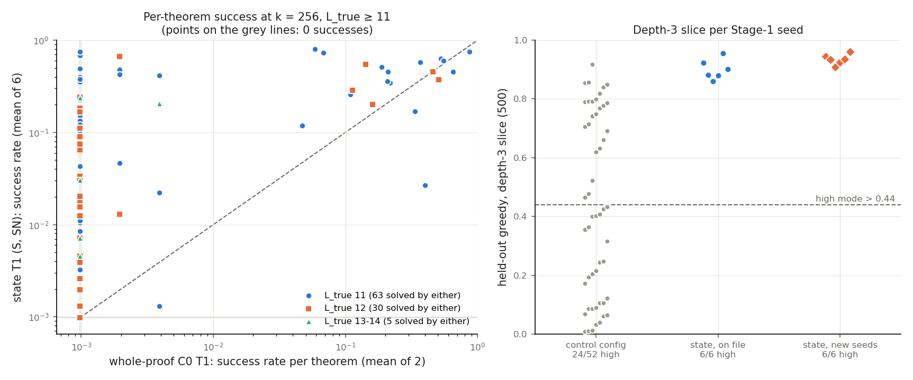

# Run `state-frontier`: the state at `L_true` ≥ 13, and the depth-3 lottery

Pre-registered at 20dfa0f1. Numbers: `numbers.md` § state-frontier. Lean alone decides; `L_true` is an ND upper bound.
Models: 3.2 M from-scratch GPTs: S / SN (state-conditioned) and C0 (whole-proof `lean_seq`).

**Q1: a real, low rate, not one lucky theorem.** Re-sampling final T1 checkpoints at k = 256 on the 224
transfer theorems at `L_true` ≥ 11, six state finals (S s0–s3, SN s0/s1) solve **5 distinct** of the 23 theorems at ≥ 13, four by ≥ 2 finals.
`la_transfer_1126` carries 42 % of the 749 successes. The pooled rate at ≥ 13 is
**2.1 %** for the state finals and **0.017 %** for C0's two (2 hits, on `1126`). Stage-1 bases score 0, except
SN s3 with 1 / 256. Paired by theorem, state beats C0 at 11–12 on 86 of 93 (p = 2 × 10⁻¹⁸), and at ≥ 13
on 5 of 5 (p = 0.06). Shortest ≥ 13 proofs: 13–14 lines, term size 8–12. All four S ladders reach `L*` 12 (1–4
theorems at ≥ 13): the state gets past 12 rarely but repeatably, without moving `L*`.

**Q2: the state removes the lottery.** All **6 / 6** new state Stage-1 seeds are in the high depth-3 mode
(0.908–0.960). p = 0.0097 under the control's 0.462; the falsifier (≥ 2 low) did not fire. All 12 state
seeds are high: Wilson [0.757, 1.00], against the control's [0.333, 0.595], with SD 0.032. This is the depth-3
slice only: S s3's held-out overall is 0.882 (358 of its 588 failures are Lean rejections).

**Floor.** Frozen SN (n = 5): IQM 869 [746, 999]. Frozen S (n = 4): IQM 823 [779, 996]. C0 scores 114–158.

**Expectations vs outcomes.**
- *Hits:* C0 / base N13; `1126` by all six; T1 11–12 counts; `L*` 12; all of Q2; frozen SN.
- *Misses:*
  - N13 was 1 for two finals (predicted 2–6).
  - Pooled rate 2.1 % (predicted 0.1–1 %).
  - State bases at 11–12 were 2–14 (predicted 10–40).
  - S T1 1,546 / 1,630 (predicted ≤ 1,500).
  - Frozen S 858 / 996 (predicted ≤ 850).

**Deviations.**
- Mixed GPUs (no 3090s free).
- The stop rule fired at 21.4 h: frozen SN s5 was dropped at round 5; frozen SN s4 finished.
- C0 T1 s1 was re-run at `max_new` 1,024, as pre-registered.

**Cost:** 22.17 pod-h, $10.94.
