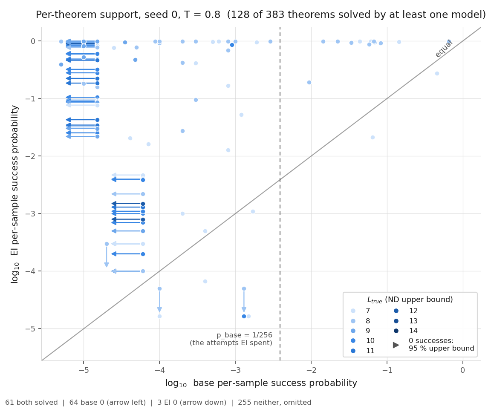
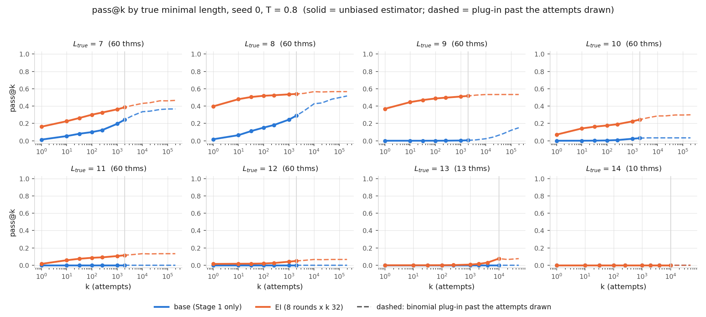

# support-curves — does expert iteration expand the base model's support?

Proposal 12, experiment 1. **Lean alone decides.** Numbers, sources and checks: `numbers.md` § support-curves;
pre-registration + addendum: `preregistration/support-curves.md`.

**Models.** *Base* `ckpts/lf/stage1_a1_seq_s{0,1}.pt` (md5 `9bde44c0…`, `fc27e52d…`): 3,214,336-parameter
from-scratch GPT, `lean_seq`, cap 6, Stage 1 only. *EI* = those + 8 rounds × k 32 at T 0.8 on a **disjoint**
pool, re-trained here.

**Design.** 383 never-trained-on transfer theorems, stratified by `L_true`, committed before any pod. 10,000
samples per theorem per model at T 0.8, then up to 390,000 more on the crux across both temperatures.

| pre-registered | outcome |
|---|---|
| E1 EI transfer solved 856–965 | **869**, `L*` 12 — hit |
| E2′ base solves 100–220 of 383 at k 10,000 | **45** — missed badly |
| E3′ EI solves 230–340 | **121** — missed |
| E4′ forward crux 50–130 | **82** — hit |
| E6 reverse crux 5–25, 0–10 survive | **6**, **2** — hit |
| E7 crossover at k 10³–10⁴ | **none, any stratum, any k** — missed |
| E10 seed agreement ≥ 70 % | **92.7 % / 90.9 %** — hit |
| **E5 falsifier: predicted 8 (0–19), no fire; fires at 20** | **29 — IT FIRES** |

**29 theorems get 0 base successes in 200,000 attempts at T 0.8 *and* 200,000 at T 1.0 — 4 × 10⁵ each, 5× the
depth the falsifier asks for — while EI solves every one of them at p̂ 0.022–1.000.** Support expansion, not a
sampling amplifier; against this project's pattern and against my own written-down prediction.

The amplifier effect is there and it saturates: survivors go **44 → 35 → 29** as the base is given
10,000 → 50,000 → 200,000 attempts at each temperature. Extra attempts do rescue theorems, then stop.

Five ways it could be an artefact; none holds. **Leakage:** the survivors share 0 names, 0 theorem strings and
0 renaming-class keys with EI's training pool (0 of 2,285 pool-wide). **Validity:** all 372 accepted EI proofs
on them re-verify one proof per Lean process, 0 `sorry`/`simp`-class tokens. **Judging:** 11/11 proofs from an
independent code path pass `support.py`'s judge. **Sampler:** on 9 theorems the base demonstrably solves it
returns 116/140/179 per 2,000. **Temperature:** T 1.0 rescued 19 theorems T 0.8 missed, 17 in the crux.

No stratum crosses over: base pass@k climbs (`L_true` 7: 0.123 → 0.335, k 256 → 10,000) and never catches up;
at `L_true` 9 — 0/60 base solves against EI's 32/60 — it is 0.024 vs 0.533. Under the base, the teacher-forced
probability of *the proof EI wrote* has median 4.7 × 10⁻¹⁴ over 297 crux proofs — a bound for that proof only.

**So:** "EI only sharpens what the base can already do" fails here; experiment 2 should target capacity and
coverage, not search. **Caveats:** one base and its EI model, 3.2 M parameters, one
pool, n = 2 seeds — *counts* sit inside `NOISE_FLOOR.md`'s floor and are not the finding; the per-theorem
structure is. `L_true` is an ND-derived **upper** bound.

