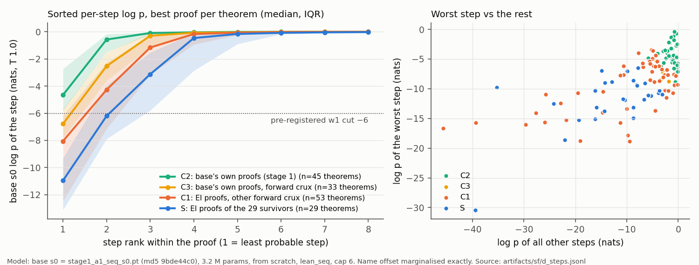
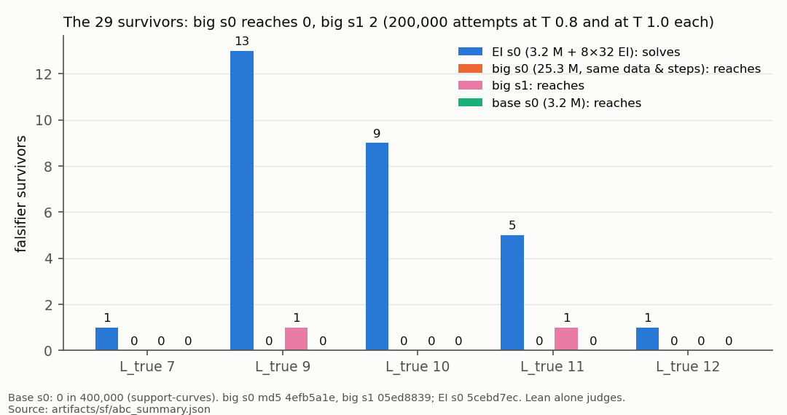

# support-followups — pressure-testing the support-expansion result

Tests `support-curves`' 29 theorems: base 0 in 400,000 attempts, its EI model p̂ 0.02–0.9995.
**Lean alone decides**; 451 / 451 literal texts pass a re-check. Details, md5s: `numbers.md`.

**Models.** *base* 3.2 M params, from scratch, `lean_seq`, cap 6; *EI* base + 8 × 32 expert iteration; *big* 25.3 M, same data and steps.

| pre-registered | outcome |
|---|---|
| D: "compounding" (≥ 20 spread) will not occur | **0 spread, 28 concentrated → "a new move"** |
| A: EI s1rerun 125–165 solved, ≥ 24 survivors | **147, 29 / 29**; 95.6 % agreement with the lost checkpoint |
| B: ≥ 5 of 6 longest survivors stay at 0 in 10⁷ | **5 stay; 1 success** |
| **C falsifier: big base reaches ≥ 15 of 29** | **does not fire: 0 (seed 0), 2 (seed 1)** |

**D — a few confident wrong turns.** Survivors' most probable EI proofs:
- The base's two worst steps cost −11.0 and −6.2 nats (medians). All other steps together cost −4.1.
- On its own proofs: −4.7 and −0.6.
- At the worst token the base puts mass **1.000** on another choice, and EI puts ≈ 0 nats on the proof's.
- Its alternative: another formula (10), another rule (8), ending the proof where EI closes a nested box (7), closing a box early (3).
- Caveat: the rule also labels most controls concentrated; survivors differ in depth, on one curve with crux theorems the base solves eventually.

**A.** The seed-1 column reproduces on an uploaded checkpoint.

**B.** `la_transfer_1932` falls at p̂ ≈ 5 × 10⁻⁷, via a shorter proof than any of EI's (`Not.elim` on `¬¬P`). The other five: p_base < 1.8 × 10⁻⁶.

**C.** Big s0 / s1: held-out 0.879 / 0.884 (base 0.909); forward crux 6 / 8 of 82; survivors 0 / 2. Caveat: same 6,000 steps — not a tuned larger model.

**So.** At 3.2 M the expansion replicates, is not a capacity artefact, and consists of a few structural decisions the base makes confidently the other way — not per-step sharpening compounding (proposal 12). Every non-EI survivor proof differs from all of EI's.

**Deviations.** 5090 / 3090 / L40S GPUs (no A40s); A at k 10,000 (stage 3's k); `max_new` 512 despite ≤ 1.4 % truncation in some strata (longest accepted proof: 352 tokens). **Cost** 25.2 pod-hours, $8.81.

