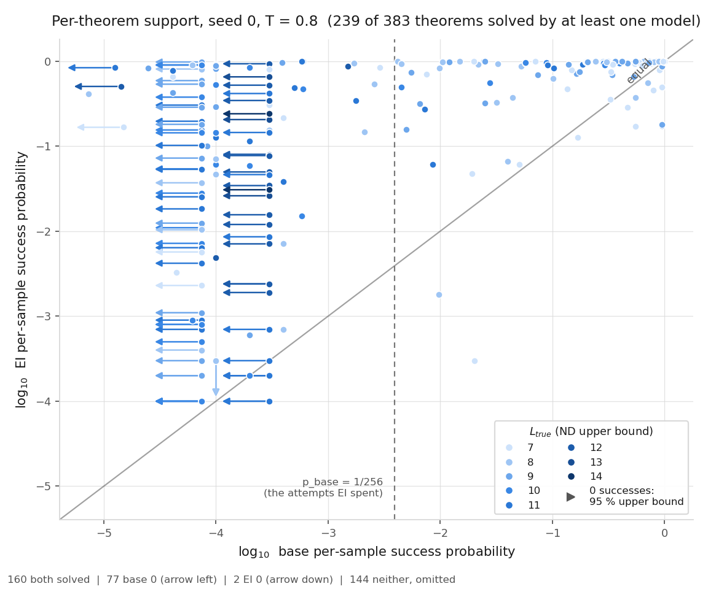

# run support-state: is the support expansion about a move, or about state?

**Models** (all 3.2 M params, from scratch, `train_depth3_f0_a1`, cap 6): SN base = `state-env`'s `stage1_SN_s{0,1}`
(`lean_staten`, sampled in `Env(assign=True)`); SN EI = `la_T1_SN_s0_r8`. Whole-proof (WP) numbers are
`support-curves`' (`stage1_a1_seq_s0` / `la_T1_sc_s0_r8`). **Lean alone decides**, on the literal text. Numbers:
`numbers.md` § support-state (SS1–SS7); pre-registration `preregistration/support-state.md`.

**The state base reaches the survivors.** Of the 29 theorems WP base never solves in 400,000 attempts, SN base s0 reaches **28** and s1 **28** (misses: la_transfer_1893 / _1110), 26 and 23 of them within 10,000 attempts
at T 0.8. Median p̂ 0.19 (s0). Pooling the rest of the run's draws, s0 reaches all 29. The brief's
falsifier (≥ 15 of 29) **fires**: the whole-proof "support expansion" is, on these theorems, about state.

The "new move" is not new to the state model. On 18 of 19 survivors where WP EI's most improbable step is a `have`,
SN base s0 takes the same step. Example, la_transfer_1004: WP base gives WP EI's proof log p −45.1; SN base s0 writes
the identical proof (up to names) in 122 of 4,096 attempts:

```lean
theorem t ( P Q R S : Prop ) : ( ( ( ¬ S ) → ( ¬ Q ) ) → ( ( S → ( ¬ P ) ) → ( ( ( ¬ S ) ∨ ( ¬ S ) ) → ( ( ( ¬ ( ¬ S ) ) → S ) ∧ ( S → ( ¬ P ) ) ) ) ) ) := by
  have n12 : ( ( ( ¬ S ) → ( ¬ Q ) ) → ( ( S → ( ¬ P ) ) → ( ( ( ¬ S ) ∨ ( ¬ S ) ) → ( ( ( ¬ ( ¬ S ) ) → S ) ∧ ( S → ( ¬ P ) ) ) ) ) ) := ( fun ( n13 : ( ( ¬ S ) → ( ¬ Q ) ) ) => by have n14 : ( ( S → ( ¬ P ) ) → ( ( ( ¬ S ) ∨ ( ¬ S ) ) → ( ( ( ¬ ( ¬ S ) ) → S ) ∧ ( S → ( ¬ P ) ) ) ) ) := ( fun ( n15 : ( S → ( ¬ P ) ) ) => by have n16 : ( ( ( ¬ S ) ∨ ( ¬ S ) ) → ( ( ( ¬ ( ¬ S ) ) → S ) ∧ ( S → ( ¬ P ) ) ) ) := ( fun ( n17 : ( ( ¬ S ) ∨ ( ¬ S ) ) ) => by have n18 : ( ( ¬ ( ¬ S ) ) → S ) := ( fun ( n19 : ( ¬ ( ¬ S ) ) ) => by have n20 : S := Classical.byContradiction ( fun hh => n19 hh ) ; exact n20 ) ; have n19 : ( ( ( ¬ ( ¬ S ) ) → S ) ∧ ( S → ( ¬ P ) ) ) := ⟨ n18 , n15 ⟩ ; exact n19 ) ; exact n16 ) ; exact n14 ) ; exact n12
```
(literal sampled text, `artifacts/ss/H_base_T08_s0.s0.jsonl`; all 510 re-checked proofs pass Lean 4.34.1, SS8.)

**But EI expands the state base's support too.** On all 383 theorems (k 10,000, T 0.8): SN base 152, SN EI 237
(WP: 45 / 121). SN forward crux: **87** theorems. **30** have 0 SN-base successes in 40,000 attempts at both
temperatures while SN EI solves them at p̂ ≥ 0.01 (E8, pre-registered falsifier ≥ 5: fires); 7 stay at 0 with
200,000 per temperature (e.g. la_transfer_394: SN EI p̂ 0.98). The state moves the frontier to `L_true` 11–14; it does not
remove it.

| whole-proof (support-curves) | state, SN (this run) |
|---|---|
|  |  |

Per-theorem log p̂ base (x) vs EI (y), seed 0, T 0.8. S2's `stop_at 1` continuations bias pooled p̂ up on those rows.

**Expectations vs outcomes.** Hit: E1 (28), E1-F, E2 (26), E3 (0.19 ≥ 0.003), E4 (28), E6 (237), E9 (2). Missed:
E5 SN base 152 (predicted 170–260), E7 crux 87 (15–60), E8 30 (5–25; its falsifier still fires), E10 95 % (30–80 %),
E11: five strata above 0.1 % truncation (max 0.22 %; ≤ 0.36 % on any zero row).

**Limits.** H is n = 2 seeds; S1/S2 are n = 1, with no measured floor. 16 E8 theorems were only deepened to
100,000, 2 not at all (budget). Spend: 10.3 pod-hours, $7.96.
