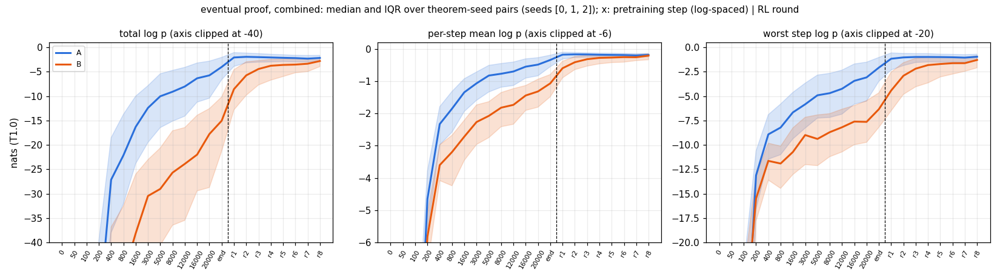
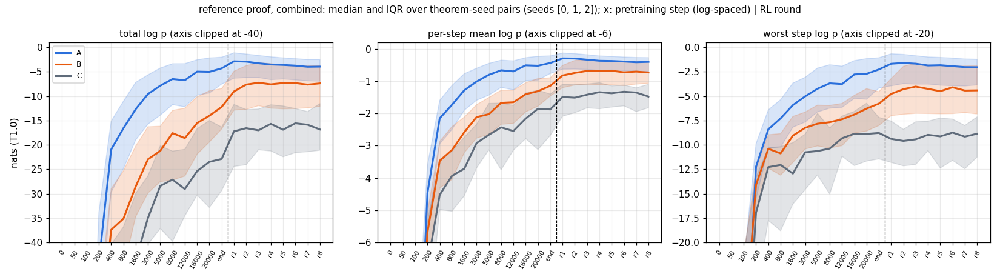
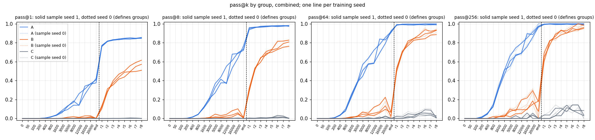
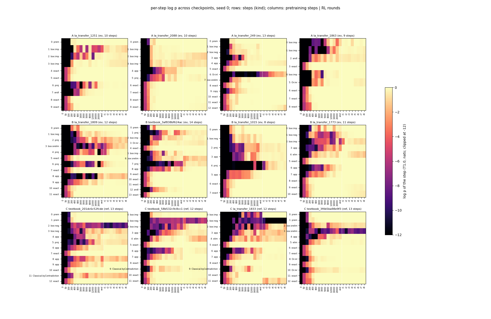

# run trajectory — when does the eventual proof become likely? (UNREVIEWED)

**Models:** 3 fresh seeds of `best-state`'s best-cap12 recipe (ALiBiGPT 9,560,832 params, `lean_staten`, from scratch on
K12, Stage-1 1,200 s on an A40, 14 kept checkpoints), then the T1 ladder (r1–r8, RTX A6000). **Lean alone.** Theorems:
textbook72 + holdout250 (322). Groups from sample seed 0: **A** end of pretraining solves (232 / 236 / 234), **B** only
r8 solves (54 / 51 / 60), **C** neither (36 / 35 / 28). Log p: teacher-forced, T 1.0, base-marginalised, assigned names
unscored. pass@k: sample seed 1. Medians over theorem-seed pairs.

 
 

| group | quantity | init | 12k | end PT | r1 | r4 | r8 |
|---|---|---|---|---|---|---|---|
| A | eventual worst step | −215 | −4.2 | −2.1 | −1.2 | −1.0 | −1.0 |
| B | eventual worst step | −191 | −8.2 | −6.3 | −4.4 | −1.8 | −1.3 |
| B | reference worst step | −189 | −7.4 | −5.8 | −4.8 | −4.3 | −4.4 |
| C | reference worst step | −241 | −9.3 | −8.8 | −9.4 | −9.0 | −8.8 |
| A / B / C | pass@1 | 0 | .18 / .007 / 0 | .40 / .001 / 0 | .77 / .12 / 0 | .83 / .44 / 0 | .85 / .56 / 0 |
| A / B / C | pass@256 | 0 | .72 / .11 / 0 | .97 / .15 / 0 | .99 / .65 / .01 | .99 / .91 / .07 | .99 / .96 / .05 |

**Findings.**
1. **B's worst step climbs as much late in pretraining as in RL.** From step 1,600 to the end of pretraining it rises
   +4.1 nats (IQM; per seed 3.4 / 4.1 / 4.8). In RL it rises +4.6 (5.1 / 4.6 / 4.1), mostly in r1–r4. The pre-registered
   headline ("mainly in RL") is **falsified**: Δ_RL ≤ Δ_PT in 2 of 3 seeds. At the end of pretraining, B is within
   reach but improbable: worst step −6.2, total −15 nats, pass@256 0.15.
2. **RL lifts its own proofs, not known ones.** For B, the reference proof's worst step gains +1.6 nats in RL (all at r1),
   against +4.6 for the eventual proof (3 / 3 seeds).
3. **C stays at one bad step.** Its reference worst step is about −9 nats through all of RL (Δ_RL +0.4).
4. B's bad step at the end of pretraining: a box opener in 82 / 165, an ∧E projection in 48.

Example (B, seed 0, `la_transfer_1015`, eventual proof): the worst step is `n5 := n1.2`, at −14.9 nats at the end of
pretraining, −7.7 at r1, −1.1 at r4 and −0.37 at r8. Every other step is above −0.6 throughout.

```lean
theorem t (P Q R S : Prop) (h1 : (S ∧ (¬((Q → P) → P)))) : (¬(S → ((Q → P) → P))) := by
  have n1 : (S ∧ (¬((Q → P) → P))) := h1
  have n7 : (¬(S → ((Q → P) → P))) := (fun (n2 : (S → ((Q → P) → P))) => by
    have n3 : S := n1.1
    have n4 : ((Q → P) → P) := n2 n3
    have n5 : (¬((Q → P) → P)) := n1.2
    have n6 : False := n5 n4
    exact (n6 : False))
  exact n7
```

**Expected vs outcome** (`preregistration/trajectory.md`; full list in `numbers.md` § trajectory). The sanity check
hit: textbook72 32 / 32 / 38 → 48 / 49 / 54 (best-state 27–32 → 51–52). Most magnitudes hit. **The headline missed:**
Δ_PT was +4.1 against a predicted −1 to +3, and late pretraining is not flat. pass@1 at r8 is higher than predicted.
B's pass@256 dips at the checkpoint that defines the groups; that is selection, not a reversal.

**Limits.** n = 3. Pretraining reads truncate 0.1–3.5 % of samples; the caps were held at best-state's values. 15 / 72
textbook theorems have no reference proof. Spend: 52.8 pod-hours, $27.42.
