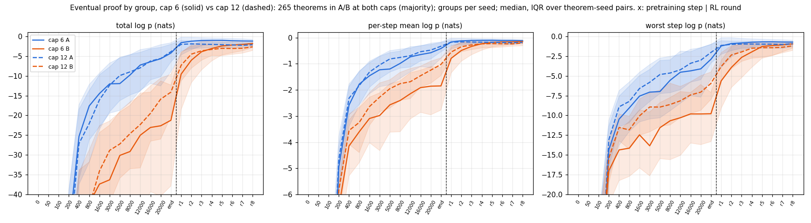
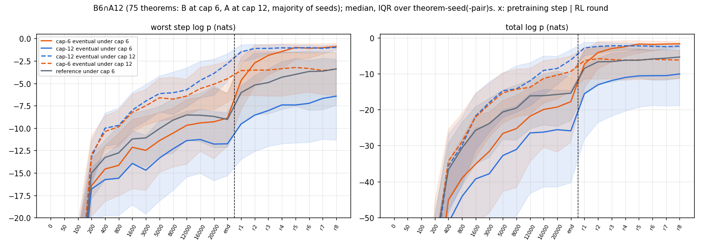
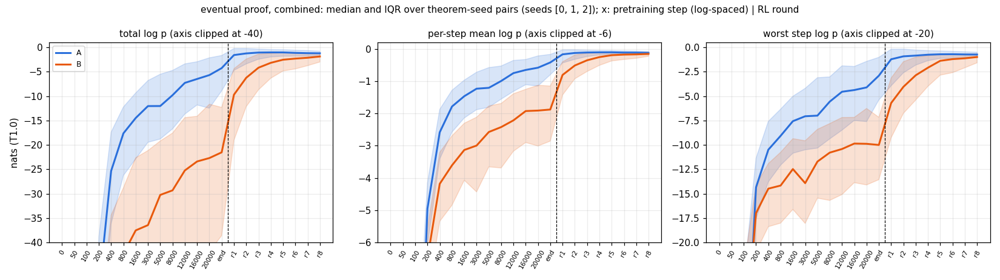
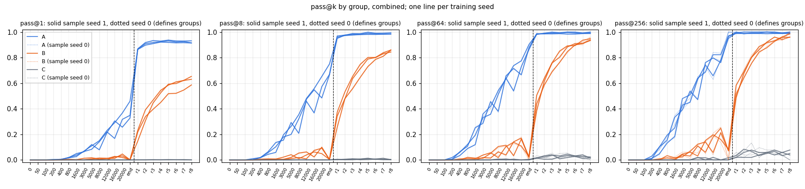
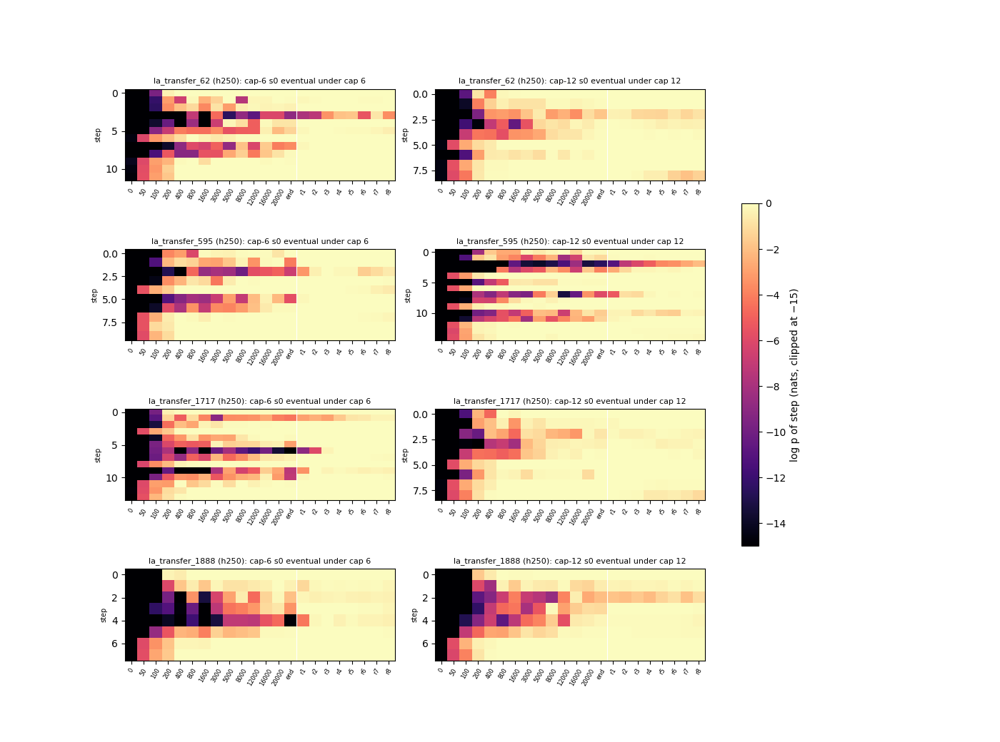

# run trajectory-cap6 — when does the eventual proof become likely, at cap 6? (UNREVIEWED)

**Models:** 3 fresh best-cap6 seeds (`best-state` recipe, 9,560,832 params, `lean_staten`, from scratch on the cap-6 set;
Stage-1 1,200 s on an A40 with 14 kept checkpoints, then T1 ladder r1–r8), against `trajectory`'s best-cap12. **Lean
alone.** 322 theorems. Groups (sample seed 0): **A** 169 / 138 / 140, **B** 101 / 132 / 122, **C** 52 / 52 / 60.
Numbers: `numbers.md` § trajectory-cap6.

 
  

**Findings.**
1. **At cap 6, B's worst step climbs mainly in RL:** −10.0 at the end of pretraining → −0.98 at r8. Δ_RL +8.8 nats
   [8.2, 9.5] vs Δ_PT (step 1,600 → end) +2.2 [1.6, 2.7], 3 / 3 seeds. It also holds on targets RL did not select:
   B's references (+5.1 vs +1.5), another seed's eventual proof (+6.0 vs +2.2), cap 12's eventual proof (+4.6 vs +1.5).
   After step 8,000 B is flat (+0.6). At cap 12 the two were about equal (+4.1 vs +4.6), and references gained only +1.5.
2. **B6∩A12 (75 theorems): longer training proofs do in pretraining what RL does at cap 6.** Cap 12's eventual proof
   climbs +4.7 in cap-12 pretraining, to −2.8; under cap 6 it sits at −11.8 and RL lifts it only to −6.4, while the
   cap-6 model's own proof reaches −0.9. RL at cap 6 finds its own route, not cap 12's.
3. **C stays put:** reference worst step ≈ −12 throughout; at 2× caps C is solved no more often than by a fresh draw.

Example (B6∩A12, seed 0): the bad step `n1.2` is at −14.9 (end of pretraining), −4.3 (r1), −0.40 (r4), −0.43 (r8).

```lean
theorem t (P Q R S : Prop) (h1 : ((Q ∨ (Q → R)) ∧ (¬(R ∧ S)))) : (¬((Q ∨ (Q → R)) → (R ∧ S))) := by
  have n1 : ((Q ∨ (Q → R)) ∧ (¬(R ∧ S))) := h1
  have n7 : (¬((Q ∨ (Q → R)) → (R ∧ S))) := (fun (n2 : ((Q ∨ (Q → R)) → (R ∧ S))) => by
    have n3 : (Q ∨ (Q → R)) := n1.1
    have n4 : (R ∧ S) := n2 n3
    have n5 : (¬(R ∧ S)) := n1.2
    have n6 : False := n5 n4
    exact (n6 : False))
  exact n7
```

**Expected vs outcome** (`preregistration/trajectory-cap6.md`):
- **Hits:** sanity, group sizes, the headline and its decision rule, 4a (at the edge), 4b, 4d, 4e, most pass@k and totals.
- **Misses:** "reference Δ_PT ≥ Δ_RL" (RL lifts references more); 4c (34 % of bad steps at action ≥ 7, not ≥ 50 %);
  C's |Δ_RL| < 2 in s0 (2.2).

**Limits.** n = 3. Eventual proof = r8's own argmax (cross-seed rows check this). Per-stratum truncation up to 14 % (C,
RL); caps held as pre-registered. Cap 12's ladders used ≈ 1.4× the GPU-s. Spend: 45.2 pod-hours, $22.62.
