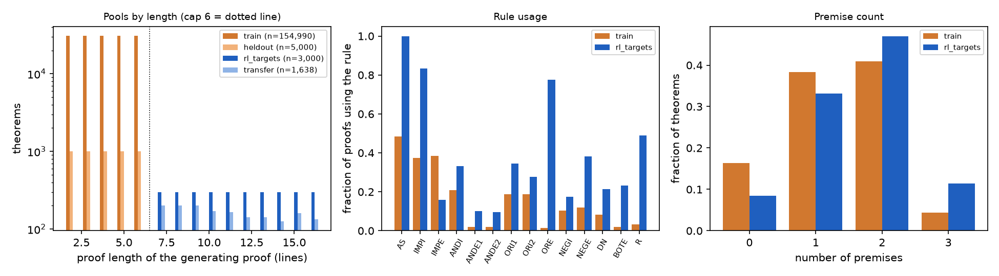
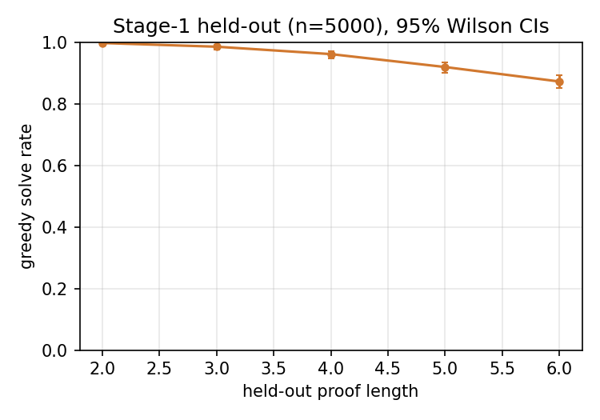
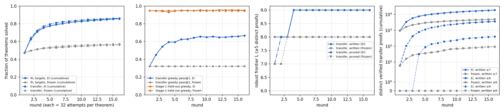
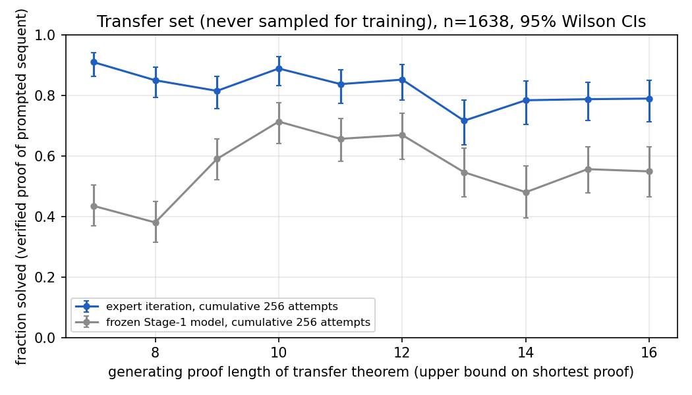
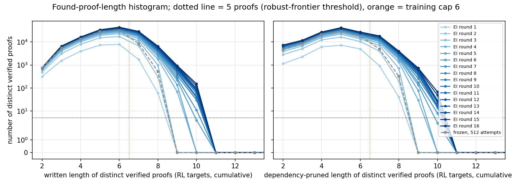
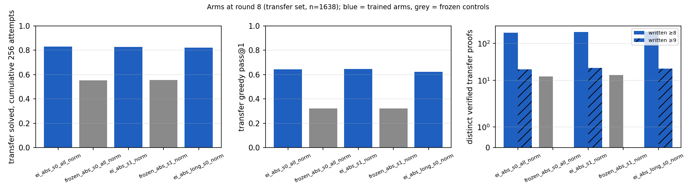

# Bootstrapping a natural-deduction prover past its training length

> **EXECUTIVE SUMMARY — DRAFT, TO BE REWRITTEN BY THE HUMAN.** Everything below the summary is filled in
> with method details, tables and figures; every number is traceable via `numbers.md`.

## Executive summary (draft)

**Question.** Train a 3.2M-parameter decoder from scratch on random natural-deduction proofs of ≤ 6 lines, then use the
verifier as the only reward. How far past 6 lines does the model prove theorems, compared with the same model simply
resampled the same number of times?

**Headline.** Robust frontier (longest length with ≥ 5 distinct verifier-accepted proofs, on 1,638 transfer theorems never
used for training, 256–512 attempts each): **L = 9** after expert iteration vs **P = 8** for the frozen Stage-1 model
→ **L − P = 1** on transfer, **2** on the RL targets (10 vs 8). Written and dependency-pruned frontiers coincide, so
padding does not inflate this. Behind the coarse frontier the effect is large: 3,628 vs 92 distinct ≥ 8-line proofs,
397 vs 0 ≥ 9-line proofs, 86.1% vs 57.3% of transfer theorems solved, 66.8% vs 32.2% greedy. Two seeds agree to 0.5 pp.

1. **The tokenisation of line references decides whether length generalisation is possible at all** (fig. §5).
   With plain absolute indices trained only on `N1..N6`, the model never writes a 7th line (0 of 26,208 samples); with the
   verifier-legal trick of a random start index in training, every index is a trained token and the frozen model
   already writes 501 7-line proofs. All Stage-2 results are conditional on this fix.
2. **Expert iteration moves the length prior, the control does not** (`figures/rounds.png`, `figures/found_length_hist.png`).
   Each round shifts the found-length histogram right; the frozen model with the same attempts stops at 8. The gain is
   concentrated on theorems whose proofs need box depth 3 (74% vs 34%) and on pure tautologies (77% vs 19%).
3. **It saturates at 9 and the last 15% of transfer theorems get no signal** (`figures/rounds.png`, right). Rounds 9–16 add
   2.6 pp greedy and no 10-line transfer proof; selecting the *longest* accepted proofs for training (EI-long) does not
   help (fewer 9-line proofs, −2 pp greedy).
4. **Transfer to textbook theorems is small**: validation-36 `> 6` bin 0/24 → 1–2/24 (`contraposition`, `export`), test
   long 9.8% → 14.5%, test short 73.0% → 73.0%. On unfamiliar theorem shapes the final model still writes ≤ 6-line
   attempts. The generator's distribution, not the length cap, is the binding constraint for textbook problems.

Stage-1 held-out greedy: 94.8% (length 2: 99.8% … length 6: 87.3%); it stays ≥ 93.1% through all 16 RL rounds.

## 1. Setting and question

- Logic and format: `spec.md`; `nd_verify` is the only judge. A proof's length is its number of lines, premises included.
- Cap: every supervised training proof has verifier length ≤ 6 (asserted at load time, `train.py --cap 6`).
- Question: after training only on ≤ 6-line proofs, how far past 6 can RL against the verifier push the
  **robust frontier** L = the longest written length at which the model produced ≥ 5 distinct verifier-accepted
  proofs, and how does that compare with the same model simply resampled the same number of times (P)?

## 2. Stage 1 — data and supervised model


### 2.1 Generator (`gen.py`)

Every training proof comes from a procedural random generator; nothing is written by hand and no
target is ever given to it. It samples proofs, not theorems: the theorem is whatever the proof ends up proving.

- **Forward mode.** Start with 0–3 random premises (formulas over `P Q R S`, nesting ≤ 2, `F` as a leaf with
  probability 0.02). Repeatedly pick a rule at random and apply it to the lines that are currently citable;
  open a box with a random hypothesis (or the antecedent of a citable implication, or `~~X`); close the
  innermost box with `IMPI`, or `NEGI` when it ends in `F`. When a rule needs a formula that is not citable
  (the antecedent for `IMPE`, the partner for `NEGE`, a disjunction for `ORE`) it may **introduce that formula
  as a premise** (lazily, capped at 3 premises). This is what makes premises fit together: `modus ponens`
  shapes appear because an `IMPE` step asked for its antecedent, not because anyone wrote them down.
- **Goal mode.** Sample a random conclusion and *complete* it with `reach(G)`: decompose by the main connective
  (`ANDI`, `ORI`, a box for `IMPI`, a box ending in `F` for `NEGI`, or classical reductio: assume `~G`, reach
  `F`, `NEGI`, `DN`), or use a citable line (`R`, `IMPE`, `ANDE`, `DN`, `BOTE`), or add a lazy premise `(Z > G)`.
  It never fails and never backtracks — it is a random generator with a goal, not a prover.
- **`ORE`.** The second branch is completed with `reach` to the first branch's end formula, so both boxes end in the same `G`.
- **Dependency pruning.** Only lines the conclusion transitively cites are kept (box citations keep the `AS`
  line and the box's last line); unused premises are dropped. Then the proof is renumbered and passed to
  `nd_verify.verify_text`; anything rejected is discarded and counted. **0 of 160,000 emitted cap-6 proofs
  and 0 of 7,000 long proofs were rejected.**
- **Filters.** Conclusion literally a premise and `F` as a premise are rejected (`trivial`). Dedup by theorem
  *class* (atoms relabelled in order of first appearance). Length histogram flattened by a per-length cap.

Figure: pool sizes by length, rule usage, premise counts.



Trivial-pattern audit of the 160k cap-6 pool (`make_splits.py`): 1,382 (0.9%) are `A |- A v A` / `A |- A & A`
shapes; 9,803 (6.1%) have a contradictory premise pair (kept in Stage 1, removed from the RL pools);
20% of the pool is length 2 by construction (single rule application), not counted as trivial here but
the per-length table below lets the reader ignore it.

### 2.2 Splits (`make_splits.py`)

| pool | n | lengths | role |
|---|---|---|---|
| `data/train.jsonl` | 154,990 | 2–6, ~31k each | Stage-1 supervised (every record asserted ≤ 6 at load) |
| `data/heldout.jsonl` | 5,000 | 2–6, 1,000 each | in-distribution greedy tracking |
| `data/rl_targets.jsonl` | 3,000 | 7–16, 300 each | RL samples against these |
| `data/transfer.jsonl` | 1,638 | 7–16, 125–200 each | never sampled for training |

- Disjoint **by atom-renaming class** across all four pools (stricter than by sequent string): the class key
  relabels atoms in order of first appearance, so `( P > Q ) , P |- Q` and `( R > S ) , R |- S` are one class.
  Renaming overlap of held-out with train is therefore 0 by construction. For calibration: inside the generator
  run, 78,931 distinct theorem *strings* were renamings of an already-emitted class (≈ 33% of distinct strings),
  so a split by exact string would have leaked about that much.
- The 36 validation classes are removed from every pool (10 hits in the cap-6 pool, 6 in the long pool — e.g.
  modus ponens is generated naturally). The test files were never opened or filtered against.
- Long pools use a **strict** generator mode (no lazy `(Z > G)` goal premise, no `F` in the theorem, final rule must
  be an elimination/discharge rule, contradictory premise pairs removed). A first version without these
  restrictions was too easy: 85% of what the frozen model solved, it solved with a ≤ 6-line proof (`log.md` 03:50).
  The generating length is stored as `n_lines` but is only an **upper bound** on the theorem's shortest proof.

### 2.3 Tokenisation: the choice that decides whether length generalisation is possible

One symbol per token (vocab 99). The only design question is how to cite lines. Two schemes were trained and compared
here (a third, `abs` *without* the offset, is the ablation in §5):

- **`rel`** — line numbers are dropped (regenerated at decode) and a citation becomes "k lines back" (`B<k>`).
  Under cap 6 the model never sees `B6+`, so a 7-line proof that cites its first premise from its last line
  needs a token the model has never emitted, and its logit has been pushed down for 6,000 steps.
- **`abs`** — keep `N<i>` verbatim, but during training shift every index in a proof by a random offset
  (the verifier accepts any starting index). All of `N1..N64` are trained tokens; the line number is a
  successor function the model has seen everywhere in `1..64`; citing a line is *copying an index token that is
  in context*, which is length-agnostic.

| Stage-1 held-out, greedy (n = 1,000 per length) | `rel` | `abs` |
|---|---|---|
| length 2 | 99.8% [99.3, 99.9] | 99.8% [99.3, 99.9] |
| length 3 | 99.1% [98.3, 99.5] | 98.6% [97.7, 99.2] |
| length 4 | 97.1% [95.9, 98.0] | 96.2% [94.8, 97.2] |
| length 5 | 92.9% [91.1, 94.3] | 92.0% [90.2, 93.5] |
| length 6 | 88.6% [86.5, 90.4] | 87.3% [85.1, 89.2] |
| all (n = 5,000) | **95.5% [94.9, 96.0]** | **94.8% [94.1, 95.4]** |

| Beyond the cap, frozen Stage-1 model, transfer pool (n = 1,638) | `rel` | `abs` |
|---|---|---|
| greedy pass@1 | 26.4% [24.3, 28.6] | 32.2% [30.0, 34.5] |
| pass@16, T = 0.8 | 40.5% [38.2, 42.9] | 44.7% [42.3, 47.1] |
| distinct verified proofs of written length 7 / 8 (pass@16) | 79 / 0 | 501 / 1 |
| validation-36 greedy | 10/36 (10/12 in ≤6, 0/24 in >6) | 7/36 (7/12, 0/24) |

In-distribution the two are equal within noise; beyond the cap `abs` is 4–6 pp better (SE of the difference ≈ 1.7 pp)
and writes 6× more length-7 proofs. `abs` was used for Stage 2. (Validation-36 is n = 36; the 3-theorem gap there is noise.)

### 2.4 Model and training

- Decoder-only transformer from scratch: 4 layers, d = 256, 8 heads, GELU MLP ×4, pre-LN, **RoPE** (no learned
  absolute positions, so no untrained position rows past the Stage-1 sequence lengths). **3,210,240 parameters.**
- Loss on proof tokens only (prompt masked). AdamW, lr 1e-3 warm-up 200 then cosine to 1e-4, batch 128,
  6,000 steps, weight decay 0.1, bf16 autocast, seed 0. ~12 min per run on the A40 (two runs sharing it).
  Final val loss 0.0018 (`rel`); `abs` sits at 0.087 because the random start index is irreducible entropy (≈ log 59 nats spread over ~50 proof tokens).
- **Held-out by length** (table above and `figures/stage1_heldout.png`): length 6 is harder than length 3 *inside* the training
  range (87–89% vs 99%).

  
- **Failures** (`abs`, 261/5000): almost all are `rule check failed` on a well-formed proof (ANDI 71, IMPE 45,
  ORI2 25, NEGE 24, IMPI 17); only 15 end on the wrong formula and 0 are parse errors. Failure rate is highest
  for theorems whose generating proof uses the rare rules (ANDE2 24%, ORE 20%, ANDE1 16% vs 4–7% for the common
  ones) and for 3-premise theorems (16% vs 4–6%).
- What the failures look like on validation-36 (`explosion`, `export`, `import`): the model has the right shape and
  **skips one step** — e.g. for `export` it writes `R : IMPE N20 N21` citing `P` where `( P & Q )` was needed (one
  `ANDI` short), for `import` it closes the box one `IMPE` early. That is a length prior, and it is exactly what
  Stage 2 has to move.

## 3. Stage 2 — expert iteration against the verifier

### 3.1 Protocol (`expert_iter.py`)

Reward = `nd_verify` accepts the emitted proof **of the prompted sequent** (premises match, last line is the
conclusion). Nothing else counts; a valid proof of a different theorem is discarded (the `--relabel` option
exists but was not used in any reported arm).

Each round, for every arm:
1. Sample **k = 32** proofs per RL target at **T = 0.8** (3,000 targets → 96,000 attempts), verify, keep the
   distinct accepted proofs (accumulated across rounds). Record written length and dependency-pruned length of each.
2. Sample k = 32 per **transfer** theorem (1,638, never trained on), verify, record only.
3. Greedy pass@1 on transfer and on the Stage-1 **held-out** set (in-distribution tracking).
4. *(RL arms only)* Fine-tune the current model for 600 steps (lr 3e-4 → 3e-5, batch 128) on a mix of
   ≤ 4 accepted proofs per solved target (each repeated 4×) plus 20,000 random Stage-1 training records
   (so the ≤ 6 regime is not forgotten). Save the checkpoint; the next round samples from it.

Arms (all from `ckpts/stage1_abs.pt`, same pools, same k, same temperature; seed 0 unless stated):

| arm | training data per round | what it tests |
|---|---|---|
| **frozen** (`frozen_abs_s0`) | none — Stage-1 model resampled | the control: what resampling alone finds with the same attempts |
| **EI** (`ei_abs_s0`) | 4 random accepted proofs per solved target | standard expert iteration / rejection-sampling fine-tuning |
| **EI-long** (`ei_abs_long_s0`) | the 4 accepted proofs with the longest *dependency-pruned* length per solved target | does selecting for long dependency chains (not padding) move the length prior further? |
| **EI / frozen, seed 1** (`ei_abs_s1`, `frozen_abs_s1`) | as EI / frozen, sampling seed 1 | seed-to-seed variance of the main comparison |
| **EI / frozen, rounds 9–16** (`*_cont`) | as EI / frozen, continued from round 8 with the cumulative bookkeeping resumed | does the frontier keep moving with 2× the attempts? |

Round 1 of every arm is the same model with the same seed, so round-1 numbers coincide by construction; the
control at round r has received exactly the same r × 32 attempts per theorem as the RL arms.

**Metrics reported every round:** RL-target solve rate (this round and cumulative), transfer solve rate by
generating length (cumulative), found-proof-length histogram (written and pruned), robust frontier
L (longest length with ≥ 5 distinct verified proofs, computed on the transfer set unless stated), transfer greedy
pass@1, Stage-1 held-out greedy. Padding is measured as written − pruned length.

### 3.2 Results (seed 0, rounds 1–8; seed 1, the EI-long arm and rounds 9–16 are in 3.3)



*Seed 0, rounds 1–16. Left to right: (1) fraction of RL targets / transfer theorems solved, cumulative over attempts; (2) greedy pass@1 on transfer and on the Stage-1 held-out set; (3) robust frontier L on the transfer set; (4) number of distinct verified transfer proofs of written length ≥ 7 / ≥ 8 / ≥ 9.*

| round | attempts / theorem | transfer solved, cumulative — EI | — frozen | transfer greedy — EI | — frozen | held-out greedy — EI | distinct transfer proofs written ≥ 8 — EI | — frozen | frontier L (written / pruned) — EI | — frozen |
|---|---|---|---|---|---|---|---|---|---|---|
| 1 | 32 | 47.0% | 47.0% | 32.2% | 32.2% | 94.8% | 6 | 6 | 8 / 7 | 8 / 7 |
| 2 | 64 | 64.0% | 49.7% | 45.1% | 32.2% | 94.5% | 104 | 16 | 8 / 8 | 8 / 7 |
| 3 | 96 | 72.3% | 51.5% | 54.3% | 32.2% | 94.3% | 429 | 27 | 8 / 8 | 8 / 8 |
| 4 | 128 | 77.1% | 52.6% | 59.3% | 32.2% | 93.1% | 765 | 33 | **9 / 9** | 8 / 8 |
| 5 | 160 | 79.5% | 53.4% | 59.5% | 32.2% | 94.5% | 1,126 | 37 | 9 / 9 | 8 / 8 |
| 6 | 192 | 81.2% | 54.0% | 62.5% | 32.2% | 95.2% | 1,472 | 42 | 9 / 9 | 8 / 8 |
| 7 | 224 | 82.2% | 54.6% | 62.7% | 32.2% | 95.1% | 1,711 | 47 | 9 / 9 | 8 / 8 |
| 8 | 256 | **82.8%** [80.9, 84.6] | **55.3%** [52.9, 57.7] | **64.2%** [61.9, 66.5] | **32.2%** [30.0, 34.5] | **94.9%** [94.2, 95.4] | **2,028** | **54** | **9 / 9** | **8 / 8** |

n = 1,638 transfer theorems, 5,000 held-out; frozen held-out greedy is 94.8% throughout. Per-round pass@32 (not cumulative) at round 8: EI 77.3%, frozen 48.6%. On the RL targets themselves (n = 3,000): EI 81.4% vs frozen 54.0% cumulative; the target frontier is 10 / 10 (EI, 30 distinct 10-line proofs) vs 8 / 8 (frozen). Full per-round tables: `artifacts/tables_s0.md`.

**Transfer by generating length, with the control.** The RL gain is present at every length and is largest where the
frozen model is weakest (7–8-line theorems, which in this generator are dominated by nested boxes).



**Found-proof-length histogram across rounds** (RL targets, all 16 rounds). Every round shifts mass to the right; the frozen
control with the same attempts (512 per theorem by round 16) stops at 8. Pruned lengths (right) are ~1 line shorter than written lengths — see padding below.



**Where the gain is** (`analyze_transfer.py`, cumulative, EI round 5 vs frozen round 4 — round 8 and round 16 are in `artifacts/transfer_breakdown.md`; same picture):

| property of the transfer theorem's generating proof | n | EI | frozen |
|---|---|---|---|
| max box depth 1 | 314 | 91% | 80% |
| max box depth 2 | 565 | 81% | 63% |
| max box depth 3 | 758 | 74% | **34%** |
| 0 premises (pure tautology) | 168 | 77% | **19%** |
| 1 / 2 / 3 premises | 571 / 719 / 180 | 79% / 82% / 77% | 56% / 57% / 54% |
| generating proof uses `ORE` | 1,202 | 82% | 62% |
| generating proof has no `ORE` | 436 | 74% | **28%** |

The frozen model's failures are structural: at round 8 its greedy failure reasons on transfer are `IMPE` 199,
`IMPI` 140, `ANDI` 132, `bad box cite` 80 — modus-ponens chains and box discharge. After EI they are `ANDI` 114,
`DN` 78, `NEGE` 68, `IMPE` 47, `IMPI` 26, `bad box cite` 27: the box machinery beyond depth 2 has been learned;
what remains are local rule slips.

**Padding.** 42% of the proofs accepted in round 1 contain at least one line the conclusion does not depend on
(mean gap written − pruned 0.45 lines; 0.09 reiterations per proof); the frozen model's 47k accepted transfer proofs
over 16 rounds have the same profile (47%, gap 0.53). **RL increases padding**: among new distinct proofs found per
round, the padded fraction rises 42% → 56% (round 8) → 61% (round 16) and the gap 0.45 → 0.69 → 0.84 lines,
reiterations 0.09 → 0.18 per proof (`analyze_found.py`, per-round breakdown in `log.md`). This is the reward-hacking
direction the brief warned about, at a modest level: the *pruned* frontier moves exactly as the written one (9 / 9 on
transfer at every round from 4 on; 10 / 10 on targets), and the ≥ 9-line count in pruned length is 272 vs 397 written.
Every headline number is given in both lengths.

**In-distribution.** Held-out greedy stays at 94.9% (frozen 94.8%); it dipped to 93.1% at round 4 and recovered
with the retained Stage-1 slice.

**Validation-36 across rounds** (greedy through `prove.py` / pass@32 at T = 0.8): Stage 1 7/36 / 10/36; EI rounds
1–7: 8/36 → 10/36 greedy, 10–11/36 pass@32. The `>6` bin moves from 0/24 to **1/24**: `contraposition`
(`( P > Q ) |- ( ( ~ Q ) > ( ~ P ) )`, 7 lines) is proved from round 2 on — 12–22 distinct 7-line proofs per 32
samples — and greedily at rounds 3 and 7. Labelled as an existence proof, not a rate:

```
THM ( P > Q ) SEQ ( ( ~ Q ) > ( ~ P ) ) PRF
N25 ( P > Q ) : PR ;
N26 | ( ~ Q ) : AS ;
N27 | | P : AS ;
N28 | | Q : IMPE N25 N27 ;
N29 | | F : NEGE N28 N26 ;
N30 | ( ~ P ) : NEGI N27 N29 ;
N31 ( ( ~ Q ) > ( ~ P ) ) : IMPI N26 N30 ;
QED
```
(The model chose to start numbering at N25; the verifier accepts any start index — this is the `abs` scheme's
random-offset augmentation showing through.) `explosion` and `consequentia_mirabilis` (`<=6` bin) stay unsolved by
every checkpoint, as does the rest of the `>6` bin (10–18 reference lines): the RL pools are drawn from the same
generator as Stage 1, and De Morgan / distribution shapes are simply not in it (see §5).

### 3.3 Second seed, the EI-long arm, and 16 rounds



| arm (round 8, 256 attempts / theorem) | transfer cumulative | transfer greedy | held-out greedy | distinct transfer proofs written ≥ 8 / ≥ 9 | frontier L (transfer) |
|---|---|---|---|---|---|
| EI seed 0 | 82.8% [80.9, 84.6] | 64.2% [61.9, 66.5] | 94.9% | 2,028 / 195 | 9 |
| EI seed 1 | 82.6% [80.7, 84.4] | 64.6% [62.2, 66.9] | 94.9% | 2,204 / 176 | 9 |
| EI-long seed 0 (train on longest pruned proofs) | 82.1% [80.1, 83.8] | 62.2% [59.8, 64.5] | 95.1% | 2,338 / 120 | 9 |
| frozen seed 0 | 55.3% [52.9, 57.7] | 32.2% [30.0, 34.5] | 94.8% | 54 / 0 | 8 |
| frozen seed 1 | 55.5% [53.1, 57.9] | 32.2% [30.0, 34.5] | 94.7% | 54 / 0 | 8 |
| **EI seed 0, continued to round 16 (512 attempts)** | **86.1% [84.4, 87.7]** | **66.8% [64.5, 69.0]** | **95.3%** | **3,628 / 397** | **9** |
| frozen seed 0, 512 attempts | 57.3% [54.9, 59.7] | 32.2% | 94.7% | 92 / 0 | 8 |

- **Seeds agree to ≤ 0.5 pp on every metric**; the EI − frozen difference (≈ 27 pp cumulative, ≈ 32 pp greedy, paired
  on the same 1,638 theorems) is an order of magnitude above the ≈ 3 pp noise floor.
- **EI-long is a negative result.** Selecting each theorem's longest dependency-pruned proofs produced more 8-line
  proofs but *fewer* 9-line ones and 2 pp lower greedy accuracy. Mechanism: the longest accepted proof of an easy
  theorem is usually a roundabout one; training on it teaches detours, not depth. Length has to come from the
  theorems, not from the selection rule.
- **Eight more rounds** (rounds 9–16, `figures/rounds.png`) add 3 pp cumulative and 2.6 pp greedy, double the number of
  ≥ 9-line transfer proofs (195 → 397), and produce 151 distinct ≥ 10-line proofs on the RL targets — but the
  transfer frontier stays at 9 and no 10-line transfer proof appears. The length distribution is saturating.
- The **final model** is round 16 of seed 0 (`ckpts/final.pt` = `ckpts/ei_abs_s0_cont_r16.pt`).

## 4. Stage 3 — evaluation

All numbers greedy through `prove.py` (the submission interface) unless marked. Test-set rows are filled in once, at the end (§4.1).

| model | Stage-1 held-out (n = 5,000) | transfer greedy (n = 1,638) | transfer pass@32 (per round) | transfer cumulative, 256 attempts | validation ≤ 6 (n = 12) | validation > 6 (n = 24) | test short | test long |
|---|---|---|---|---|---|---|---|---|
| Stage 1 (`abs`, frozen) | 94.8% [94.1, 95.4] | 32.2% [30.0, 34.5] | 48.6% (round 8) | 55.3% [52.9, 57.7] | 7/12 | 0/24 | **73.0%** (195/267; CI 67.4–78.0) | **9.8%** (52/532; CI 7.5–12.6) |
| EI seed 0, round 8 | 94.9% [94.2, 95.4] | 64.2% [61.9, 66.5] | 77.3% | 82.8% [80.9, 84.6] | 9/12 | 0/24 (greedy); 1/24 pass@32 | — | — |
| **EI seed 0, round 16 = final** | 95.3% [94.6, 95.8] | 66.8% [64.5, 69.0] | 79.4% | 86.1% [84.4, 87.7] (512 attempts) | 8/12 | 1/24 (`contraposition`, greedy and pass@32) | **73.0%** (195/267; CI 67.4–78.0) | **14.5%** (77/532; CI 11.7–17.7) |
| Stage 1 (`rel`), for reference | 95.5% [94.9, 96.0] | 26.4% [24.3, 28.6] | — | — | 10/12 | 0/24 | — | — |

Validation-36 with 32 samples at T = 0.8: Stage 1 10/36 (0/24 in > 6), EI round 8 11/36 (1/24: `contraposition`), final 11/36
(1/24); round 14 reached 12/36 with `export` (7 lines) as a second > 6 solve. `min_lines_ub` was never beaten: no proof
shorter than the bound was found (`eval_targets.py` reports "shorter 0" for every checkpoint). Greedy through `prove.py`,
`contraposition` is proved at rounds 3, 7, 11 and 16 (the final model) and at no other; the other 23 are 0 at every checkpoint.

### 4.1 Test set (run once)

`artifacts/TEST_RUN_DONE` was created at 07:38:07 UTC, immediately before the single run (`test_run_once.sh`:
`prove.py --greedy`, one run per checkpoint per file, no per-theorem inspection). `score_test.py` verbatim:

```
stage1 (ckpts/stage1_abs.pt) : test_short_prompts.jsonl: 73.0% passed  (195/267; 95% CI 67.4–78.0%)
stage1 (ckpts/stage1_abs.pt) : test_long_prompts.jsonl: 9.8% passed  (52/532; 95% CI 7.5–12.6%)
final (ckpts/final.pt) : test_short_prompts.jsonl: 73.0% passed  (195/267; 95% CI 67.4–78.0%)
final (ckpts/final.pt) : test_long_prompts.jsonl: 14.5% passed  (77/532; 95% CI 11.7–17.7%)
```

The short set is unchanged (identical count, not just rate); the long set gains 4.7 pp with overlapping intervals
(paired on the same 532 theorems the gain is 25 theorems, SE ≈ 8, so it is real but small). Against the +32 pp greedy
gain on the generator's own transfer distribution, this is the clearest statement of §5 barrier 3.

### 4.2 What the final model writes on the validation `> 6` bin

Greedy attempts of the final model on the 24 hard validation theorems (`artifacts/ei_abs_s0_cont_r16_val36_greedy.jsonl`)
are **2–7 lines long** (median 5; 21 of 24 are ≤ 6 lines; the one success, `contraposition`, is 7) and fail with a rule
check on a step that skips something (`IMPE`, `DN`, `ORE`). On the transfer set the same model writes 7–9-line proofs routinely. The length prior
was moved *for the generator's theorem shapes*, not in general: on an unfamiliar shape the model falls back to the
short-proof habit.

## 5. What limits the frontier

**Barrier 1 — the model cannot emit a token it has never been trained to emit (fixed).** Three Stage-1 models,
identical except for how line references are tokenised, on the transfer pool (n = 1,638, T = 0.8, 16 samples each):

| reference scheme | held-out greedy (≤ 6) | transfer pass@16 | distinct verified proofs of length 7 / 8 | longest written |
|---|---|---|---|---|
| `abs-fixed`: `N<i>` verbatim, numbering always starts at 1 | 95.4% | 38.5% [36.2, 40.9] | **0 / 0** | 6 |
| `rel`: "k lines back" (`B<k>`) | 95.5% | 40.5% [38.2, 42.9] | 79 / 0 | 7 |
| `abs`: `N<i>` with random start offset in training | 94.8% | 44.7% [42.3, 47.1] | 501 / 1 | 8 |

With `abs-fixed`, `N7` is an output row whose logit has been pushed down at every step of training; in 26,208
samples the model never wrote a seventh line. In-distribution accuracy is identical, so nothing in Stage-1
evaluation would reveal this. `rel` moves the untrained token from "line 7" to "cite 7 lines back", which is a
softer ceiling (most 7–8-line proofs cite within 6 lines) but still a ceiling. `abs` with a random start offset
makes every index a trained token and turns citation into copying an index that is in context; it is the only
scheme that produced 8-line proofs before any RL. The whole Stage-2 result is conditional on this choice: with
`abs-fixed`, expert iteration would have had nothing beyond 6 to select.

**Barrier 2 — the length prior (moved by RL, not removed).** The Stage-1 model plans the right proof shape and
skips a step to land inside 6 lines (§2.4, `export`/`import`). Expert iteration moves the written-length
distribution outwards by about one line per two rounds early on and then saturates: the number of ≥ 9-line
transfer proofs grows 0 → 31 → 87 → 135 → 157 → 195 over rounds 3–8, while ≥ 10 stays at 0 on transfer and 30 on
the RL targets. Two mechanisms are visible in the data:
- *Selection pressure is on solving, not on length.* 79% of the accepted proofs of "7–16-line" targets are ≤ 6
  lines because the targets admit short proofs; the fine-tuning mix is dominated by them. The EI-long arm (§3.3)
  tests the obvious fix.
- *Signal at the frontier is rare.* At round 8 only 5,499 new distinct proofs appear per 96,000 attempts and the
  per-round transfer pass@32 has flattened (75.7 → 76.4 → 76.1 → 77.3%). The remaining ~17% of transfer theorems
  are the ones where 32 attempts per round give ~0 successes — the all-fail groups the brief warned about.

**Barrier 3 — the generator's theorem distribution.** Validation-36 makes this concrete: the model learned to
prove `contraposition` (a nested `IMPI`/`NEGI` shape the generator produces often) but none of the De Morgan,
distribution, or Peirce theorems, whose proofs need an `ORE` over a *derived* (not premise) disjunction or an
excluded-middle detour — shapes that the generator emits rarely or never. RL can only amplify what the sampler
already produces with non-zero probability.

## 6. Limitations

- **"Length" of a theorem is an upper bound.** Every pool is labelled by the length of the proof that generated
  it; many of those theorems have much shorter proofs (the frozen model proves 47% of the "7–16-line" pool with
  ≤ 6-line proofs). All headline numbers are therefore stated in terms of the length of the proof the model
  actually *wrote*, and additionally in dependency-pruned length so that padding cannot inflate them. A bounded
  minimal-length prover for the targets would make the pools sharper; it was not built.
- **One model size, one generator.** Everything is 4 layers / d = 256 and one generator design. The generator's
  distribution (nested `IMPI` boxes, `ORE` over disjunction premises) shapes what "long" means here, and the RL
  targets come from the same generator as the training data (strict mode), so transfer to *textbook* theorems
  is measured only on validation-36 and the test files.
- **Padding grows under RL** (42% → 61% of new proofs carry a dead line, +0.4 lines on average over 16 rounds). It does
  not change the frontier here, but a longer run would need the pruned proof as the training target (§7).
- **Expert iteration is off-policy in spirit.** Each round fine-tunes on a growing set of past successes; the
  policy can drift towards theorem types it already solves (the retained Stage-1 slice guards the ≤ 6 regime,
  and held-out greedy is reported every round, but the RL-target pool itself is fixed).
- **Seeds.** Two seeds for the main comparison; one seed for the EI-long arm; single training seed for Stage 1.
  Wilson intervals are per-set; differences between arms on the same set are paired, so their SE is smaller
  than the intervals suggest.
- **Validation-36 is n = 36.** Its numbers are reported as counts, not rates, and no conclusion rests on them alone.
- **Compute sharing.** Wall-clock figures were measured with 2–4 jobs sharing one A40; per-job times are ~2–3× what a
  dedicated GPU would give.
- **What was not done:** GRPO / on-policy policy gradient, hindsight relabelling of by-products (implemented as
  `--relabel`, not run), search at inference time, a minimal-length prover for target labelling.

## 7. What I would do next with another week

1. **Label targets with a bounded prover** (minimal proof length ≤ N by iterative deepening over the 14 rules) so
   that "solved a 12-line theorem" means a 12-line proof was necessary. Then the frontier curve is against true
   length and the pools can be enriched at the true frontier.
2. **Curriculum by measured difficulty**, not generating length: allocate more samples (k = 128–256) to targets
   with a low per-sample success rate and stop sampling saturated ones; success at the frontier is rare and
   that is where the attempts should go.
3. **Fix the padding incentive.** 40% of accepted proofs carry a dead line. Train on the dependency-pruned proof
   instead of the written one (it is still verifier-valid), so RL rewards structure rather than length.
4. **GRPO with a fixed loss divisor and no KL** as a second RL family, to check whether the on-policy variant
   moves the length prior faster than rejection-sampling fine-tuning at the same sample budget.
5. **Textbook-style targets.** A second target pool built from classical patterns (De Morgan, distribution,
   contraposition and their converses) with fresh atoms, disjoint from validation-36 by renaming class, to see
   whether the transfer to validation-36 is limited by theorem *type* rather than by length.

## Appendix: reproduction
See `README.md` (Reproduction section), `numbers.md`, `log.md`.
